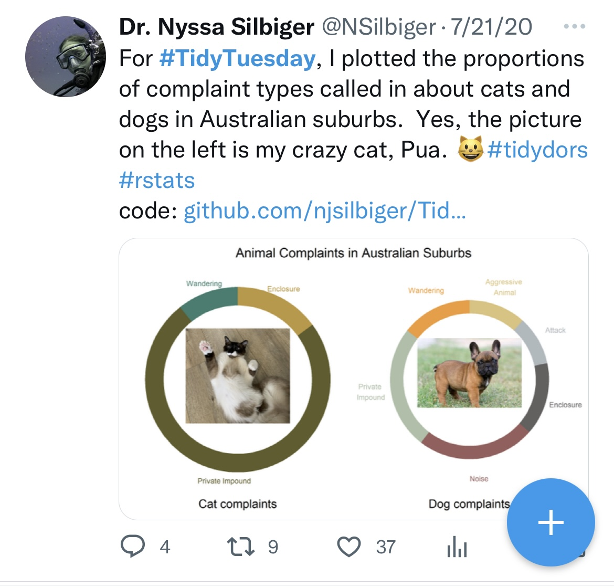
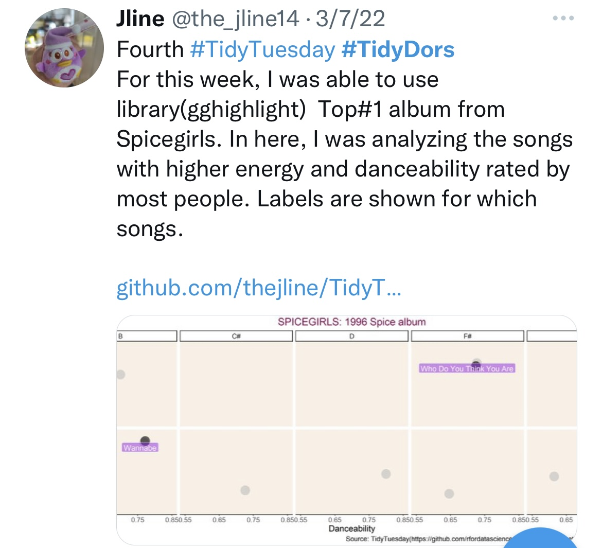
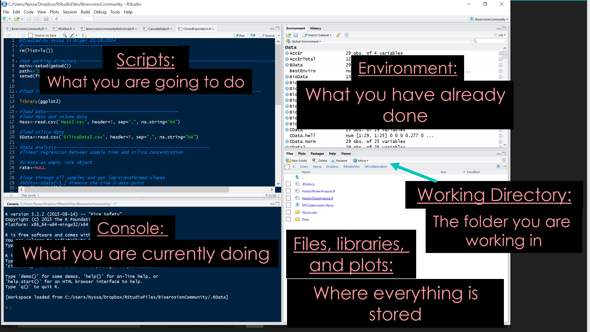
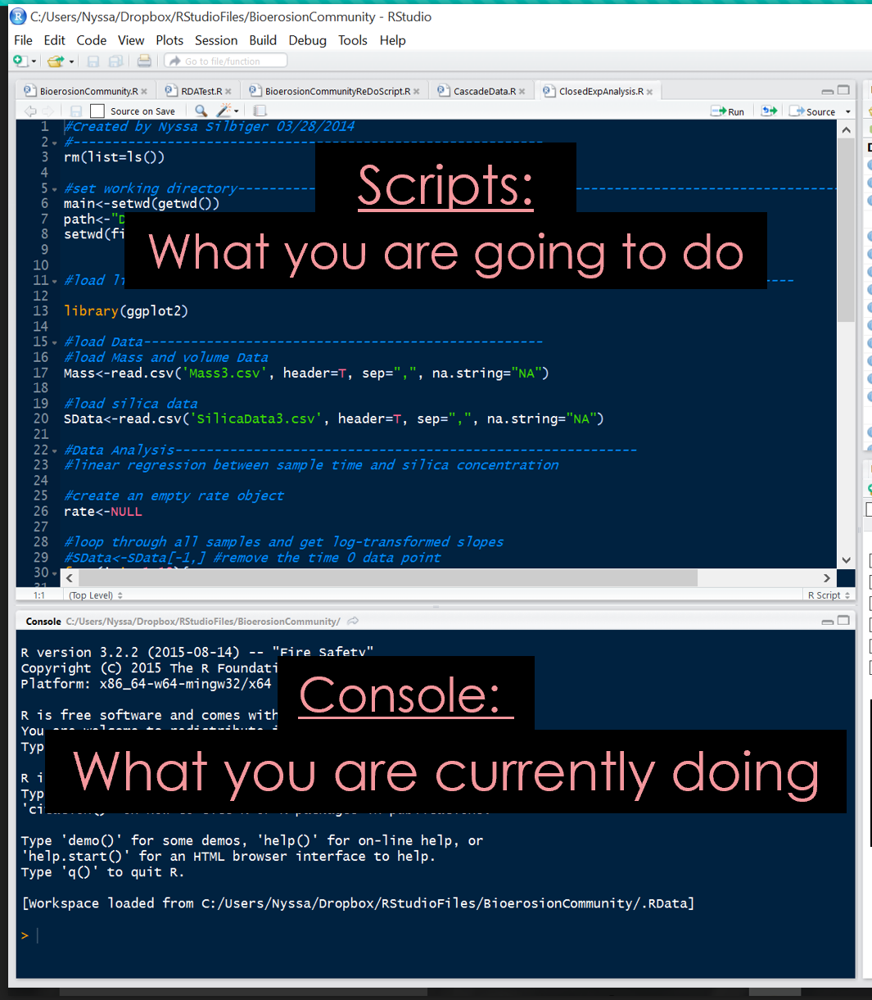

```{r setup, include=FALSE}
options(htmltools.dir.version = FALSE, htmltools.preserve.raw = FALSE)
library(tidyverse)
library(patchwork)
```

## Welcome to Data Science Fundamentals in R {.inverse .center .middle}

## Welcome to Data Science Fundamentals in R

::: {.columns}

::: {.column width="70%"}

**Class times:** 1:00 - 2:50 Tuesday

**Dr. Nyssa Silbiger**

- Office hours: Tuesday 3:00 - 4:00 (MSB 612)

**TA is Mica Chapuis**

- Office hours: Monday 12:00 - 14:00 (MSB 306)

:::

::: {.column width="30%"}

{width="100%"}

:::

:::

## Outline of class

1. What are data?
2. What is your coding background?
3. Introduction to the class
4. Data structures
5. R intro/refresher

## Data are everywhere!

{fig-align="center" width="70%"}

## Data are everywhere!

{fig-align="center" width="100%"}

## Data are everywhere!

{fig-align="center"}

## Data are everywhere!

{fig-align="center" width="100%"}

## We live in a data filled world

### Data can take many forms

::: {.columns}

::: {.column width="50%"}

- Athletic performance
- Timeseries of polls
- Sequence data
- Measurements of physical properties
- Spatial data (e.g., Maps)
- Timing of events
- Images
- Networks
- Plain text
- So much more...

:::

::: {.column width="50%"}

{width="100%"}

:::

:::

## Data are at the center of biology and oceanography {.inverse .center .middle}

## Data are at the center of biology and oceanography

{fig-align="center"}

## Data are at the center of biology and oceanography

{fig-align="center"}

## Data are at the center of biology and oceanography

{fig-align="center"}

## This semester, we will all become data scientists!

::: {.columns}

::: {.column width="50%"}

{width="100%"}

:::

::: {.column width="50%"}

::: {.fragment}

> *"I feel like I am fighting R most of the time and I think if we (me and R) just could sit down and understand one another it would be much easier for us both, ya know?"*

:::

:::

:::

## What is your experience?

```{r experience-plots, echo=FALSE, warning=FALSE, message=FALSE}
survey <- read_csv("libs/Data/survey4.csv")
nr <- nrow(survey)

degree <- survey %>%
  count(Grade) %>%
  mutate(n = 100*n/nr, x = "Grade") %>%
  ggplot(aes(y = n, fill = Grade, x = x)) +
  geom_bar(position = "stack", stat = "identity") +
  labs(title = "Degree") +
  theme_bw() +
  theme(axis.title = element_blank(), axis.ticks.x = element_blank(),
        axis.text.x = element_blank(), legend.text = element_text(size = 14),
        title = element_text(size = 14))

Rexper <- survey %>%
  count(R_experience) %>%
  mutate(n = 100*n/nr, x = "R experience") %>%
  separate(R_experience, into = c("R", "experience"), sep = "-") %>%
  ggplot(aes(y = n, fill = R, x = x)) +
  geom_bar(position = "stack", stat = "identity") +
  labs(title = "What is your experience with R?") +
  theme_bw() +
  theme(axis.title = element_blank(), axis.ticks.x = element_blank(),
        axis.text.x = element_blank(), legend.text = element_text(size = 14),
        title = element_text(size = 14))

gitexper <- survey %>%
  count(Github_experience) %>%
  mutate(n = 100*n/nr, x = "Git experience") %>%
  separate(Github_experience, into = c("Github", "experience"), sep = "-") %>%
  ggplot(aes(y = n, fill = Github, x = x)) +
  geom_bar(position = "stack", stat = "identity") +
  labs(title = "What is your experience with Github?") +
  theme_bw() +
  theme(axis.title = element_blank(), axis.ticks.x = element_blank(),
        axis.text.x = element_blank(), legend.text = element_text(size = 14),
        title = element_text(size = 14))

Rexper
```


## What is your experience?

```{r git-plot, echo=FALSE, warning=FALSE, message=FALSE, fig.width=10, fig.height=6}
gitexper
```

## What do you want to learn?

```{r wordcloud, echo=FALSE, message=FALSE, warning=FALSE, fig.align='center', fig.width=10, fig.height=7}
library(ggwordcloud)

stop_words <- c('a','and','for','the','to','in','be','i','it','of','that',
                'with','can','about','if','how','use','my','when','am','on',
                'im','this','were','could','was','so','its','or','but','by')

words <- survey %>%
  select(text = WantToDo) %>%
  mutate(text = tolower(text),
         text = str_remove_all(text, '[[:punct:]]'),
         tokens = str_split(text, "\\s+")) %>%
  unnest(cols = c(tokens)) %>%
  count(tokens) %>%
  filter(!tokens %in% stop_words) %>%
  arrange(desc(n)) %>%
  select(words = tokens, freq = n)

set.seed(4821)
ggplot(words, aes(label = words, size = freq, color = freq)) +
  geom_text_wordcloud_area(shape = "circle", rm_outside = TRUE) +
  scale_size_area(max_size = 24) +
  scale_color_gradientn(colors = c("#007965", "#F58634", "#FFCC29")) +
  theme_void()
```

## But first, tell me about you...

### Ice Breaker

::: {.incremental}

1. Tell us your name
2. Why you wanted to take this class
3. If you could create any function in the world, what would it be?

:::

## Our semester: NOT a statistics or bioinformatics course

::: {.columns}

::: {.column width="60%"}

**This class is NOT:**

- A statistics course
- A bioinformatics course

::: {.fragment}

**We WILL:**

::: {.incremental}

- Learn best practices for data entry
- Create clean, reproducible scripts in *R*
- Share code and data on a public version-controlled repository ([GitHub]{.fn})
- Work collaboratively on a project
- Create high quality visuals using *R*
- Learn to love working with data!

:::

:::

:::

::: {.column width="40%"}

::: {.fragment}

{width="100%"}

:::

:::

:::

## Our semester: the data science workflow

{fig-align="center" width="100%"}

## We will learn **R** and **Markdown** languages

{fig-align="center" width="80%"}

Image credit: [Allison Horst](https://github.com/allisonhorst/stats-illustrations)

## We will create beautiful graphics using fun #TidyTuesday and real scientific data

::: {.columns}

::: {.column width="50%"}

{width="100%"}

:::

::: {.column width="50%"}

{width="100%"}

:::

:::

## Grading {.center}

| Component                                    | Percent |
|-----------------------------------------------|:-------:|
| Short Quizzes                                 | 15%     |
| Homework Assignments                          | 25%     |
| AI-Assisted Community Data Sprint & Reflection| 20%     |
| Class Participation                           | 5%      |
| Final Independent Project                     | 35%     |

::: {.fragment}

I will go over each component in future lectures. All rubrics are on Lamakū and details are on the syllabus.

{fig-align="center" width="35%"}

:::

## Ethical & responsible AI use in this course

::: {.callout-warning}
## Core skill-building work (quizzes, homework, final project)
Do **not** use generative AI to write, complete, or generate the code, functions, or written interpretations you submit. If AI use is suspected, you may be asked to live-code your answers in class.
:::

::: {.fragment}

::: {.callout-tip}
## The AI-Assisted Community Data Sprint (Week 8)
This assignment explicitly requires AI use — once you already have the independent skills to evaluate what it produces. Every prompt, response, and correction must be logged.
:::

:::

::: {.fragment}

::: {.callout-note}
## Disclosure
Any permitted AI use requires a brief AI-use statement (tool, prompt, what you changed) in your submission or commit message.
:::

:::

## Communication

::: {.columns}

::: {.column width="40%"}

{width="100%"}

:::

::: {.column width="60%"}

I created a class Slack channel (**OCN682**) for asking classmates for help, sharing advice, and sharing resources.

[Click Here to Join](https://join.slack.com/t/ocn-682/shared_invite/zt-3bc1df99i-QtMqDmktE0kAf1WtyZTs2Q) or see the syllabus.

What is Slack? [See here](https://slack.com/intl/en-pf/)

Is it free? **YES**

:::

:::

::: {.fragment}

::: {.callout-note}
## Best source of course info
Course [GitHub]{.fn} site — [github.com/OCN-682-UH/Fall_2026](https://github.com/OCN-682-UH/Fall_2026) — and Lamakū. Check the schedule regularly; it may change.
:::

:::

## How to get class assignments and lectures?

This week everything will be on Lamakū. Starting next week, all assignments and slides will be on **Github**.

::: {.columns}

::: {.column width="55%"}

::: {.incremental}

- 3 unit class: 2 units in-person, 1 unit at home
- One in-class lecture + one online lecture per week (complete online lecture **before** next in-person meeting)
- Weekly homework assignments due the following week — **turned in on GitHub** for full credit

:::

:::

::: {.column width="45%"}

::: {.fragment}

**What is Github?**

{width="100%"}

Stay tuned...

:::

:::

:::

## Group work

This class is structured on the principle that you learn just as much from your peers as you do from me. All assignments are turned in independently, but you are encouraged to work in groups.

::: {.fragment}

You will have many **think-pair-share** opportunities during lectures. Pair with different students each class — every one thinks differently!

:::

::: {.fragment}

::: {.callout-note}
## Class Participation (5%)
Helping your peers during class counts toward your participation grade.
:::

:::

{fig-align="center" width="35%"}

## Readings

All textbooks are **free and online**.

::: {.incremental}

- Links for all books are in the syllabus
- All required reading should be completed **before** class
- Use **active reading** — most readings include code. Work through it before class and it will be much easier to follow in lecture

:::

::: {.fragment}

{width="12%"} {width="12%"} {width="12%"} {width="12%"}

:::

## Short quizzes

### Multiple-choice quiz every week

::: {.incremental}

- Covers required readings, homework, and lectures
- Open notes — but no discussing with classmates
- Only 10 mins, at the **start** of class, so come prepared and on time!
- Lowest grade is dropped — no make-ups

:::

## New this semester: AI-Assisted Community Data Sprint

::: {.incremental}

- In **Week 8**, you'll act as a coding consultant for a real local community partner (e.g., DAR, DOH, or a Mālama restoration group)
- You'll use a generative AI tool as a coding assistant under a **documented, disclosed, and critically evaluated** workflow
- This is layered **on top of** — not a substitute for — the core coding skills you build independently the rest of the semester
- You'll keep an **AI Developer Log**: prompts, AI output/errors, how you diagnosed and corrected them, and a reflection

:::

## Projects

### Independent Final Project

::: {.incremental}

- Tell a story with a dataset of your choosing — your own work or publicly available data
- Bringing together multiple datasets is encouraged!
- Start thinking now about what data you want to use and what questions you want to answer
- You will propose your ideas to me for approval
- You'll **present** your project to the class at the end of the semester

:::

## What is data? {.inverse .center .middle}

## Data comes in lots of forms

### There are several **Data Types** in R that you will need to know

::: {.incremental}

- [character]{.dt} : Letters or combinations of letters enclosed in quotes
  - ex: `"a"`, `"my name is Dr. Silbiger"`

- [numeric]{.dt} : Numbers with a decimal value or fraction (also called "double")
  - ex: `2.0`, `14.573849`

- [integer]{.dt} : Numbers without decimal values
  - ex: `1`, `2`, `3`, `4`

- [logical]{.dt} : A variable that can only be `TRUE` or `FALSE`
  - ex: `TRUE`, `FALSE`

:::

## Data types (cont.)

::: {.incremental}

- [complex]{.dt} : An imaginary number
  - ex: `1+4i`

- [factor]{.dt} : A qualitative relationship — useful in statistical modeling
  - ex: `"Good"`, `"Better"`, `"Best"`

:::

::: {.fragment}

### Knowing the names of all these data types is important

::: {.callout-tip}
## Quick check
Use [class]{.fn}([x]{.param}) to find out the data type of any object — e.g. `class("hello")` → `"character"`, `class(3.14)` → `"numeric"`.
:::

:::

## Data can also come in many *structures*

{fig-align="center" width="80%"}

## Data can also come in many *structures*

| Dims | Homogeneous (same type) | Heterogeneous (mixed types) |
|:----:|:-----------------------:|:---------------------------:|
| 1D   | Atomic vector           | List                        |
| 2D   | Matrix                  | DataFrame (Tibble)          |
| ND   | Array                   |                             |

::: {.columns}

::: {.column width="50%"}

::: {.fragment}

**Vector** — 1D, homogeneous

```{r vector-example, echo=FALSE}
Vector <- c(1, 2, 3, 4)
print(Vector)
```

:::

:::

::: {.column width="50%"}

::: {.fragment}

**List** — 1D, heterogeneous

```{r list-example, echo=FALSE}
List <- list(1, "a", "TRUE")
print(List)
```

:::

:::

:::

## Data can also come in many *structures* (continued)

| Dims | Homogeneous (same type) | Heterogeneous (mixed types) |
|:----:|:-----------------------:|:---------------------------:|
| 1D   | Atomic vector           | List                        |
| 2D   | Matrix                  | DataFrame (Tibble)          |
| ND   | Array                   |                             |

::: {.columns}

::: {.column width="33%"}

::: {.fragment}

**Matrix** — 2D, homogeneous

```{r matrix-example, echo=FALSE}
matrix(1:6, ncol = 3, nrow = 2)
```

:::

:::

::: {.column width="33%"}

::: {.fragment}

**DataFrame** — 2D, heterogeneous

```{r dataframe-example, echo=FALSE}
data.frame(x = 1:3,
           y = c("a","b","c"),
           stringsAsFactors = FALSE)
```

:::

:::

::: {.column width="33%"}

::: {.fragment}

**Array** — ND

```{r array-example, echo=FALSE}
data.frame(x = 1:3, y = I(matrix(1:9, nrow = 3)))
```

:::

:::

:::

## What is R? {.inverse .center .middle}

## What is R?

::: {.columns}

::: {.column width="60%"}

::: {.incremental}

- "R is a language and environment for statistical computing and graphics"
- **FREE** and completely open-source
- Object-oriented and functional language
- Runs on all computer platforms
- Superb data management and manipulation capabilities

:::

:::

::: {.column width="40%"}

{width="100%"}

:::

:::

## What is coding?

::: {.incremental}

- **Coding** is directly telling the computer what to do
- Every button click in a program has a line of code behind it
- Coding lets you manipulate the computer exactly how you want
- A **script** contains multiple lines of code to execute at once

:::

::: {.fragment}

{fig-align="center" width="70%"}

:::

## Benefits of using R

::: {.incremental}

- **FREE!** (JMP: \$1,540 · PRIMER: \$500 · Minitab: \$1,495)
- Powerful and flexible
- Publication quality graphics
- Runs on all platforms
- Reproducibility: scripts instead of mouse clicks
- You can write functions for specific needs
- You become a **better statistician** by learning model internals, not just clicking buttons
- Enormous help community — Google knows everything about R
- Coding skills = some of the most lucrative jobs in science

:::

## Publication quality graphics

::: {.columns style="display: flex !important; flex-wrap: nowrap !important; gap: 1rem;"}

::: {.column width="50%" style="flex: 1 1 50% !important; min-width: 0;"}

::: {.fragment}

**From simple...**

{width="85%"}

:::

:::

::: {.column width="50%" style="flex: 1 1 50% !important; min-width: 0;"}

::: {.fragment}

**To more complex...**

{width="85%"}

:::

:::

:::

## Constraints

::: {.columns}

::: {.column width="55%"}

::: {.incremental}

- It's an uphill battle — but totally worth it and **YOU CAN DO IT**
- Open source means multiple functions can do the same thing
- Errors are often cryptic at first

:::

::: {.fragment}

::: {.callout-tip}
## The learning curve is real, but short
Most students find that after a few weeks of consistent practice the language starts to click.
:::

:::

:::

::: {.column width="45%"}

{width="100%"}

Image credit: [Allison Horst](https://github.com/allisonhorst/stats-illustrations)

:::

:::

## RStudio: Integrated Development Environment

{fig-align="center"}

## RStudio

::: {.columns}

::: {.column width="50%"}

{width="100%"}

:::

::: {.column width="50%"}

Two main ways to interact with R:

::: {.incremental}

- **Console** — R waits for commands. Useful for quick checks, but commands are lost when you close R.

- **Script** — Write and save code. Send lines to the console in several ways. Always use scripts for real work.

:::

:::

:::

## Interacting with R

::: {.incremental}

- **`>`** in the console means R is ready for you. If you don't see it, R is busy.

- **`+`** means R is waiting for you to finish an incomplete expression.

- Use [<-]{.op} to assign objects. An [=]{.err} will work for simple cases but causes hard-to-trace errors in complex code.

:::

::: {.fragment}

```{r assignment-example}
#| echo: true
#| eval: true
X <- 3  # the value of X is now 3
```

:::

::: {.fragment}

::: {.callout-warning}
## Always use `<-` not `=`
`=` works for simple assignment but will break in function calls and more complex code.
:::

:::

::: {.incremental}

- **`#`** marks a comment — everything to the right is ignored by R
- R is **case-sensitive**: `a <- 4` and `A <- 4` are completely different objects

:::

## Functions

::: {.incremental}

- Functions are "canned scripts" that automate something complicated or convenient
- Example: [sum]{.fn}([1, 4, 3]{.param}) adds numbers together instead of writing out a long equation

:::

::: {.fragment}

```{r sum-example}
#| echo: true
#| eval: true
sum(1, 4, 3)
```

:::

::: {.columns}

::: {.column width="50%"}

::: {.fragment}

- [plot]{.fn}([x]{.param}, [y]{.param}) creates a simple plot

:::

:::

::: {.column width="50%"}

::: {.fragment}

```{r plot-example, fig.width=4, fig.height=3}
#| echo: true
#| eval: true
plot(1:5, 5:9)
```

:::

:::

:::

## Asking for help

::: {.fragment}

Put **`?`** in front of any function name:

```{r help-example}
#| echo: true
#| eval: false
?plot
```

:::

::: {.fragment}

Search for a function that does a particular task:

```{r help-search-example}
#| echo: true
#| eval: false
help.search("ANOVA")
```

:::

::: {.fragment}

When you can't even remember the name:

```{r apropos-example}
#| echo: true
#| eval: true
apropos("nova")
```

:::

::: {.fragment}

**Google is your best friend!!**

:::

## R as a calculator

::: {.columns}

::: {.column width="50%"}

::: {.fragment}

```{r calc-simple}
#| echo: true
#| eval: true
1 + 1
```

:::

:::

::: {.column width="50%"}

::: {.fragment}

```{r calc-assign}
#| echo: true
#| eval: true
answer <- 1 + 1  # save it as answer
answer
```

:::

:::

:::

## R as a calculator: functions and equations

::: {.columns}

::: {.column width="50%"}

::: {.fragment}

```{r sqrt-example}
#| echo: true
#| eval: true
a <- sqrt(10)
a
```

:::

:::

::: {.column width="50%"}

::: {.fragment}

```{r log-example}
#| echo: true
#| eval: true
b <- a * log(10)
b
```

:::

:::

:::

::: {.fragment}

::: {.callout-note}
## Good practice
Save intermediate results as named objects (like [a]{.var} and [b]{.var}) so your work is readable and reusable.
:::

:::

## Getting started with R

::: {.callout-note}
## Before next Tuesday
Work through these Data Carpentry lessons for an intro/refresher in R. Not graded, but if you skip it you will fall behind quickly.

[Data Analysis and Visualization in R](https://datacarpentry.org/R-ecology-lesson-alternative/index.html)
:::

::: {.fragment}

::: {.callout-warning}
## Online lecture this week
The online lecture covers making data sheets. Complete the **reading assignment before watching**. There is homework due — do not wait until the last minute.
:::

:::

## Thanks! {.center .middle}

Slides created via [**Quarto**](https://quarto.org/)
