## Outline of class

::: {.columns}

::: {.column width="60%"}

1. Data dimensions
2. Metadata
3. Create a data sheet for the field/lab
4. Create a data sheet for data analysis

These are different, but equally important tools for transparent data.

:::

::: {.column width="40%"}

{width="100%"}

:::

:::

## Data dimensions {.inverse .center .middle}

## What are the dimensions of your data?

::: {.columns}

::: {.column width="50%"}

::: {.fragment}

### Number of complete observations

Each **row** = one observation

- A water sample
- A mouse in a trial

:::

:::

::: {.column width="50%"}

::: {.fragment}

### Number of things measured per observation

Each **column** = one variable

- pH, nitrate, and salinity measured per water sample
- Height and weight measured per mouse

:::

:::

:::

## Wide data

### One observation per row — each variable is a column

| Sample ID | Treatment | Nitrate | Temp | Salinity |
|:---------:|:---------:|:-------:|:----:|:--------:|
| 1         | High      | 1.2     | 7.2  | 34.1     |
| 2         | High      | 3.0     | 7.8  | 34.0     |
| 3         | Low       | 2.4     | 8.0  | 34.2     |
| 4         | Low       | 5.1     | 8.0  | 33.0     |
| 5         | Low       | 1.1     | 7.9  | 34.5     |

## Long data

### One unique measurement per row — all info about that measurement in the same row

| Sample ID | Treatment | Measurement_Type | Value | Units  |
|:---------:|:---------:|:----------------:|:-----:|:------:|
| 1         | High      | Nitrate          | 1.2   | uM_L   |
| 1         | High      | Temp             | 7.2   | deg_C  |
| 1         | High      | Salinity         | 34.1  | psu    |
| 2         | High      | Nitrate          | 3.0   | uM_L   |
| 2         | High      | Temp             | 7.9   | deg_C  |
| 2         | High      | Salinity         | 34.0  | psu    |

::: {.fragment}

::: {.callout-note}
## Wide vs. Long
There are pros and cons to both. The right choice depends on your data. This will become clear as you code throughout the semester.
:::

:::

## Hybrid data

### A mix of both...

::: {.columns}

::: {.column width="65%"}

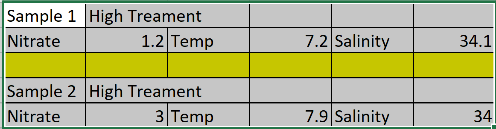{width="100%"}

:::

::: {.column width="35%"}

::: {.fragment}

{width="100%"}

:::

:::

:::

## Metadata {.inverse .center .middle}

## What is metadata?

Metadata is simply data about **data** — a description and context of the data that helps you organize, find, and understand it.

::: {.incremental}

- Title and description
- Tags and categories
- Who created or collected the data, and when
- Who last modified it, and when
- Who can access or update it
- Units of measurement for each parameter
- Notes associated with the collection

:::

::: {style="font-size: 0.7em; margin-top: 0.5em;"}
Source: [dataedo.com/kb/data-glossary/what-is-metadata](https://dataedo.com/kb/data-glossary/what-is-metadata)
:::

## We use metadata in our everyday lives

::: {.columns}

::: {.column width="33%"}

::: {.fragment}

{width="100%"}

:::

:::

::: {.column width="33%"}

::: {.fragment}

{width="100%"}

:::

:::

::: {.column width="33%"}

::: {.fragment}

{width="100%"}

:::

:::

:::

## What metadata is required for your research?

### Required metadata for different biological databases

::: {.incremental}

- **BCO-DMO** (oceanographic data): [Dataset metadata form](https://www.bco-dmo.org/files/bcodmo/DATASET.rtf)
- **NCBI** (sequence data/GenBank): [GenBank metadata](https://www.ncbi.nlm.nih.gov/genbank/structuredcomment/)
- **EML** (ecological metadata): [EML Guide](https://nceas.github.io/oss-lessons/ecological-metadata/ecological-metadata.html)

:::

::: {.fragment}

::: {.callout-tip}
## Make metadata a habit
Record metadata every time you collect data — it is much harder to reconstruct it later.
:::

:::

## Field & lab data sheets {.inverse .center .middle}

## Creating a good data collecting sheet

::: {.columns}

::: {.column width="55%"}

A good field/lab data sheet answers:

::: {.incremental}

1. How easy is it to read in the field?
2. Are column and row definitions clear?
3. Is there metadata?
4. How similar is it to your data entry sheet?
5. Can you use it at **4am** in the rain?

:::

:::

::: {.column width="45%"}

::: {.fragment}

{width="100%"}

:::

:::

:::

## Making a data sheet for the field/lab

::: {.incremental}

- **Font size matters** — can you read it easily outside?
- **Bold** key labels and headers
- Have well-defined lines and enough writing space
- Record: **who**, **when**, and **where** data were taken
- Does the sheet fit on one page?
- Landscape or portrait — which makes more sense?
- **Print it and check** before finalizing

:::

## Field Data Sheet Examples

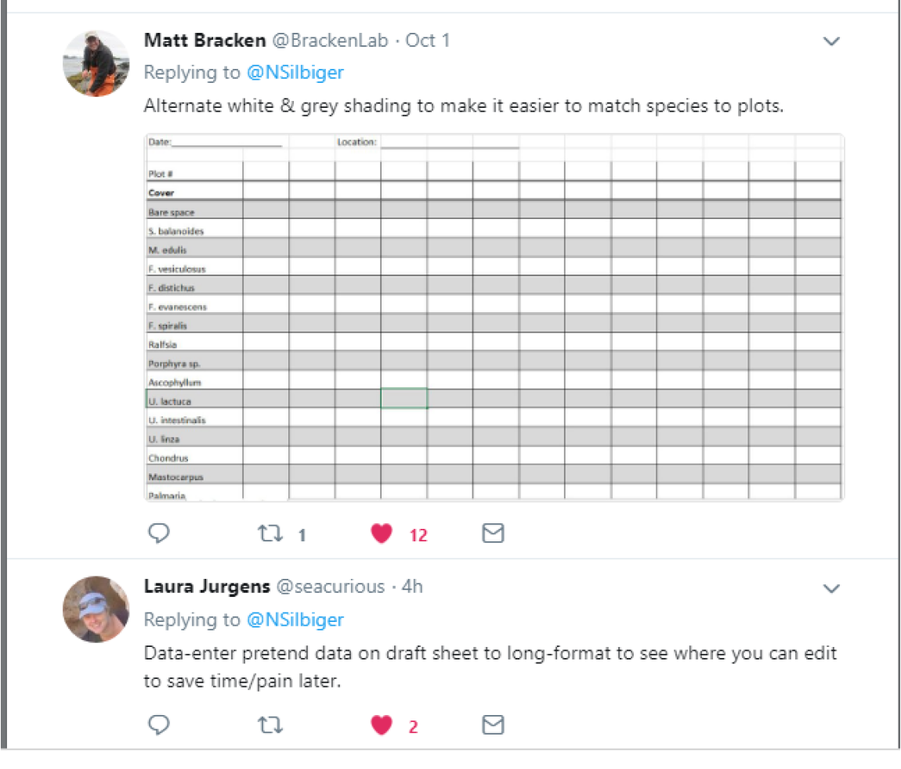{fig-align="center" width="85%"}

## Field Data Sheet Examples

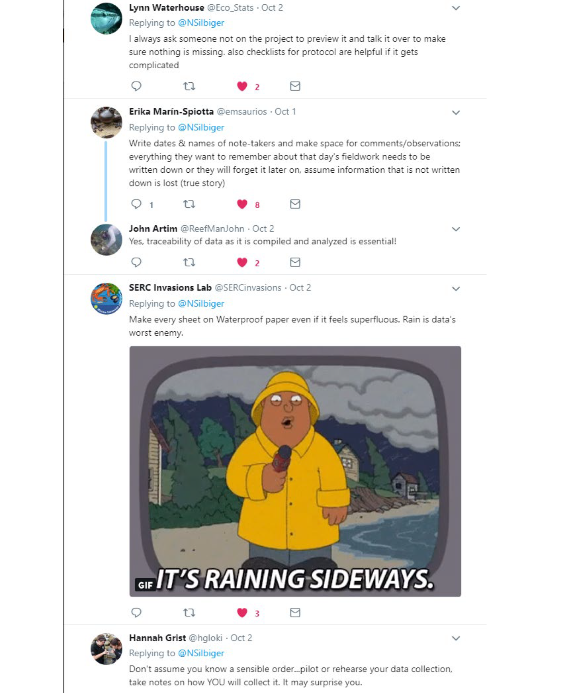{fig-align="center" width="85%"}

## NOT good field or lab data sheets

::: {.columns}

::: {.column width="50%"}

{width="80%" fig-align="center"}

:::

::: {.column width="50%"}

{width="80%" fig-align="center"}

:::

:::

::: {.callout-warning}
## Always keep a hard copy
Loose notes get lost, wet, or destroyed. Always keep an original hard copy of your data.
:::

## Spreadsheets for analysis {.inverse .center .middle}

## Creating good spreadsheets for analysis

### Tips from Broman and Woo (2018)

::: {.columns}

::: {.column width="50%"}

::: {.incremental}

1. Be consistent
2. Choose good names
3. Write dates as YYYY-MM-DD
4. No empty cells
5. Put one thing in each cell
6. Make it a rectangle

:::

:::

::: {.column width="50%"}

::: {.incremental}

7. Create a data dictionary
8. No calculations in the raw data file
9. Do not use color or highlights
10. Make back-ups
11. Use data validation to avoid errors
12. Save as plain text

:::

:::

:::

## 1. Be consistent — terminology & names

::: {.incremental}

**Terminology:** use the same terms throughout
- ✅ male/female; m/f; Male/Female — pick one and stick with it
- ❌ Male/female; M/female — mixing causes silent errors in R

**Variable names:** use the same format throughout
- ✅ `High_treatment` / `Low_treatment`
- ❌ `High_treatment` / `Treatment_14C`

:::

## 1. Be consistent — spaces & file names

::: {.incremental}

**Watch for invisible spaces!** (I always copy-paste instead of retyping)
- ❌ `"Site A"` vs `" Site A"` vs `"Site A "` — R treats these as three different values

**File names:** use a consistent convention
- ✅ `CondData_S32_011721.csv` / `CondData_S32_011821.csv`
- ❌ `S32_CondSensor_011821` / `CondData_S32_011921.csv`

:::

## 2. Choose good names

::: {.columns}

::: {.column width="55%"}

### Avoid spaces in names
- `Site_1` is best (also `Site.1`, `Site1`)
- Spaces at start/end are **invisible** but break code: `"high"` ≠ `" high"`

### No special characters
- ❌ `$  @  %  #  &  *  (  )  !  /`
- These have special meanings in R and will cause errors

Keep names **short but meaningful**

:::

::: {.column width="45%"}

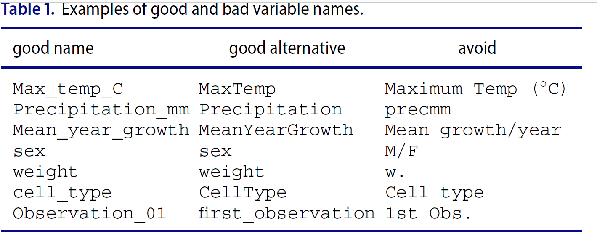{width="100%"}

:::

:::

## Never name a document "final"... it is a curse.

{fig-align="center" width="45%"}

## 3. Write dates in ISO 8601 format

### YYYY-MM-DD (e.g., 2026-01-23)

::: {.columns}

::: {.column width="50%"}

Excel makes dangerous mistakes with dates — ISO 8601 is the only safe standard.

{width="90%"}

:::

::: {.column width="50%"}

::: {.fragment}

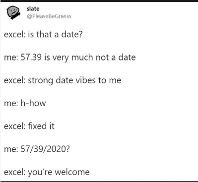{width="90%"}

:::

::: {.fragment}

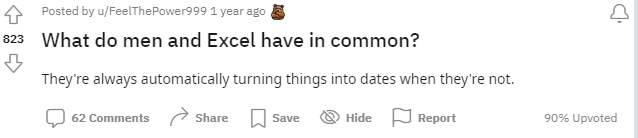{width="90%"}

:::

:::

:::

## 4. No empty cells &nbsp;&nbsp; 5. One thing per cell

::: {.columns}

::: {.column width="50%"}

### 4. No empty cells

::: {.incremental}

- Missing data ≠ zero
- Missing value → write **`NA`**
- Zero counts → write **`0`**
- Never leave a cell blank

:::

:::

::: {.column width="50%"}

### 5. One thing per cell

::: {.incremental}

- Plate-well `"13-A01"` → two columns: `plate = 13`, `well = A01`
- Don't put units in data cells — use a data dictionary
- Don't mix notes with data — add a separate notes column

:::

:::

:::

## 6. Make your spreadsheet a rectangle

Every row = one observation &nbsp; | &nbsp; Every column = one variable

::: {.columns}

::: {.column width="50%"}

::: {.fragment}

**❌ Bad:**

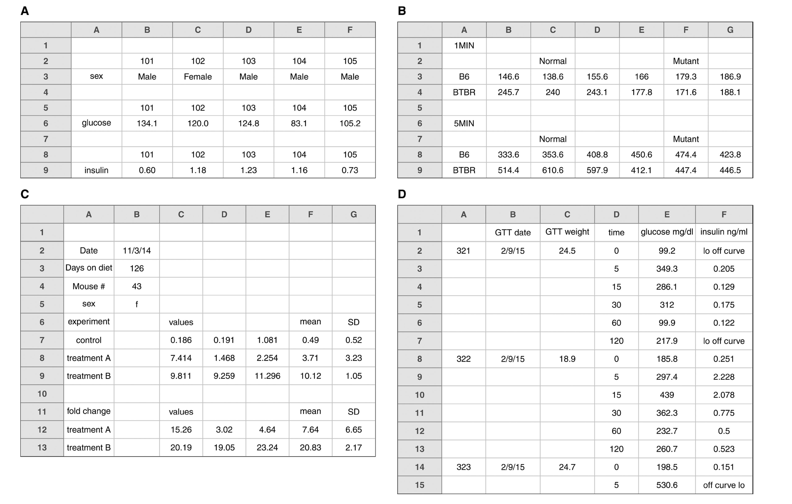{width="95%"}

:::

:::

::: {.column width="50%"}

::: {.fragment}

**✅ Good:**

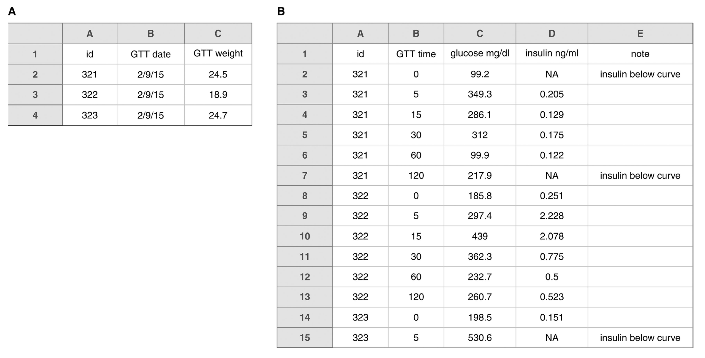{width="95%"}

Multiple rectangles → separate sheets.

:::

:::

:::

## 7. Make a data dictionary

::: {.columns}

::: {.column width="45%"}

### Metadata for your datasheet

It should contain (at minimum):

::: {.incremental}

- **Exact variable name** as in the data file
- A **"pretty name"** for visualizations
- A **description** of the variable
- The **measurement units**

:::

:::

::: {.column width="55%"}

::: {.fragment}

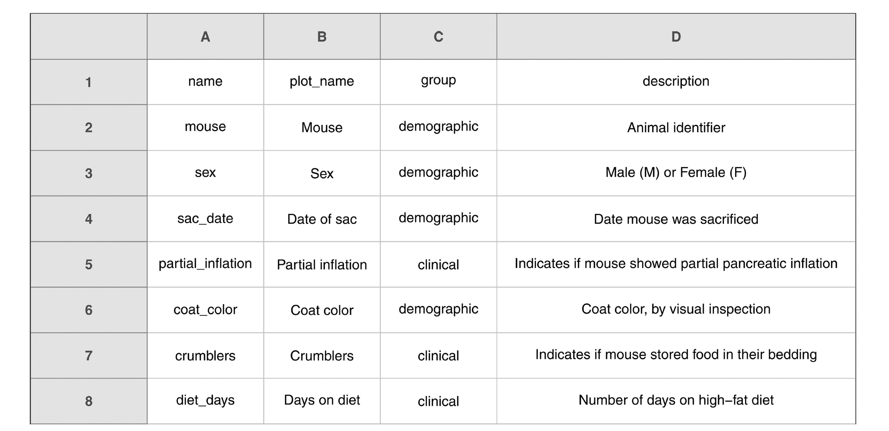{width="100%"}

:::

:::

:::

## 8. NO calculations in your spreadsheets

::: {.columns}

::: {.column width="55%"}

::: {.callout-warning}
## Not transparent data analysis
Once saved as `.csv`, all formulas are gone — leaving numbers you cannot trace.
:::

::: {.incremental}

- Hidden calculations cause major, hard-to-find errors
- **All calculations must live in your R script**

:::

:::

::: {.column width="45%"}

::: {.fragment}

{width="100%"}

:::

:::

:::

## 9. Do not use highlight or colors

::: {.columns}

::: {.column width="60%"}

Color and highlighting are **lost** when you save as `.csv`.

### Ex. outlier highlighted (left) vs. what you should do (right):

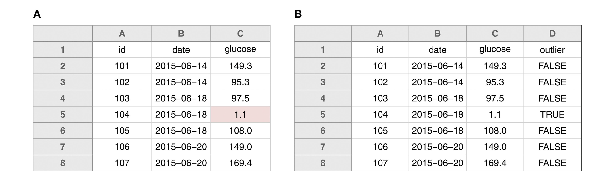{width="100%"}

:::

::: {.column width="40%"}

::: {.fragment}

::: {.callout-tip}
## The right way to flag outliers
Add a `notes` or `flag` column and record your concern in text.

e.g. `"possible outlier, sensor malfunction"`
:::

:::

:::

:::

## 10. Make back-ups!!

::: {.columns}

::: {.column width="55%"}

### We will cover GitHub next week.

Consider also: Box, Dropbox, or Google Drive.

**Never have your only copy on your hard drive.**

This actually happened to me...

:::

::: {.column width="45%"}

{width="100%"}

:::

:::

## 11. Use data validation to avoid errors

::: {.columns}

::: {.column width="55%"}

In Excel: **Data → Validation**

::: {.incremental}

Choose appropriate criteria:
- A whole number within a range
- A decimal number within a range
- A list of allowed values
- Text with a length limit

An error pops up immediately if a value is outside the range.

:::

:::

::: {.column width="45%"}

::: {.fragment}

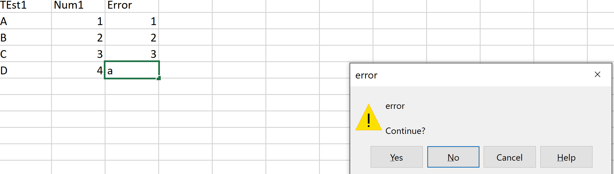{width="100%"}

:::

:::

:::

## 12. Save data as plain text

::: {.columns}

::: {.column width="60%"}

::: {.incremental}

- Always save as **`.csv`** (comma-separated values)
- Non-proprietary — opens in any program, on any computer
- R reads `.csv` files natively with `read_csv()`

:::

:::

::: {.column width="40%"}

{width="100%"}

:::

:::

## What is wrong with this data sheet? {.inverse .center .middle}

## What is wrong with this data sheet?

{fig-align="center" width="88%"}

## What is wrong with this data sheet?

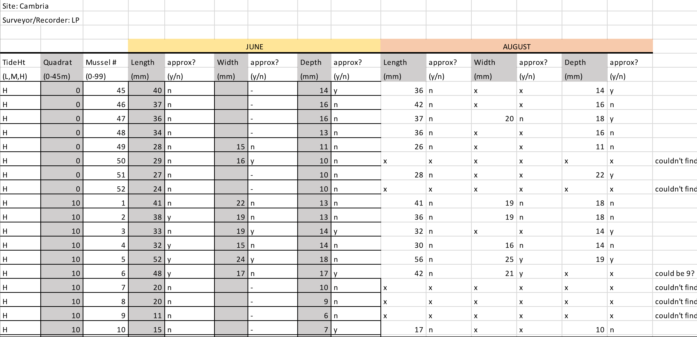{fig-align="center" width="80%"}

## What about this one?

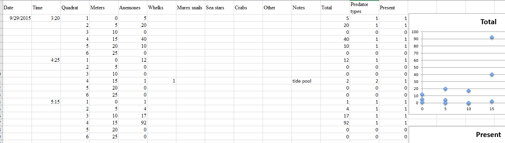{fig-align="center" width="88%"}

## Homework {.center .middle}

For homework, you will make a **field sheet**, a **lab data sheet**, and **metadata (data dictionary)**.

Read through the directions in the attached PDF on Lamakū carefully.

**Due before class on Tuesday.**

## Thanks! {.center .middle}

Slides created via [**Quarto**](https://quarto.org/)
