```{r setup, include=FALSE}
options(htmltools.dir.version = FALSE, htmltools.preserve.raw = FALSE)
library(tidyverse)
```

## Outline of class

1. Quiz!
2. Share your data sheets
3. What is reproducible science?
4. Open science: Should data and protocols be public?
5. Tools for reproducible science:
   - RStudio
   - GitHub

## Reproducibility — what is it?

::: {.fragment}
### "U.S. National Science Foundation (NSF) subcommittee on replicability in science: 'reproducibility refers to the **ability of a researcher to duplicate the results of a prior study using the same materials as were used by the original investigator.'**"

{fig-align="center" width="80%"}

<small><em>Goodman et al., Science Translational Medicine 01 Jun 2016: Vol. 8, Issue 341, pp. 341ps12. DOI: 10.1126/scitranslmed.aaf5027</em></small>
:::

## We are in a reproducibility crisis in science

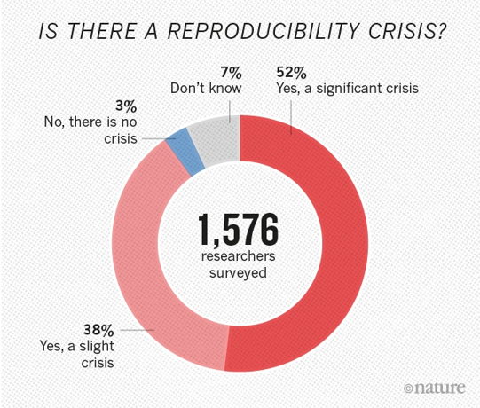{fig-align="center"}

<small><em>Monya Baker (2016). 1500 scientists lift the lid on reproducibility. Nature 533 (7604).</em></small>

## Types of reproducibility

<small><em>From Victoria Stodden (as summarized in the ROpenSci Reproducibility Guide)</em></small>

::: {.fragment}
"**Computational reproducibility**: when detailed information is provided about code, software, hardware and implementation details."
:::

::: {.fragment}
"**Empirical reproducibility**: when detailed information is provided about non-computational empirical scientific experiments and observations. In practice this is enabled by making data freely available, as well as details of how the data was collected."
:::

::: {.fragment}
"**Statistical reproducibility**: when detailed information is provided about the choice of statistical tests, model parameters, threshold values, etc. This mostly relates to pre-registration of study design to prevent p-value hacking and other manipulations."
:::

## Is this how you have been working?

### If so, that's ok! Let's learn together.

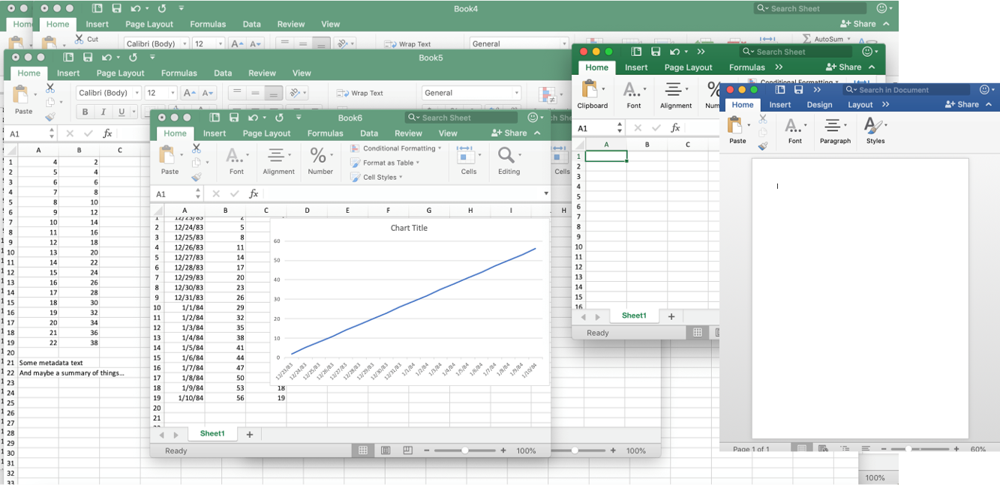{fig-align="center"}

## What about this workflow makes it hard to reproduce?

{fig-align="center"}

## A few areas for improvement

::: {.incremental}
- No clear or organized history of what's been done to the data from raw data through final figures/results
- Lack of comments/annotation describing the steps
- Tedious & time consuming for a collaborator to recreate the analyses
- Backed up w/version control? Probably not…
- How do we transfer this into a final report or presentation? Is that reproducible?
- Note all the slides I make for this class are.... in R!
:::

::: {.fragment}
{fig-align="center"}
:::

## Why does this matter?

Say I've been **arrested for a murder** that was committed 6 months ago. My attorney says it's very important to remember exactly what I did on the day of the murder to establish an alibi. I try my best to remember, and come up with this diagram describing my day:

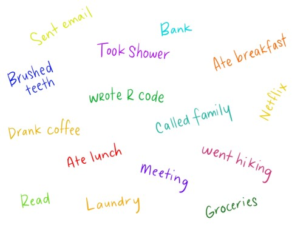{fig-align="center"}

## My attorney is like "bummer..."

{fig-align="center" width="35%"}

## I wrack my brain and come up with this order of things:

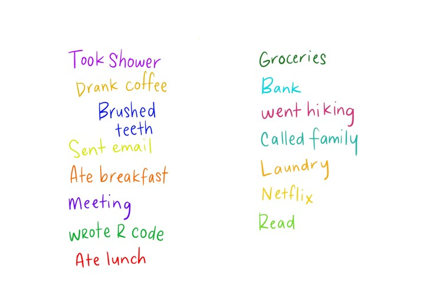{fig-align="center" width="30%"}

<small><em>Still not great...</em></small>

## But then! I remember I had a datebook with all this information...

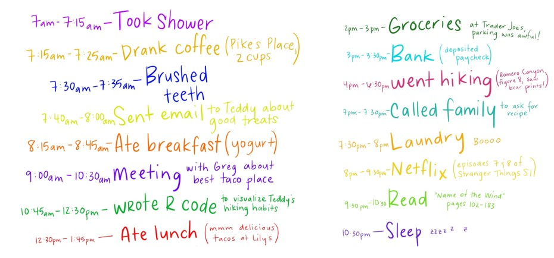{fig-align="center"}

{fig-align="center" width="25%"}

## Do your **Data Sci** like it is going to need an **alibi**.

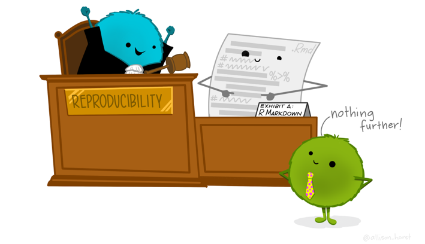{fig-align="center"}

## With data that looks something like...

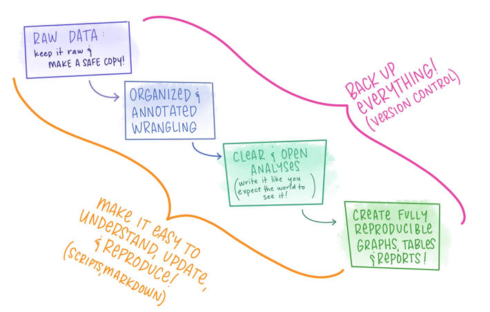{fig-align="center"}

## The workflow we will grow in this class...

*We will do everything in **well-annotated, organized scripts** that contain streamlined and easy-to-follow records of our entire analyses from **raw data** through **final reports**, with **unbreakable file paths** and with **a complete history** of changes made.*

## The workflow we will grow in this class... (continued)

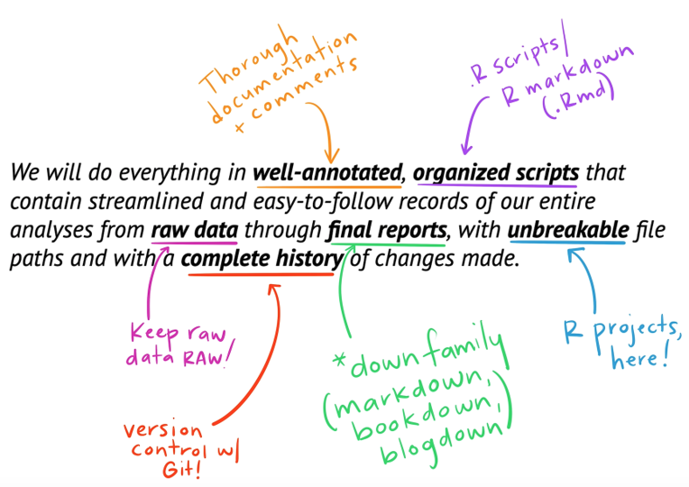{fig-align="center"}

## But first, why open science is best science

{fig-align="center"}

## Open Science

::: {.center}
### *"Open science is not just about improving the way we share data and methods; it is also about improving the way we think, work and interact with each other. It's about technology enabling social infrastructure that can promote inclusivity to create kinder science."*
:::

<small><em>[Open Software Means Kinder Science. By Julia Stewart Lowndes on December 10, 2019](https://blogs.scientificamerican.com/observations/open-software-means-kinder-science/)</em></small>

## Open Science (continued)

### One scientist can only do so much
- More data = more Power

::: {.fragment}
### Science must be reproducible
:::

::: {.fragment}
### Who paid for this data collection?
- If on federal or state grant then the tax payers paid for your data
:::

::: {.fragment}
### "Better and kinder science, done in less time and done together." - Julie Lowndes
:::

## Examples of #OpenScience

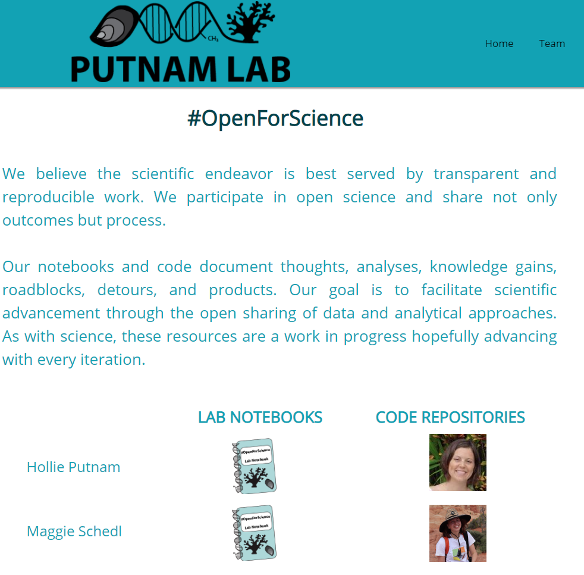{fig-align="center" width="50%"}

## Examples of #OpenScience (continued)

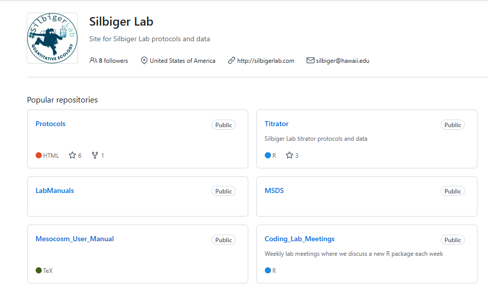{fig-align="center"}

## Why some people are scared....

::: {.columns}

::: {.column width="50%"}
{width="100%"}
:::

::: {.column width="50%"}
{width="100%"}
:::

:::

::: {.center}
Work together, advance science, and don't waste time and money
:::

## FAIR and CARE principles

{fig-align="center"}

## CARE principles for Indigenous Data Governance

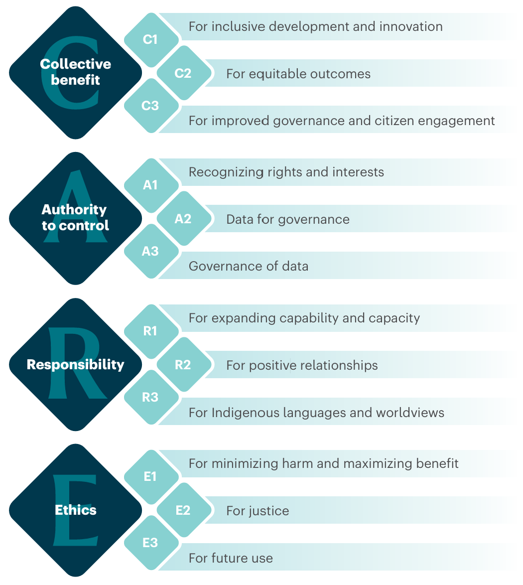{fig-align="center" width="45%"}

Jennings et al. 2023

## CARE principles, close to home

CARE stands for **Collective Benefit, Authority to Control, Responsibility,** and **Ethics** — a complement to FAIR that centers the rights and interests of the people data is *about*, not just those reusing it.

::: {.incremental}
- **Collective Benefit**: data ecosystems should be designed to benefit Indigenous communities, not just researchers or institutions
- **Authority to Control**: Native Hawaiian communities and organizations (e.g., DAR, DHHL, community-based monitoring groups) have the right to govern data about their ʻāina, moʻolelo, and resources
- **Responsibility**: researchers must build relationships that support the self-determination of Kānaka Maoli and local communities before, during, and after data collection
- **Ethics**: data practices should reduce harm and actively consider Native Hawaiian and Pacific values, not just legal compliance
:::

## CARE in practice, here in Hawaiʻi

::: {.callout-note}
## Data governance is already happening locally
**DHHL** and **OHA** maintain their own protocols for who can access and use data about Native Hawaiian beneficiaries, lands, and resources — a real-world example of Authority to Control. If your research touches Hawaiian Home Lands, ceded lands, or Kānaka Maoli communities, identify and respect these structures **before** you collect a single data point.
:::

::: {.fragment}
::: {.callout-tip}
## Why this matters for your Community Data Sprint
Working with DAR, DOH, or a Mālama restoration group in Week 8 means handling data tied to a specific place and community. CARE asks who benefits, who decides, and who's accountable — not just whether the data is technically open.
:::
:::

## Our tools this semester for open and reproducible science

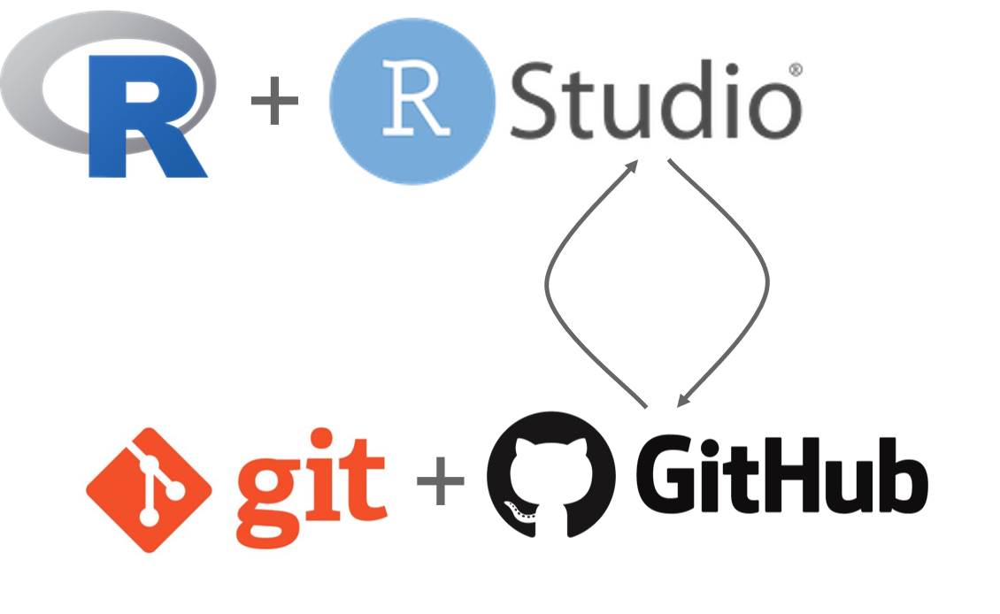{fig-align="center"}

## Git and GitHub

Why use it?

Do you have a folder for your research project that looks like this?

::: {.center}
{fig-align="center" width="70%"}
:::

## Git and GitHub solve this problem

### Git
- Git is a distributed version control system.
- Imagine if Dropbox (saving info on the cloud) and "Track changes" from MS word had a baby. Git would be that baby.
- But, it's even better because Git is optimized for the things that data scientists spend a lot of time working on (e.g., code)
- There is a learning curve, but I promise you it is worth it.

::: {.fragment}
### GitHub
- Git and GitHub are two different things.
- GitHub is an online hosting platform that provides an array of services that are built on the Git system. (There are also other platforms like Bitbucket and GitLab)
- Just like we don't *need* RStudio to run R code, we don't *need* GitHub to use Git... but it will make our lives a lot easier

<small><em>https://raw.githack.com/uo-ec607/lectures/master/02-git/02-Git.html</em></small>
:::

## From software development...

Git and GitHub play a big role in global software development.

- There is a high probability that your fave app., program or package is built using Git-based tools (RStudio is).

::: {.fragment}
### ... to scientific research
- Git and GitHub help operationalise the ideals of open science and reproducibility
- Journals have increasingly strict requirements regarding reproducibility and data access. GH makes this easy (DOI integration, off-the-shelf licenses, etc.)
- I host all my code, data for my research papers, and research protocols on GH.
- GH helps us to collaborate with others and, most importantly, **your future self.**
:::

## Git and RStudio work well together

We will start with Rprojects to keep organized.

::: {.center}
{width="45%"}
:::

## We will make our first repository together

## Create a GitHub account

Go to [https://github.com/](https://github.com/)

- Click Sign-up and follow directions
- [Advice for your username](https://happygitwithr.com/github-acct.html)
- GitHub now **requires two-factor authentication (2FA)** on all accounts — have your phone or an authenticator app ready during sign-up

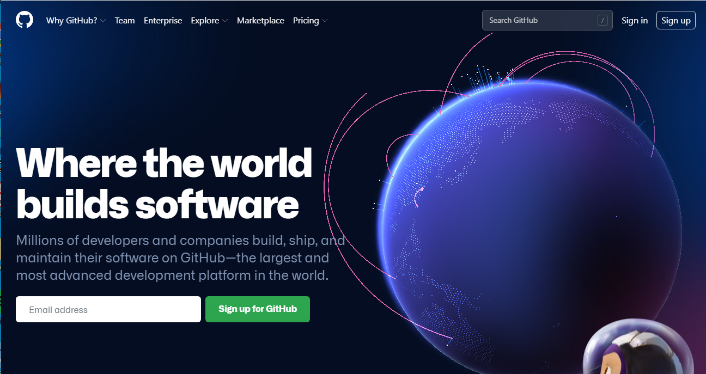{fig-align="center"}

## Install git

Follow the directions here from the "Install git" and "Introduce yourself to Git" chapters:

- [https://happygitwithr.com/install-git.html](https://happygitwithr.com/install-git.html)

- NOTE: When you get to the part where you create a Personal Access Token, make sure that all boxes are clicked and that you set the expiration date to never (the very first drop down menu). If you keep the default (30 days), it will stop working in the middle of the semester.

- This may take a while if you are completely new. That is OK! We are here to help.

- One common issue to look out for... "Support for password authentication was removed!"
- If this happens to you at any time, follow the directions [here](https://happygitwithr.com/https-pat.html)

## First, sign into GitHub and we will create a new repository

- Press the new button

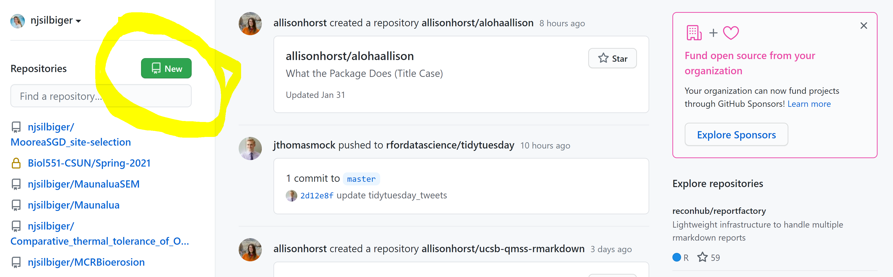{fig-align="center"}

## We are going to make a test repo

- Fill in the name and description
- Click "add ReadMe"

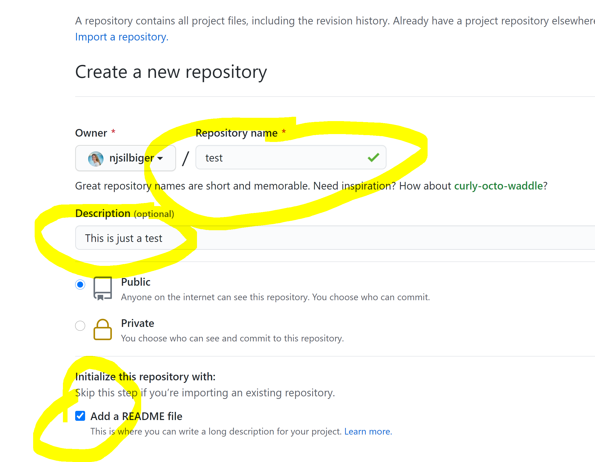{fig-align="center" width="75%"}

## Here is your empty repo

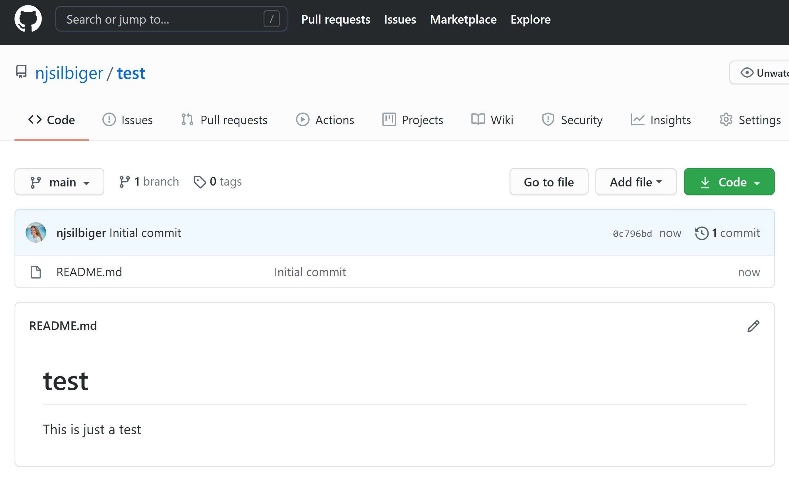{fig-align="center"}

## "Clone it" and bring it into RStudio

- Click the green "code" button
- Click the clipboard to copy the link

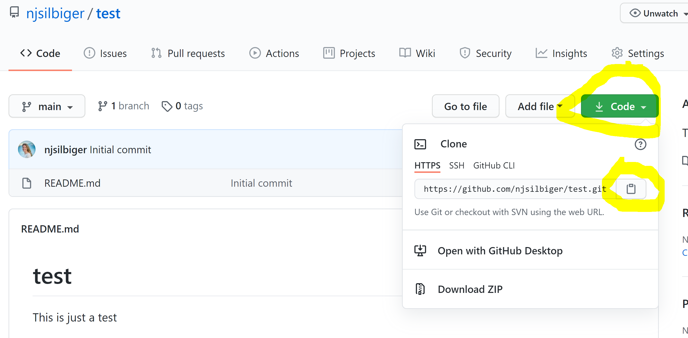{fig-align="center"}

## Open RStudio

- Click the carrot on the top right

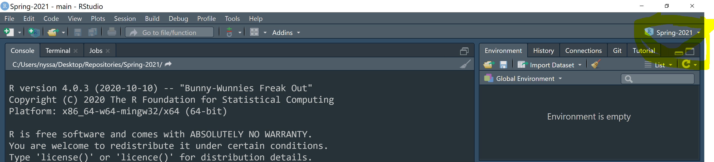{fig-align="center"}

- Click New project

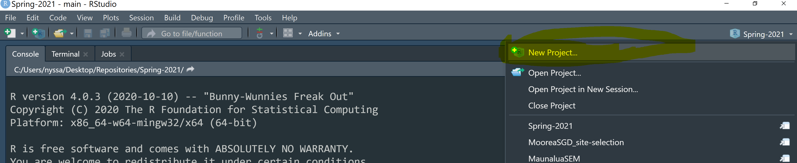{fig-align="center"}

## Create a version controlled project

- Click Version control

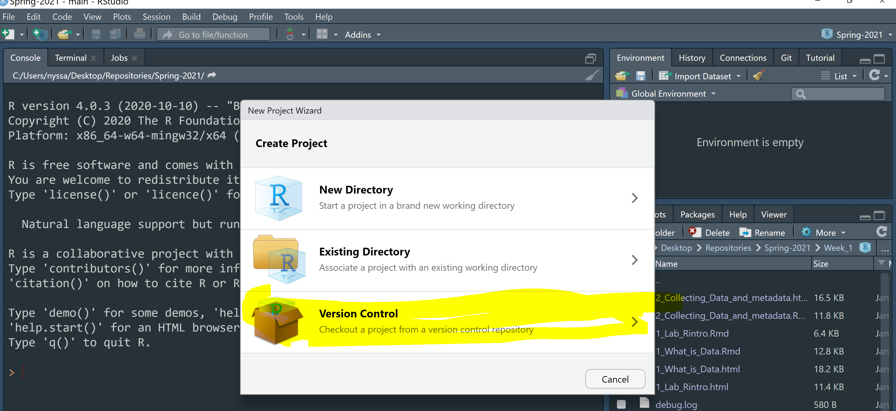{fig-align="center"}

## Create a version controlled project (continued)

- Click Git

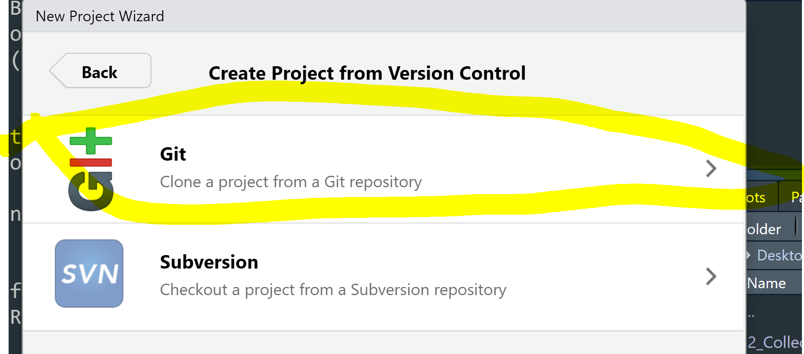{fig-align="center"}

## Create a version controlled project (continued 2)

- Paste the url that you copied from GitHub
- Decide where you want it to live on your computer
- Click Create Project

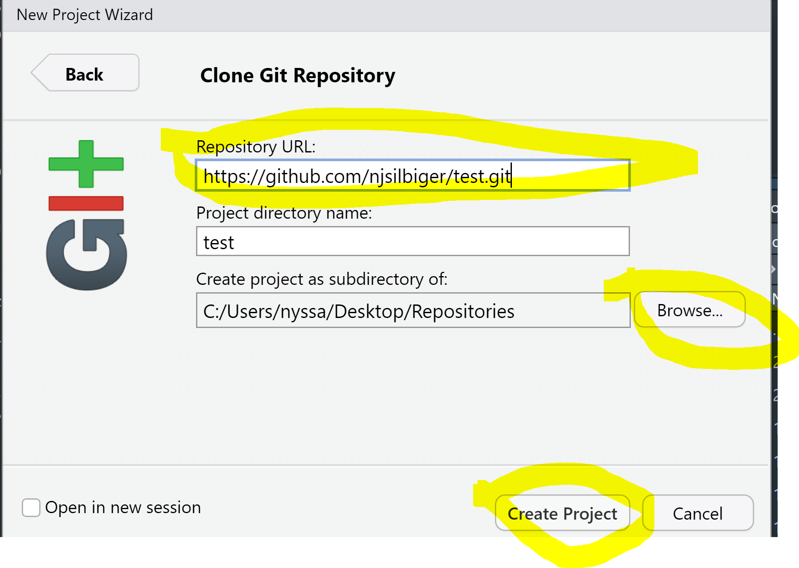{fig-align="center"}

## You have a version-controlled project!

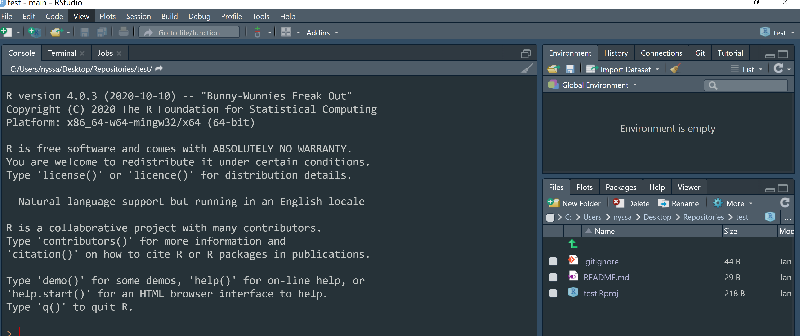{fig-align="center"}

{fig-align="center" width="50%"}

## So, now what....

### Most important things to know to version-control your repository

### P
### A
### C
### P

## So, now what.... (continued)

### Most important things to know to version-control your repository

### Pull
### Add
### Commit
### Push

## So, now what.... (continued 2)

### Most important things to know to version-control your repository

### Pull (please)
### Add (always)
### Commit (carry)
### Push (pizza)

## Most important commands

**Pull** - `git pull` — this "downloads" any changes to your repository on GitHub, by your collaborators, or your past self on a different machine. (always do this first! You may have forgotten that you made a change.)

::: {.fragment}
**Add** - `git add` — this stages files. It tells git, "I want to add these to the repository"
:::

::: {.fragment}
**Commit** - `git commit` — this "saves" your changes with git (as opposed to ctrl+S which saves them to your local machine – although you should still do that too)
:::

::: {.fragment}
- git commit always requires a message so that you know what changes you made.
- ex: `git commit -a -m "I created a test repo"`
- "-a" means commit all (every change) "-m" means (I am adding a message). What you have in quotes is your message.
:::

::: {.fragment}
**Push** - `git push` — this "uploads" your changes to GitHub.
:::

## Work with git in the terminal

::: {.incremental}
- First, let's create and save a simple script (save it as "testscript.R")
- Now, let's save it to git
- Click on the terminal tab (next to console). This allows you to interact directly with your terminal
- Type "git pull" (it should say already up to date because you have not done anything yet)
- Type `git add testscript.R` (this stages the new script)
- Type `git commit -a -m "I am adding testscript"`
- Type `git push`
  - you may get prompted for your username and password
:::

## What it should look like

Check GitHub and see if it is there!

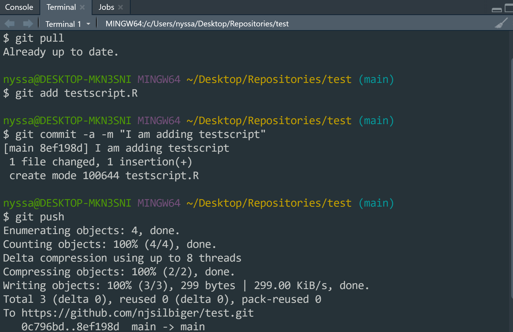{fig-align="center"}

## Let's do the same thing by clicking buttons

- Make a new script (testscript2.R)

Find the git tab on the right-hand side

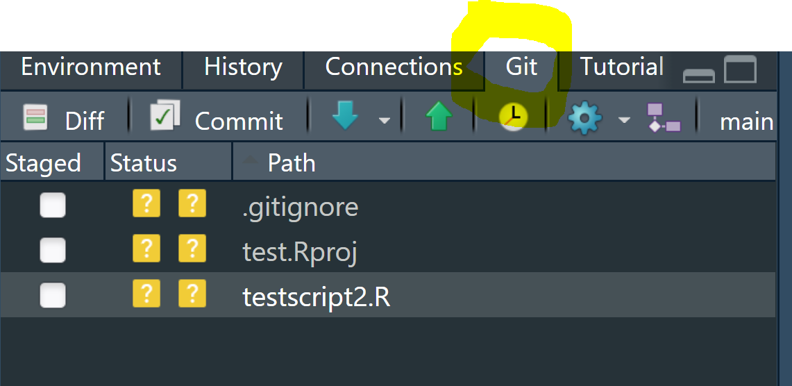{fig-align="center"}

## Let's do the same thing by clicking buttons (continued)

- Check the box next to testscript2.R (this adds it -- once you add a script, you never have to add it again. Only commit new changes)

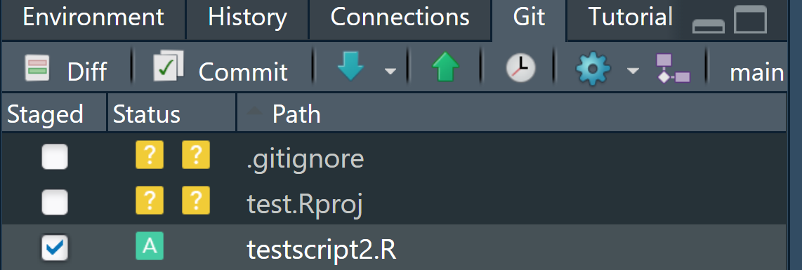{fig-align="center"}

::: {.fragment}
- Click commit and add a message
:::

## Click commit and add a message

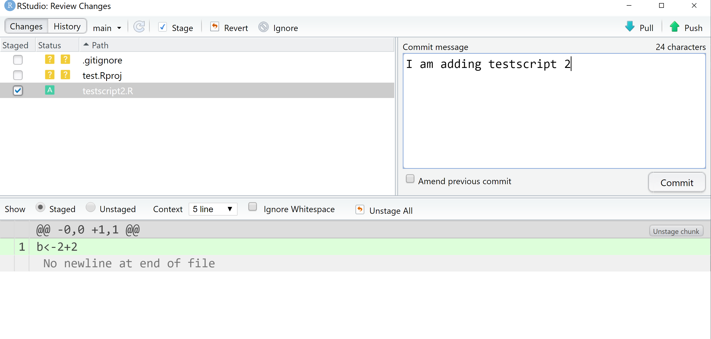{fig-align="center"}

- Press commit and when it is done hit close and exit out
- Next hit "push"
- When it is done close it. You should no longer see "testscript2.R" in the upper right-hand side.
- Check GitHub! (Don't forget to refresh the webpage)

## Make some changes!

- Let's make some changes to testscript.R
- Add any code you want to it, commit it (with a message), and push it
- Click history (the clock on the top) to see what changes were made and by who

## Oh no!

- You notice that your cat walked across the screen totally screwed up your code. Oh no!

{fig-align="center" width="50%"}

- It's ok... you can revert it
- Click the blue wheel and then revert
- Note: commit often (it will only revert back to the last commit you made. This is like pressing the save button. Do it with every major change to your script.)

## Delete this test repository

- Click settings and scroll all the way to the bottom ('Danger Zone') and delete repository and follow directions

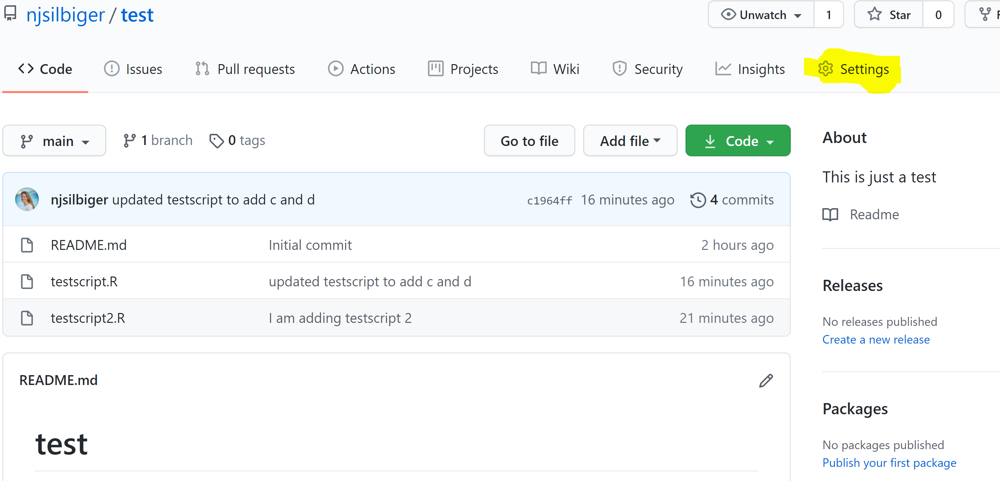{fig-align="center"}

## Online class

- We will learn about proper file structure and how to set-up a transparent script.
- Send me your git username in Slack **right now**.

## {.center .middle}

# Thanks!

Slides created via [**Quarto**](https://quarto.org/)

Some slides modified from Allison Horst, Jarret Byrnes
