```{r setup, include=FALSE}
options(htmltools.dir.version = FALSE)
library(tidyverse)
library(palmerpenguins)
# Loaded here (rather than only inside their eval=FALSE demo chunks) so that
# deployment dependency scanners (e.g. rsconnect) reliably detect and bundle
# them -- they are still executed later via ref.label in the Jitter/Density
# plot slides.
library(ggbeeswarm)
library(ggridges)
```

## Outline of class

1. Quiz 2!

1. Go over some readme files

1. Responsible plotting

1. Intro to ggplot2

1. Make your first plot

## Review

What are the 5 sections you should always have in your scripts?

## Why you should always look at your data

We have to really understand our data to be able to decide on the appropriate analyses to answer our research questions. It can also lead to unexpected & interesting research questions. That requires first **looking** at your data, usually in a number of ways, to ask questions like:

::: {.incremental}
- Are there interesting patterns, groups, trends or relationships?
- How are observations distributed?
- Are there outliers?
- Is there notable bias in observations or missing observations?
:::

::: {.fragment}
**When do I need to look at my data and think about it really hard before analyzing it?**
:::

::: {.fragment}
***EVERY TIME***
:::

::: {.fragment}
**When can I just make assumptions about the data and some some regression or hypothesis testing or anything else without exploring it?**
:::

::: {.fragment}
***NEVER***
:::

## Start exploring with visualizations that don't hide or assume anything about the data

::: {.center}
{fig-align="center" width="50%"}
:::

## For continuous (measured) observations you might start with:

- Jitter plots (if logical groups exist)  
- Beeswarm plots (ggbeeswarm)  
- Scatterplots (2 variables, or map additional)  
- Histograms or density plots  
- More variables: map w/ colors, size?

## Jitter plots:   
Show values of observations within a group, adding some amount of “jitter” so that they don’t all overlap 

::: {.columns}

::: {.column width="50%"}
```{r, plot-label, eval=FALSE, echo=TRUE, warning=FALSE, message=FALSE, results = 'hide'}
library(tidyverse)
ggplot(chickwts, aes(x = feed, y = weight))+
  geom_jitter(aes(color = feed),
              alpha = 0.4,
              width = 0.1,
              height = 0,
              size = 3,
              show.legend = FALSE)+
  scale_color_brewer(palette = "Dark2")+
  theme_light()
```
:::

::: {.column width="50%"}
```{r plot-label-out, ref.label="plot-label", echo=FALSE, warning=FALSE, message=FALSE}
```
:::

:::

## Swarm plots:   
Show values of observations within a group, with amount of jitter dependent on density around values

::: {.columns}

::: {.column width="50%"}
```{r, plot-label2, eval=FALSE, echo=TRUE, warning=FALSE, message=FALSE}
library(ggbeeswarm)
ggplot(iris, aes(x = Species, y = Petal.Length))+
  geom_jitter(aes(color = Species),
              alpha = 0.5,
              show.legend = FALSE)+
  scale_color_manual(values = c("purple",
                                "black",
                                "orange"))+
  theme_minimal()+
  labs(y = "Petal Length (cm)")
```
:::

::: {.column width="50%"}
```{r plot-label2-out, ref.label="plot-label2", echo=FALSE, warning=FALSE, message=FALSE}
```
:::

:::

## Density plots:   
Show values of observations within a group

::: {.columns}

::: {.column width="50%"}
```{r, plot-label2b, eval=FALSE, echo=TRUE, warning=FALSE, message=FALSE}
library(ggridges)
ggplot(iris, aes(y = Species, x = Petal.Length))+
  geom_density_ridges(aes(fill = Species),
              alpha = 0.5,
              show.legend = FALSE)+
  scale_fill_manual(values = c("purple",
                                "black",
                                "orange"))+
  theme_minimal()+
  labs(x = "Petal Length (cm)")
```
:::

::: {.column width="50%"}
```{r plot-label2b-out, ref.label="plot-label2b", echo=FALSE, warning=FALSE, message=FALSE}
```
:::

:::


## Scatter plots:
Show relationship between two measured variables

::: {.columns}

::: {.column width="50%"}
```{r, plot-label3, eval=FALSE, echo=TRUE, warning=FALSE, message=FALSE}
ggplot(faithful, aes(x = waiting, y = eruptions))+
  geom_point(aes(color = eruptions),
             show.legend = FALSE,
             size=2)+
  scale_color_gradient(low = "black",
                       high = "purple")+
  theme_bw()+
  labs(x = "Waiting time (min)",
       y = "Eruption duration (min)",
       title = "Old Faithful eruption patterns")
```
:::

::: {.column width="50%"}
```{r plot-label3-out, ref.label="plot-label3", echo=FALSE, warning=FALSE, message=FALSE}
```
:::

:::

## Website with other ways to visualize the same data

[Beyond Bar and Boxplots/](https://z3tt.github.io/beyond-bar-and-box-plots/)


## Why can’t we just look at summary statistics?

::: {.center}
{fig-align="center" width="70%"}
:::

## Why can’t we just look at summary statistics?

{fig-align="center" width="70%"}

#### Summary statistics hide important information!!

<small><em>Originally created by Alberto Cairo in [Download the Datasaurus: Never trust summary statistics alone; always visualize your data](http://www.thefunctionalart.com/2016/08/download-datasaurus-never-trust-summary.html)</em></small>

## Don't hide your data 

Weissgerber TL, Milic NM, Winham SJ, Garovic VD (2015) **Beyond Bar and Line Graphs: Time for a New Data Presentation Paradigm.** PLoS Biol 13(4): e1002128. https://doi.org/10.1371/journal.pbio.1002128  


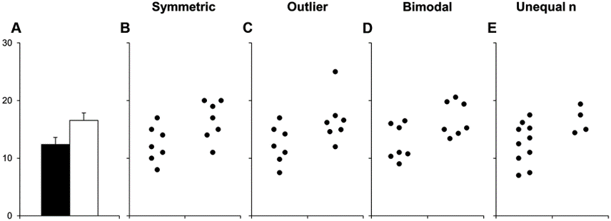

Would you draw the same conclusions with each of these datasets?

## The hierarchy of data viz 

1. Is it **correct**?

1. Is it **clear**?

1. Does it communicate data **responsibly**?

1. Does it look **awesome**?

## 1. Is it **correct**?

::: {.incremental}
- Observations and experimental design
- Avoid data wrangling and calculation mistakes
  - Keep raw data raw
  - Check...check.. quadruple check data wrangling/cleaning
  - Look at your data frames at every step
  - Compare your outcomes to expected results
  - Reproducibility and detailed annotation
  - Get an outside reviewer to check your code
- Units/labels
:::

## 2. Is it **clear**?

::: {.incremental}
- Too many points, variables, or series
- Overwhelming legends
- Lack of useful emphasis
- Are things put in context?
- Is it a pie graph? (Don't do it)
- Overmapping aesthetics
- Is it 3D? (please no)
:::

## Too many points, variables or series

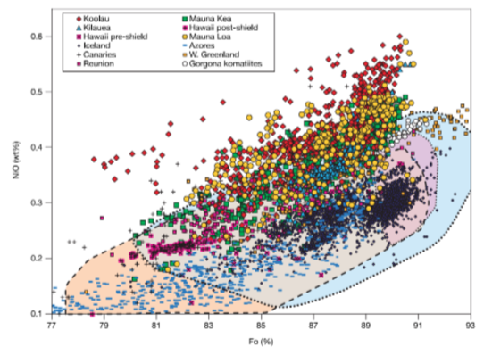

## Too many everything

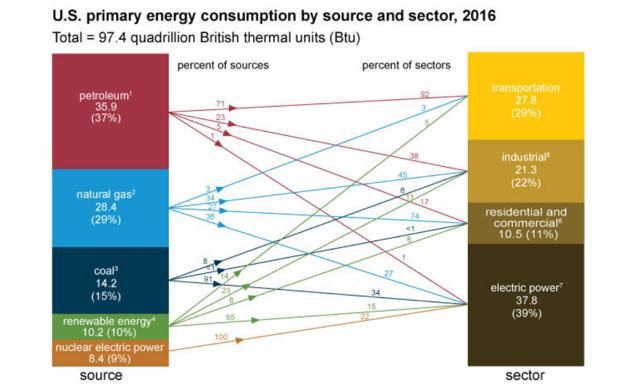

## **Emphasize** the things you want the audience or readers to remember

::: {.center}
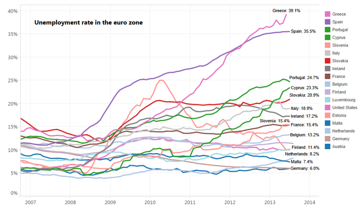
:::

## **Emphasize** the things you want the audience or readers to remember

::: {.center}
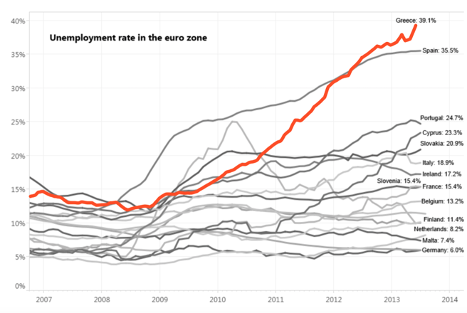
:::

## **Legends:**  
### Put them somewhere that reduces eyes jumping back and forth across the whole page

::: {.center}
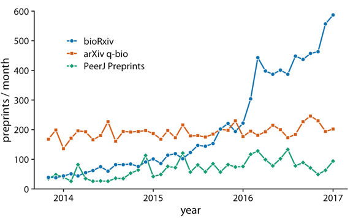
:::

<small><em>[Fundamentals of Data Visualization by Claus O. Wilke 
](https://serialmentor.com/dataviz/)</em></small>


## Often for clarity, **labels are often easier than legends**
 

::: {.center}
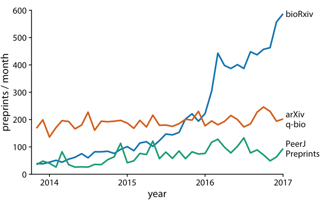
:::

<small><em>[Fundamentals of Data Visualization by Claus O. Wilke 
](https://serialmentor.com/dataviz/)</em></small>


## Often for clarity, **labels are often easier than legends**
 

::: {.center}
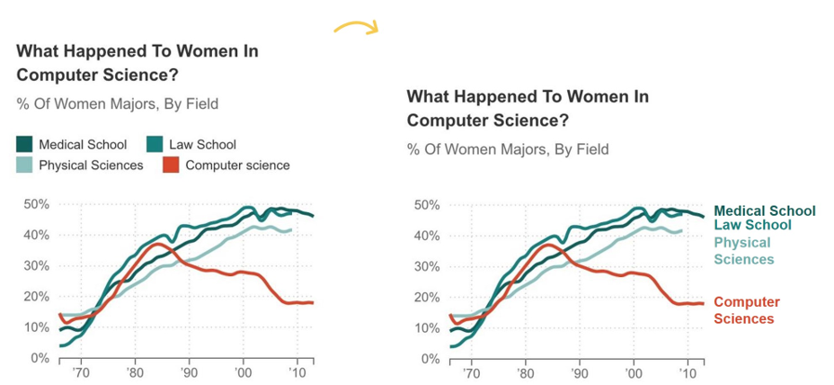
:::


<small><em>[Depict Data Studio Directly Labeling Your Line Graphs](https://depictdatastudio.com/directly-labeling-line-graphs/)</em></small>

## Your legends should **definitely** follow a logical order

::: {.center}
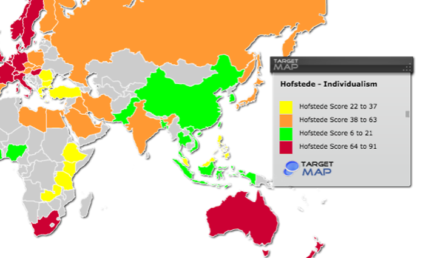
:::


## Consider putting things in **context** if visualizing across plots, for easier comparison

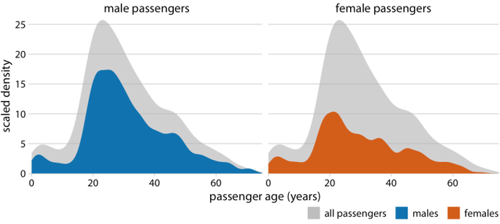

<small><em>[Fundamentals of Data Visualization by Claus O. Wilke 
](https://serialmentor.com/dataviz/)</em></small>

## 3. Is it **responsible**?

- Is your graph type/model/presentation even appropriate? 

- Misleading axes ranges or direction  

- Masking data within summary statistics  

- Does it include a measure of uncertainty (if applicable)?

## Misleading axes ranges or direction

- Reversing scale direction  
- Manipulating scale increments or data to make differences seem larger/less than they are  
- Cropping value scale to exaggerate differences

## Reversing scale direction

::: {.center}
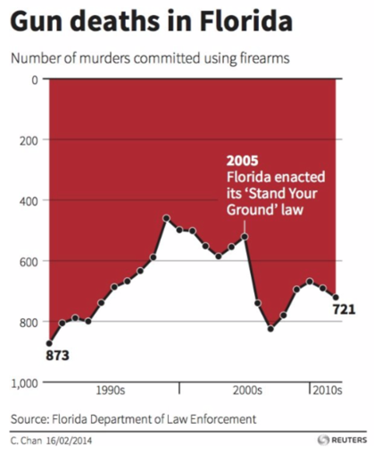
:::

<small><em>[https://viz.wtf/](https://viz.wtf/)</em></small>

## Manipulating scales

::: {.center}
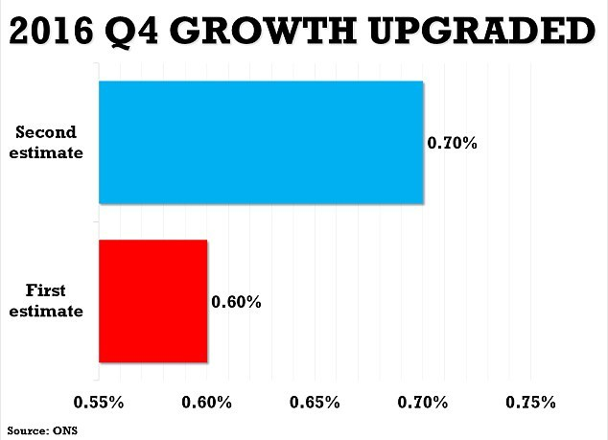
:::

<small><em>[https://viz.wtf/](https://viz.wtf/)</em></small>


## Manipulating scales

::: {.center}
{fig-align="center" width="50%"}
:::

<small><em>[https://viz.wtf/](https://viz.wtf/)</em></small>

## Show me the data
Adding summary statistics, models, etc. is good - but try to also show me the *actual data*

::: {.center}
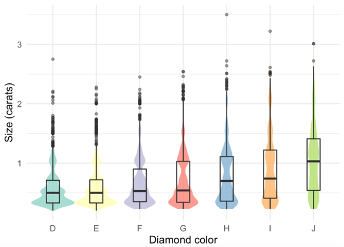{fig-align="center" width="75%"}
:::

## Show me the data
Adding summary statistics, models, etc. is good - but try to also show me the *actual data*

::: {.center}
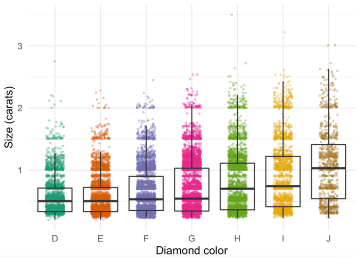{fig-align="center" width="75%"}
:::

## Show me the data
Another option to show data + summary: **Marginal Plots**

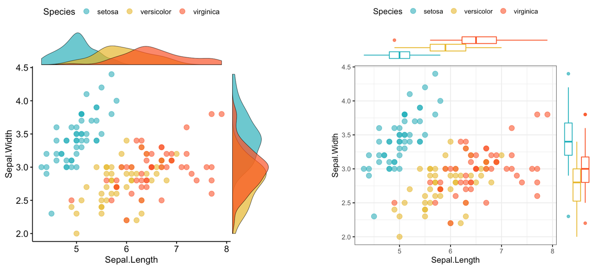{fig-align="center"}

<small><em>[Datanovia.com ggplot examples](https://www.datanovia.com/en/blog/ggplot-examples-best-reference/#scatter-plot)</em></small>

## Does it look **awesome**?

- Never sacrifice clarity for creativity  

- Decluttering your graphs  

- Empty & inked space balance  

- Thoughtful color schemes (always clarity > beauty)


## Declutter your graphs
#### Every element should exist to improve audience understanding

::: {.columns}

::: {.column width="50%"}
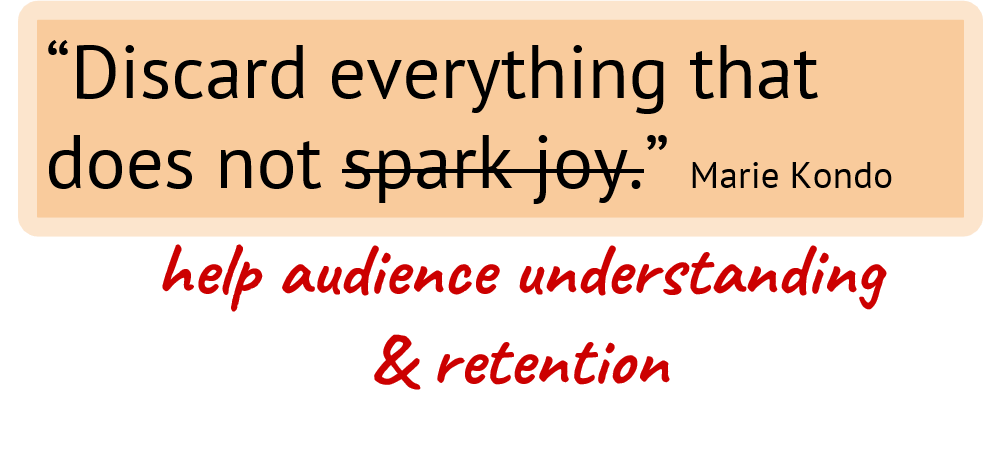
:::

::: {.column width="50%"}
{fig-align="center"}
:::

:::

---

### **For each element and design decision, ask:**

- Is this element necessary/helpful for **audience understanding**?
- Is it presented in the **best way** to encourage audience understanding & retention of the things that I have decided are the most critical?

::: {.fragment}
### **This includes:**

::: {.incremental}
- Gridlines
- Symbols/images
- Tick marks & increments
- Axis labels & tick mark labels
- Angled text
- Points, columns, lines, etc.
- Legends (avoid redundancy)
- Value labels & annotation
- Colors & formatting
:::
:::

## This is not awesome

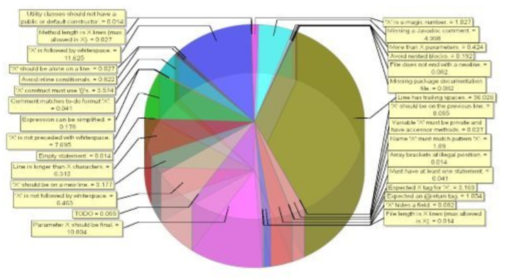

## And ggplot2 defaults have their own issues

::: {.columns}

::: {.column width="50%"}
```{r, plot-label4, eval=FALSE, echo=TRUE, warning=FALSE, message=FALSE}
ggplot(midwest, aes(x = state, y = percbelowpoverty))+
  geom_jitter()
```

##### Things you **must** change here:
- Update axis labels
- Reduce width of each groups

##### Things you should **consider** changing:
- BG color  
- X & Y limits & expansion  
- Often overused/unnecessary gridlines  
- Not prompted to auto-update axis labels  
- Abbreviations are hard
:::

::: {.column width="50%"}
```{r plot-label4-out, ref.label="plot-label4", echo=FALSE}
```
:::

:::

## Make it better

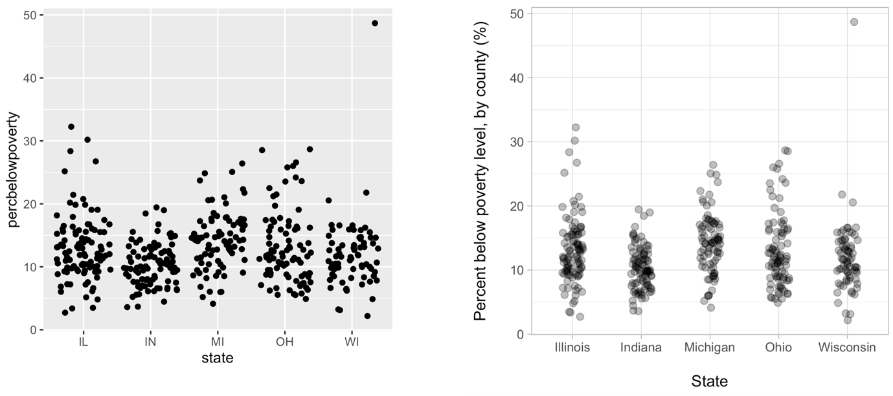

---

### Things that are **almost always bad**, or a symptom of badness:

- Color gradients with a single element
- Shadows. Why are there shadows?
- 3D. With rare exceptions.

::: {.fragment}
### Things that **can be bad**, or a symptom of badness:

::: {.incremental}
- Multiple legends (probably means you've plotted too much)
- Overuse of colors
- Many symbols of line types
- Labels for values (esp. if many) - consider a table of exact value is important
- Really creative fonts
:::
:::

## What needs changing?

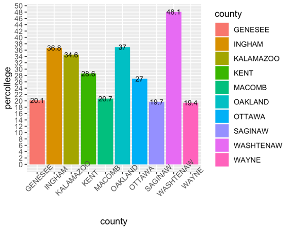

## A possible update

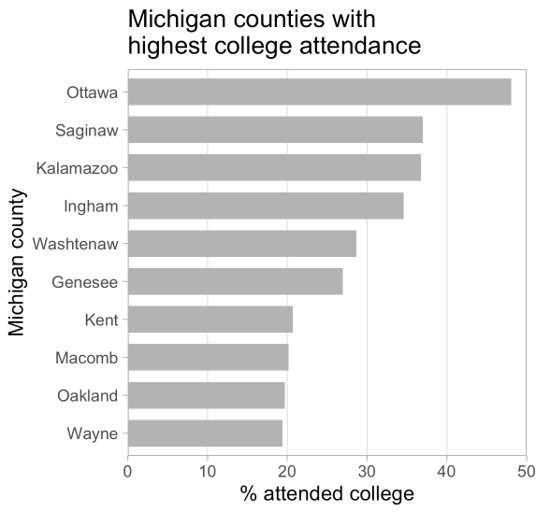


## Let's ggplot!

{fig-align="center" width="50%"}

## Grammar of graphics (ggplot2)
[ggplot2]{.green} is a data visualization package  

Structure of the plot can be summarized like this:

```{r, eval=FALSE, echo=TRUE}
ggplot(data = [dataset], 
       mapping = aes(x = [x-variable], 
                     y = [y-variable])) +
   geom_xxx() +
   other options
```

*aes()* means *aesthetics*  
*geom_xx* means *geometry*


## Data: Palmer Penguins
#### Measurements for penguin species, island in Palmer Archipelago, size (flipper length, body mass, bill dimensions), and sex.  
- Set-up your script and don't forget to comment.


{fig-align="center" width="75%"}

```{r, eval=FALSE, echo=TRUE}
install.packages("palmerpenguins")
```

```{r, message=FALSE, warning=FALSE, echo=TRUE}
library(palmerpenguins)
library(tidyverse)
glimpse(penguins)
```

## We will make this plot

```{r, plot-label151, echo=FALSE, warning=FALSE, message=FALSE}
ggplot(data=penguins, 
  mapping = aes(x = bill_depth_mm,
                y = bill_length_mm,
                color = species)) +
  geom_point()+
   labs(title = "Bill depth and length",
        subtitle = "Dimensions for Adelie, Chinstrap, and Gentoo Penguins",
        x = "Bill depth (mm)", y = "Bill length (mm)",
        color = "Species",
        caption = "Source: Palmer Station LTER / palmerpenguins package")+
  scale_color_viridis_d()

```

## Start with the [penguin]{.orange} dataframe {.smaller-title}

::: {.columns}

::: {.column width="50%"}
```{r, plot-label5, eval=FALSE,echo=TRUE}
#| code-line-numbers: "1"
ggplot(data=penguins)

```
:::

::: {.column width="50%"}
```{r plot-label5-out, ref.label="plot-label5", echo=FALSE}
```
:::

:::

## Start with the [penguin]{.orange} dataframe, [map bill depth to the x-axis]{.yellow} {.smaller-title}

::: {.columns}

::: {.column width="50%"}
```{r, plot-label6, eval=FALSE, warning=FALSE, message=FALSE,echo=TRUE}
#| code-line-numbers: "2"
ggplot(data=penguins, 
  mapping = aes(x = bill_depth_mm))

```
:::

::: {.column width="50%"}
```{r plot-label6-out, ref.label="plot-label6", echo=FALSE}
```
:::

:::

## Start with the [penguin]{.orange} dataframe, map bill depth to the x-axis [and map bill length to the y-axis.]{.yellow} {.smaller-title}

::: {.columns}

::: {.column width="50%"}
```{r, plot-label7, eval=FALSE, warning=FALSE, message=FALSE,echo=TRUE}
#| code-line-numbers: "3"
ggplot(data=penguins, 
  mapping = aes(x = bill_depth_mm,
                y = bill_length_mm))

```
:::

::: {.column width="50%"}
```{r plot-label7-out, ref.label="plot-label7", echo=FALSE}
```
:::

:::


## Start with the [penguin]{.orange} dataframe, map bill depth to the x-axis and map bill length to the y-axis. [Represent each observation with a point.]{.yellow} {.smaller-title}

::: {.columns}

::: {.column width="50%"}
```{r, plot-label8, eval=FALSE, warning=FALSE, message=FALSE,echo=TRUE}
#| code-line-numbers: "4"
ggplot(data=penguins, 
  mapping = aes(x = bill_depth_mm,
                y = bill_length_mm)) +
  geom_point()

```
:::

::: {.column width="50%"}
```{r plot-label8-out, ref.label="plot-label8", echo=FALSE, warning = FALSE}
```
:::

:::

## Start with the [penguin]{.orange} dataframe, map bill depth to the x-axis and map bill length to the y-axis. Represent each observation with a point [and map species to the colour of each point.]{.yellow} {.smaller-title}

::: {.columns}

::: {.column width="50%"}
```{r, plot-label9, eval=FALSE, warning=FALSE, message=FALSE,echo=TRUE}
#| code-line-numbers: "4"
ggplot(data=penguins, 
  mapping = aes(x = bill_depth_mm,
                y = bill_length_mm,
                color = species)) +
  geom_point()

```
:::

::: {.column width="50%"}
```{r plot-label9-out, ref.label="plot-label9", echo=FALSE, warning = FALSE}
```
:::

:::

## Start with the [penguin]{.orange} dataframe, map bill depth to the x-axis and map bill length to the y-axis. Represent each observation with a point and map species to the colour of each point. [Title the plot "Bill depth and length"]{.yellow} {.smaller-title}

::: {.columns}

::: {.column width="50%"}
```{r, plot-label10, eval=FALSE, warning=FALSE, message=FALSE,echo=TRUE}
#| code-line-numbers: "6"
ggplot(data=penguins, 
  mapping = aes(x = bill_depth_mm,
                y = bill_length_mm,
                color = species)) +
  geom_point()+
   labs(title = "Bill depth and length")

```
:::

::: {.column width="50%"}
```{r plot-label10-out, ref.label="plot-label10", echo=FALSE, warning = FALSE}
```
:::

:::

## Start with the [penguin]{.orange} dataframe, map bill depth to the x-axis and map bill length to the y-axis. Represent each observation with a point and map species to the colour of each point. Title the plot "Bill depth and length". [Add the subtitle "Dimensions for Adelie, Chinstrap, and Gentoo Penguins"]{.yellow} {.smaller-title}

::: {.columns}

::: {.column width="50%"}
```{r, plot-label11, eval=FALSE, warning=FALSE, message=FALSE,echo=TRUE}
#| code-line-numbers: "7"
ggplot(data=penguins, 
  mapping = aes(x = bill_depth_mm,
                y = bill_length_mm,
                color = species)) +
  geom_point()+
   labs(title = "Bill depth and length",
        subtitle = "Dimensions for Adelie, Chinstrap, and Gentoo Penguins")

```
:::

::: {.column width="50%"}
```{r plot-label11-out, ref.label="plot-label11", echo=FALSE, warning = FALSE}
```
:::

:::

## Start with the [penguin]{.orange} dataframe, map bill depth to the x-axis and map bill length to the y-axis. Represent each observation with a point and map species to the colour of each point. Title the plot "Bill depth and length". Add the subtitle "Dimensions for Adelie, Chinstrap, and Gentoo Penguins", [label the x and y axes as "Bill depth (mm)" and "Bill length (mm)", respectively.]{.yellow} {.smaller-title}

::: {.columns}

::: {.column width="50%"}
```{r, plot-label12, eval=FALSE, warning=FALSE, message=FALSE,echo=TRUE}
#| code-line-numbers: "8"
ggplot(data=penguins, 
  mapping = aes(x = bill_depth_mm,
                y = bill_length_mm,
                color = species)) +
  geom_point()+
   labs(title = "Bill depth and length",
        subtitle = "Dimensions for Adelie, Chinstrap, and Gentoo Penguins",
        x = "Bill depth (mm)", y = "Bill length (mm)")

```
:::

::: {.column width="50%"}
```{r plot-label12-out, ref.label="plot-label12", echo=FALSE, warning = FALSE}
```
:::

:::

## Start with the [penguin]{.orange} dataframe, map bill depth to the x-axis and map bill length to the y-axis. Represent each observation with a point and map species to the colour of each point. Title the plot "Bill depth and length". Add the subtitle "Dimensions for Adelie, Chinstrap, and Gentoo Penguins", label the x and y axes as "Bill depth (mm)" and "Bill length (mm)", respectively. [Label the legend "Species.]{.yellow} {.smaller-title}

::: {.columns}

::: {.column width="50%"}
```{r, plot-label13, eval=FALSE, warning=FALSE, message=FALSE,echo=TRUE}
#| code-line-numbers: "9"
ggplot(data=penguins, 
  mapping = aes(x = bill_depth_mm,
                y = bill_length_mm,
                color = species)) +
  geom_point()+
   labs(title = "Bill depth and length",
        subtitle = "Dimensions for Adelie, Chinstrap, and Gentoo Penguins",
        x = "Bill depth (mm)", y = "Bill length (mm)",
        color = "Species")

```
:::

::: {.column width="50%"}
```{r plot-label13-out, ref.label="plot-label13", echo=FALSE, warning = FALSE}
```
:::

:::

## Start with the [penguin]{.orange} dataframe, map bill depth to the x-axis and map bill length to the y-axis. Represent each observation with a point and map species to the colour of each point. Title the plot "Bill depth and length". Add the subtitle "Dimensions for Adelie, Chinstrap, and Gentoo Penguins", label the x and y axes as "Bill depth (mm)" and "Bill length (mm)", respectively. Label the legend "Species. [Add a caption for the source of the data.]{.yellow} {.smaller-title}

::: {.columns}

::: {.column width="50%"}
```{r, plot-label14, eval=FALSE, warning=FALSE, message=FALSE,echo=TRUE}
#| code-line-numbers: "10"
ggplot(data=penguins, 
  mapping = aes(x = bill_depth_mm,
                y = bill_length_mm,
                color = species)) +
  geom_point()+
   labs(title = "Bill depth and length",
        subtitle = "Dimensions for Adelie, Chinstrap, and Gentoo Penguins",
        x = "Bill depth (mm)", y = "Bill length (mm)",
        color = "Species",
        caption = "Source: Palmer Station LTER / palmerpenguins package")

```
:::

::: {.column width="50%"}
```{r plot-label14-out, ref.label="plot-label14", echo=FALSE, warning = FALSE}
```
:::

:::

## Start with the [penguin]{.orange} dataframe, map bill depth to the x-axis and map bill length to the y-axis. Represent each observation with a point and map species to the colour of each point. Title the plot "Bill depth and length". Add the subtitle "Dimensions for Adelie, Chinstrap, and Gentoo Penguins", label the x and y axes as "Bill depth (mm)" and "Bill length (mm)", respectively. Label the legend "Species. Add a caption for the source of the data. [Finally, use a discrete color scale that is designed to be preceived by viewers with common forms of color blindness.]{.yellow} {.smaller-title}

::: {.columns}

::: {.column width="50%"}
```{r, plot-label15, eval=FALSE, warning=FALSE, message=FALSE,echo=TRUE}
#| code-line-numbers: "11"
ggplot(data=penguins, 
  mapping = aes(x = bill_depth_mm,
                y = bill_length_mm,
                color = species)) +
  geom_point()+
   labs(title = "Bill depth and length",
        subtitle = "Dimensions for Adelie, Chinstrap, and Gentoo Penguins",
        x = "Bill depth (mm)", y = "Bill length (mm)",
        color = "Species",
        caption = "Source: Palmer Station LTER / palmerpenguins package")+
  scale_color_viridis_d()

```
:::

::: {.column width="50%"}
```{r plot-label15-out, ref.label="plot-label15", echo=FALSE, warning = FALSE}
```
:::

:::

---

::: {.center}
```{r plot-label15-out, ref.label="plot-label15", echo=FALSE, warning = FALSE}
```
:::

## Aesthetic options
Commonly used characteristics of plotting characters that can be [mapped to a specific variable]{.orange} in the data are:

- color (or colour)
- shape
- size
- alpha (transparency)

## Color
::: {.columns}

::: {.column width="50%"}
```{r, plot-label17, eval=FALSE, warning=FALSE, message=FALSE, echo = TRUE}
#| code-line-numbers: "4,9"
ggplot(data=penguins, 
  mapping = aes(x = bill_depth_mm,
                y = bill_length_mm,
                color = species)) +
  geom_point()+
   labs(title = "Bill depth and length",
        subtitle = "Dimensions for Adelie, Chinstrap, and Gentoo Penguins",
        x = "Bill depth (mm)", y = "Bill length (mm)",
        color = "Species") +
  scale_color_viridis_d()

```
:::

::: {.column width="50%"}
```{r plot-label17-out, ref.label="plot-label17", echo=FALSE, warning = FALSE}
```
:::

:::

## Shape

Mapped to a different variable than [color]{.orange}.

::: {.columns}

::: {.column width="50%"}
```{r, plot-label18, eval=FALSE, warning=FALSE, message=FALSE, echo = TRUE}
#| code-line-numbers: "5"
ggplot(data=penguins, 
  mapping = aes(x = bill_depth_mm,
                y = bill_length_mm,
                color = species,
                shape = island
                )) +
  geom_point()+
   labs(title = "Bill depth and length",
        subtitle = "Dimensions for Adelie, Chinstrap, and Gentoo Penguins",
        x = "Bill depth (mm)", y = "Bill length (mm)",
        color = "Species") +
  scale_color_viridis_d()

```
:::

::: {.column width="50%"}
```{r plot-label18-out, ref.label="plot-label18", echo=FALSE, warning = FALSE}
```
:::

:::


## Shape

Mapped to the same variable than [color]{.orange}.

::: {.columns}

::: {.column width="50%"}
```{r, plot-label19, eval=FALSE, warning=FALSE, message=FALSE, echo = TRUE}
#| code-line-numbers: "5"
ggplot(data=penguins, 
  mapping = aes(x = bill_depth_mm,
                y = bill_length_mm,
                color = species,
                shape = species
                )) +
  geom_point()+
  scale_color_viridis_d()

```
:::

::: {.column width="50%"}
```{r plot-label19-out, ref.label="plot-label19", echo=FALSE, warning = FALSE}
```
:::

:::


## Size


::: {.columns}

::: {.column width="50%"}
```{r, plot-label20, eval=FALSE, warning=FALSE, message=FALSE, echo = TRUE}
#| code-line-numbers: "5"
ggplot(data=penguins, 
  mapping = aes(x = bill_depth_mm,
                y = bill_length_mm,
                color = species,
                size = body_mass_g
                )) +
  geom_point()+
  scale_color_viridis_d()

```
:::

::: {.column width="50%"}
```{r plot-label20-out, ref.label="plot-label20", echo=FALSE, warning = FALSE}
```
:::

:::

## Alpha (transparency)

::: {.columns}

::: {.column width="50%"}
```{r, plot-label21, eval=FALSE, warning=FALSE, message=FALSE, echo = TRUE}
#| code-line-numbers: "6"
ggplot(data=penguins, 
  mapping = aes(x = bill_depth_mm,
                y = bill_length_mm,
                color = species,
                size = body_mass_g,
                alpha = flipper_length_mm
                )) +
  geom_point()+
  scale_color_viridis_d()

```
:::

::: {.column width="50%"}
```{r plot-label21-out, ref.label="plot-label21", echo=FALSE, warning = FALSE}
```
:::

:::

## Mapping vs setting

::: {.incremental}
- [Mapping:]{.orange} Determine the size, shape, alpha, etc. of points **based on the values of a variable** in the data
  - goes into [aes()]{.orange}
- [Setting:]{.orange} Determine the size, shape, alpha, etc. of points **not** based on the values of a variable in the data
  - goes into [geom_*()]{.orange}. This was geom_point() in the previous example, but we will learn more geoms soon.
:::

---

::: {.columns}

::: {.column width="50%"}
#### Mapping
```{r, echo=TRUE, warning=FALSE, fig.width= 6, fig.height=4}
ggplot(data=penguins, 
  mapping = aes(x = bill_depth_mm,
                y = bill_length_mm,
                size = body_mass_g,
                alpha = flipper_length_mm
                )) +
  geom_point()
```
:::

::: {.column width="50%"}
#### Setting
```{r, echo=TRUE, warning=FALSE, fig.width= 5, fig.height=5}
ggplot(data=penguins, 
  mapping = aes(x = bill_depth_mm,
                y = bill_length_mm)) +
  geom_point(size = 2, alpha = 0.5)
```
:::

:::

## Faceting {.inverse .center .middle}

## Faceting

- Smaller plots that display different subsets of the data
- Useful for exploring conditional relationships and large data

::: {.fragment}
### Note:
In the next few slides I do not put proper titles, axis labels, etc. because I am focusing on faceting. However, remember to always label your plots!
:::


## Facet grid (Make it a grid)

::: {.columns}

::: {.column width="50%"}
```{r, plot-label-facetgrid1, eval=FALSE, warning=FALSE, fig.width= 6, fig.height=6, echo=TRUE}
#| code-line-numbers: "5"
ggplot(penguins, 
       aes(x = bill_depth_mm,
           y = bill_length_mm))+
  geom_point()+
  facet_grid(species~sex)
# make multiple plots groups by species on the y (rows) and and sex on the x (columns) 
```
:::

::: {.column width="50%"}
```{r plot-label-facetgrid1-out, ref.label="plot-label-facetgrid1", echo=FALSE, warning=FALSE, fig.width= 6, fig.height=6}
```
:::

:::

Notice there is a section labeled **NA** for sex. This is because there were some birds where they did not know the sex.  We will learn how to clean this up next week.


## Facet wrap (allows you to manipulate rows and columns)
- wrap by species

::: {.columns}

::: {.column width="50%"}
```{r, plot-label-facetwrap1, eval=FALSE, warning=FALSE, echo=TRUE}
#| code-line-numbers: "3"
ggplot(penguins, aes(x = bill_depth_mm, y = bill_length_mm)) + 
  geom_point() +
  facet_wrap(~ species)
```
:::

::: {.column width="50%"}
```{r plot-label-facetwrap1-out, ref.label="plot-label-facetwrap1", echo=FALSE, warning=FALSE}
```
:::

:::

## Facet wrap (allows you to manipulate rows and columns)
- Make it two columns

::: {.columns}

::: {.column width="50%"}
```{r, plot-label-facetwrap2, eval=FALSE, warning=FALSE, echo=TRUE}
#| code-line-numbers: "3"
ggplot(penguins, aes(x = bill_depth_mm, y = bill_length_mm)) + 
  geom_point() +
  facet_wrap(~ species, ncol=2) # make it two columns
```
:::

::: {.column width="50%"}
```{r plot-label-facetwrap2-out, ref.label="plot-label-facetwrap2", echo=FALSE, warning=FALSE}
```
:::

:::


## Faceting summary

- facet_grid():
  - 2D grid
  - rows ~ columns

- facet_wrap(): 1d ribbon wrapped according to numbers of rows and columns specified or available plotting area

## Facet and color

::: {.columns}

::: {.column width="50%"}
```{r, plot-label22, eval=FALSE, warning=FALSE, message=FALSE, echo=TRUE}
#| code-line-numbers: "8"
ggplot(data=penguins, 
  mapping = aes(x = bill_depth_mm,
                y = bill_length_mm,
                color = species,
                )) +
  geom_point()+
  scale_color_viridis_d()+
  facet_grid(species~sex)

```
:::

::: {.column width="50%"}
```{r plot-label22-out, ref.label="plot-label22", echo=FALSE, warning = FALSE}
```
:::

:::

## Facet and color, no legend

::: {.columns}

::: {.column width="50%"}
```{r, plot-label23, eval=FALSE, warning=FALSE, message=FALSE, echo=TRUE}
#| code-line-numbers: "9"
ggplot(data=penguins, 
  mapping = aes(x = bill_depth_mm,
                y = bill_length_mm,
                color = species,
                )) +
  geom_point()+
  scale_color_viridis_d()+
  facet_grid(species~sex)+
  guides(color = "none")

```
:::

::: {.column width="50%"}
```{r plot-label23-out, ref.label="plot-label23", echo=FALSE, warning = FALSE}
```
:::

:::

## ggplot2 resources

[Data to viz](https://www.data-to-viz.com/#histogram)  
[ggplot2 cheatsheet](https://github.com/rstudio/cheatsheets/blob/main/data-visualization-2.1.pdf)  
[All the geoms](https://ggplot2.tidyverse.org/reference/)  
[A master list of visuals](http://r-statistics.co/Top50-Ggplot2-Visualizations-MasterList-R-Code.html)  
[Practical ggplot](https://wilkelab.org/practicalgg/)  
[R graph gallery](https://www.r-graph-gallery.com/)  

::: {.fragment}
### More plotting fun in online class.
:::

## {.center .middle}

# Thanks!

Slides created via [**Quarto**](https://quarto.org/)

Some slides modified from Allison Horst, Data Science Box

[Allison Horst ESM 206](https://docs.google.com/presentation/d/1IlQlBbZo53C_NUl-A9MHxQZZiubiiyFKV_nf1hFwAeM/edit#slide=id.g9c1b4376f4_0_211)  
[Data Science Box](https://rstudio-education.github.io/datascience-box/course-materials/slides/u2-d02-ggplot2/u2-d02-ggplot2.html#1)

