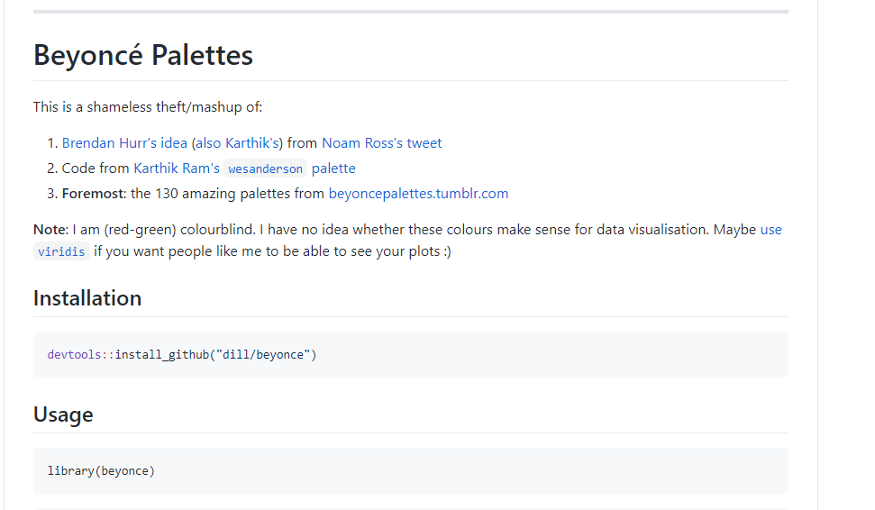
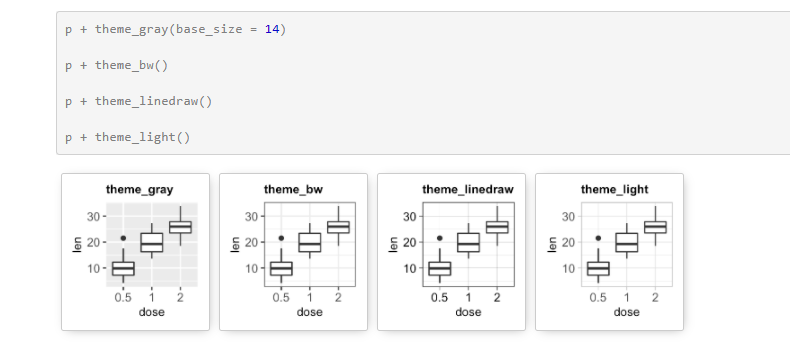
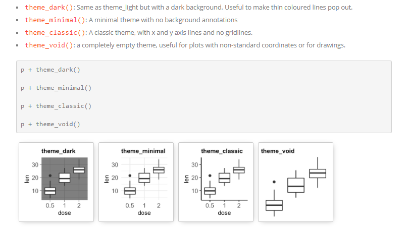

```{r setup, include=FALSE}
options(htmltools.dir.version = FALSE)
library(tidyverse)
library(palmerpenguins)
library(here)
```

## Outline of class

1. Adding multiple geoms

1. Scales

1. Coordinates

1. Themes

1. Save your plots

1. ggplot extensions


  
Homework 
1. Make your own plot

## Review: Grammar of graphics (ggplot2)
[ggplot2]{.green} is a data visualization package

Structure of the plot can be summarized like this:

```{r, eval=FALSE, echo=TRUE}
ggplot(data = [dataset], 
       mapping = aes(x = [x-variable], 
                     y = [y-variable])) +
   geom_xxx() +
   other options
```

*aes()* means *aesthetics*  
*geom_xx* means *geometry*

::: {.fragment}
### What is the difference between **mapping** and **setting**?
:::

## Penguin data. Let's start our script

```{r, message=FALSE, warning=FALSE, echo=TRUE}
### Today we are going to plot penguin data ####
### Created by: Dr. Nyssa Silbiger #############
### Updated on: 2025-09-10 ####################


#### Load Libraries ######
library(palmerpenguins)
library(tidyverse)
library(here)


### Load data ######
# The data is part of the package and is called penguins
# How else besides glimpse can we inspect the data?
glimpse(penguins) 


```

## Make a simple plot
::: {.columns}

::: {.column width="50%"}
```{r, plot-labela, eval=FALSE, warning=FALSE, message=FALSE, echo=TRUE}
ggplot(data=penguins, 
  mapping = aes(x = bill_depth_mm,
                y = bill_length_mm)) +
  geom_point()+
   labs(x = "Bill depth (mm)", 
        y = "Bill length (mm)"
        ) 

```
:::

::: {.column width="50%"}
```{r plot-labela-out, ref.label="plot-labela", echo=FALSE, warning = FALSE, message=FALSE}
```
:::

:::

## Add a best fit line
::: {.columns}

::: {.column width="50%"}
```{r, plot-labelb, eval=FALSE, warning=FALSE, message=FALSE, echo=TRUE}
#| code-line-numbers: "5"
ggplot(data=penguins, 
  mapping = aes(x = bill_depth_mm,
                y = bill_length_mm)) +
  geom_point()+ 
  geom_smooth()+
   labs(x = "Bill depth (mm)", 
        y = "Bill length (mm)"
        ) 
```
Look up all the different methods  
?geom_smooth()
:::

::: {.column width="50%"}
```{r plot-labelb-out, ref.label="plot-labelb", echo=FALSE, warning = FALSE, message=FALSE}
```
:::

:::

## A quick aside: `size` vs `linewidth`

Since ggplot2 3.4 (2022), the `size` aesthetic is **deprecated for line-based geoms** (`geom_line()`, `geom_smooth()`, `geom_segment()`, etc.) in favor of `linewidth`.

```{r, eval=FALSE, echo=TRUE}
geom_smooth(linewidth = 2)   # current, correct syntax
geom_smooth(size = 2)        # still runs, but triggers a deprecation warning
```

`size` still works for **point-based geoms** (`geom_point()`, `geom_jitter()`) — only line *thickness* moved to `linewidth`. If you see a deprecation warning in your own scripts, this is almost always why.

## Add a best fit line: [Make it a linear model]{.orange}

::: {.columns}

::: {.column width="50%"}
```{r, plot-labelc, eval=FALSE, warning=FALSE, message=FALSE, echo=TRUE}
#| code-line-numbers: "5"
ggplot(data=penguins, 
  mapping = aes(x = bill_depth_mm,
                y = bill_length_mm)) +
  geom_point()+ 
  geom_smooth(method = "lm")+
   labs(x = "Bill depth (mm)", 
        y = "Bill length (mm)"
        ) 

# Note you can put any formula here to make it specific to your analysis

```

There are 3 different species in this data, how do you think we should view the model?
:::

::: {.column width="50%"}
```{r plot-labelc-out, ref.label="plot-labelc", echo=FALSE, warning = FALSE, message=FALSE}
```
:::

:::

## Add a best fit line. Make it a linear model. [Group by species.]{.orange}

::: {.columns}

::: {.column width="50%"}
```{r, plot-labeld, eval=FALSE, warning=FALSE, message=FALSE, echo=TRUE}
#| code-line-numbers: "4"
ggplot(data=penguins, 
  mapping = aes(x = bill_depth_mm,
                y = bill_length_mm,
                group = species)) +
  geom_point()+ 
  geom_smooth(method = "lm")+ 
   labs(x = "Bill depth (mm)", 
        y = "Bill length (mm)"
        ) 

# Note you can put any formula here to make it specific to your analysis

```
:::

::: {.column width="50%"}
```{r plot-labeld-out, ref.label="plot-labeld", echo=FALSE, warning = FALSE, message=FALSE}
```
:::

:::

## Add a best fit line. Make it a linear model. Group by species. [Add some colors by species.]{.orange}

::: {.columns}

::: {.column width="50%"}
```{r, plot-labele, eval=FALSE, warning=FALSE, message=FALSE, echo=TRUE}
#| code-line-numbers: "5,11"
ggplot(data=penguins, 
  mapping = aes(x = bill_depth_mm,
                y = bill_length_mm,
                group = species,
                color = species)) +
  geom_point()+ 
  geom_smooth(method = "lm")+ 
   labs(x = "Bill depth (mm)", 
        y = "Bill length (mm)"
        ) +
  scale_color_viridis_d()

# Note you can put any formula here to make it specific to your analysis

```
:::

::: {.column width="50%"}
```{r plot-labele-out, ref.label="plot-labele", echo=FALSE, warning = FALSE, message=FALSE}
```
:::

:::

## {.center .middle}

{fig-align="center"}

## Aside....

#### Celebrate your R victories with the *{praise}* package

```{r, eval=FALSE, echo=TRUE}
install.packages("praise")

```

```{r, echo=TRUE}
library(praise)
praise()
```

```{r, echo=TRUE}
praise()
```

```{r, echo=TRUE}
praise()
```

## Scales

### Back to penguins....

The naming scheme for *scale* has 3 parts:

1. scale
1. The name of the primary aesthetic (e.g., color, shape, or x)
1. The name of the scale (e.g., continuous, discrete, manual).

::: {.fragment}
If I want to change the scale of a continuous color it would be:
```{r, eval=FALSE, echo=TRUE}
scale_color_continuous()
```
:::

::: {.fragment}
If I want to change the scale of a continuous x-axis it would be:
```{r, eval=FALSE, echo=TRUE}
scale_x_continuous()
```
:::

## Change scales. [Change x scale limits (0,20).]{.orange}

::: {.columns}

::: {.column width="50%"}
```{r, plot-labelf, eval=FALSE, warning=FALSE, message=FALSE, echo=TRUE}
#| code-line-numbers: "12"
ggplot(data=penguins, 
  mapping = aes(x = bill_depth_mm,
                y = bill_length_mm,
                group = species,
                color = species)) + 
  geom_point()+ 
  geom_smooth(method = "lm")+ 
   labs(x = "Bill depth (mm)", 
        y = "Bill length (mm)"
        ) +
  scale_color_viridis_d()+
  scale_x_continuous(limits = c(0,20)) # set x limits from 0 to 20

# Note anytime you make a vector you need to put "c" which means "concatenate

```
:::

::: {.column width="50%"}
```{r plot-labelf-out, ref.label="plot-labelf", echo=FALSE, warning = FALSE, message=FALSE}
```
:::

:::

## Change scales. Change x scale limits (0,20). [Change y scale limits (0,50).]{.orange}  
Obviously, this is a terrible figure.... but this is how you change the limits

::: {.columns}

::: {.column width="50%"}
```{r, plot-labelg, eval=FALSE, warning=FALSE, message=FALSE, echo=TRUE}
#| code-line-numbers: "13"
ggplot(data=penguins, 
  mapping = aes(x = bill_depth_mm,
                y = bill_length_mm,
                group = species,
                color = species)) + 
  geom_point()+ 
  geom_smooth(method = "lm")+ 
   labs(x = "Bill depth (mm)", 
        y = "Bill length (mm)"
        ) +
  scale_color_viridis_d()+
  scale_x_continuous(limits = c(0,20)) + # set x limits from 0 to 20 
  scale_y_continuous(limits = c(0,50))

# Note anytime you make a vector you need to put "c" which means "concatenate

```
:::

::: {.column width="50%"}
```{r plot-labelg-out, ref.label="plot-labelg", echo=FALSE, warning = FALSE, message=FALSE}
```
:::

:::

## Change scales: [Change x breaks.]{.orange}

::: {.columns}

::: {.column width="50%"}
```{r, plot-labelh, eval=FALSE, warning=FALSE, message=FALSE, echo=TRUE}
#| code-line-numbers: "12"
ggplot(data=penguins, 
  mapping = aes(x = bill_depth_mm,
                y = bill_length_mm,
                group = species,
                color = species)) + 
  geom_point()+ 
  geom_smooth(method = "lm")+ 
   labs(x = "Bill depth (mm)", 
        y = "Bill length (mm)"
        ) +
  scale_color_viridis_d()+
  scale_x_continuous(breaks = c(14, 17, 21))
 

# Note anytime you make a vector you need to put "c" which means "concatenate

```
:::

::: {.column width="50%"}
```{r plot-labelh-out, ref.label="plot-labelh", echo=FALSE, warning = FALSE, message=FALSE}
```
:::

:::


## Change scales: Change x breaks. [Change x break labels]{.orange}

::: {.columns}

::: {.column width="50%"}
```{r, plot-labeli, eval=FALSE, warning=FALSE, message=FALSE, echo=TRUE}
#| code-line-numbers: "13"
ggplot(data=penguins, 
  mapping = aes(x = bill_depth_mm,
                y = bill_length_mm,
                group = species,
                color = species)) + 
  geom_point()+ 
  geom_smooth(method = "lm")+ 
   labs(x = "Bill depth (mm)", 
        y = "Bill length (mm)"
        ) +
  scale_color_viridis_d()+
  scale_x_continuous(breaks = c(14, 17, 21), 
                     labels = c("low", "medium", "high"))
 

# Note anytime you make a vector you need to put "c" which means "concatenate

```
:::

::: {.column width="50%"}
```{r plot-labeli-out, ref.label="plot-labeli", echo=FALSE, warning = FALSE, message=FALSE}
```
:::

:::

## Change scales: [Manually change color scale.]{.orange}

::: {.columns}

::: {.column width="50%"}
```{r, plot-labelj, eval=FALSE, warning=FALSE, message=FALSE, echo=TRUE}
#| code-line-numbers: "11,12"
ggplot(data=penguins, 
  mapping = aes(x = bill_depth_mm,
                y = bill_length_mm,
                group = species,
                color = species)) + 
  geom_point()+ 
  geom_smooth(method = "lm")+ 
   labs(x = "Bill depth (mm)", 
        y = "Bill length (mm)"
        ) +
  #scale_color_viridis_d()
  scale_color_manual(values = c("orange", "purple", "green"))
 

# Note anytime you make a vector you need to put "c" which means "concatenate

```
:::

::: {.column width="50%"}
```{r plot-labelj-out, ref.label="plot-labelj", echo=FALSE, warning = FALSE, message=FALSE}
```
:::

:::

## Custom color scales

#### There are [**so many**]{.orange} custom color palettes to play with.

[Most popular color palettes](https://www.datanovia.com/en/blog/top-r-color-palettes-to-know-for-great-data-visualization/) [Beyonce - tumblr!!!](https://beyoncepalettes.tumblr.com/)  
[Beyonce - color palette](https://github.com/dill/beyonce)  
[Wes Anderson palette](https://github.com/karthik/wesanderson)  
[Colors of California](https://github.com/an-bui/calecopal)                     
[Colors of the Pacific Northwest](https://github.com/jakelawlor/PNWColors)

## Check your palette: is it colorblind-friendly?

Using `scale_color_viridis_d()` isn't just about looking nice — viridis palettes are designed to be **perceptually uniform and distinguishable under common forms of color blindness**. This connects back to the "responsible plotting" idea from our first lecture: color choices are part of communicating data honestly, not just aesthetics.

You can check *any* palette — including custom ones — with the **colorBlindness** package:

```{r, eval=FALSE, echo=TRUE}
install.packages("colorBlindness")
library(colorBlindness)

my_plot <- ggplot(data = penguins,
       mapping = aes(x = bill_depth_mm, y = bill_length_mm, color = species)) +
  geom_point() +
  scale_color_viridis_d()

cvdPlot(my_plot) # simulates deuteranopia, protanopia, tritanopia
```

::: {.fragment}
Try this on a `scale_color_manual()` palette too. Some color combinations that look distinct to you may be indistinguishable to the ~8% of men with red-green color blindness.
:::

## Aside on downloading packages that are *in development*.
There are several packages on GitHub that are not yet published and are still being developed.  You can still use them, but you need to install them directly from github.

First, you need to install the *{devtools}* package (Development tools)

```{r, eval=FALSE, echo=TRUE}
install.packages('devtools')
```

::: {.fragment}
Instead of using *install.packages("PackageName")*, we use *install_github("username/packagename")*.
:::


## Let's download the beyonce color palette.

::: {.fragment}
1. Ask google where the "Beyonce color palette in R" is.
2. Go to the [github page](https://github.com/dill/beyonce) and follow the directions

::: {.center}
{fig-align="center" width="40%"}
:::
:::

## Install the package
::: {.fragment}
3. In your **console** (not your script): copy and paste:

```{r, eval=FALSE, echo=TRUE}
devtools::install_github("dill/beyonce")
```
:::

::: {.fragment}
4. In the **libraries section of your script**: copy and paste

```{r, echo=TRUE}
library(beyonce)
```
:::

## Change scales: [Use one of the Beyonce color palettes.]{.orange}

::: {.columns}

::: {.column width="50%"}
```{r, plot-labelk, eval=FALSE, warning=FALSE, message=FALSE, echo=TRUE}
#| code-line-numbers: "11"
ggplot(data=penguins, 
  mapping = aes(x = bill_depth_mm,
                y = bill_length_mm,
                group = species,
                color = species)) + 
  geom_point()+ 
  geom_smooth(method = "lm")+ 
   labs(x = "Bill depth (mm)", 
        y = "Bill length (mm)"
        ) +
  scale_color_manual(values = beyonce_palette(2))


```
:::

::: {.column width="50%"}
```{r plot-labelk-out, ref.label="plot-labelk", echo=FALSE, warning = FALSE, message=FALSE}
```
:::

:::

## Change scales: [Use one of the Beyonce color palettes.]{.orange}

::: {.columns}

::: {.column width="50%"}
```{r, plot-labell, eval=FALSE, warning=FALSE, message=FALSE, echo=TRUE}
#| code-line-numbers: "11"
ggplot(data=penguins, 
  mapping = aes(x = bill_depth_mm,
                y = bill_length_mm,
                group = species,
                color = species)) + 
  geom_point()+ 
  geom_smooth(method = "lm")+ 
   labs(x = "Bill depth (mm)", 
        y = "Bill length (mm)"
        ) +
  scale_color_manual(values = beyonce_palette(10))


```
:::

::: {.column width="50%"}
```{r plot-labell-out, ref.label="plot-labell", echo=FALSE, warning = FALSE, message=FALSE}
```
:::

:::

## Coordinates

The default coordinates for ggplot is *cartesian*, where the 2D position of an element is given by the x and y position in *aes()*.

We can manipulate the coordinates system in a few different ways.

We will run through the following examples

- coord_flip(): Cartesian coordinate system with x and y axes flipped.

- coord_fixed(): Cartesian coordinate system with a fixed aspect ratio.

- coord_trans(): Apply arbitrary transformations to x and y positions, after the data has been processed by the stat.

- coord_polar(): Polar coordinates.

Later when we learn how to make a map  

- coord_map()/coord_quickmap()/coord_sf(): Map projections.

## Change coordinates: [Flip the axes.]{.orange}

::: {.columns}

::: {.column width="50%"}
```{r, plot-labelm, eval=FALSE, warning=FALSE, message=FALSE, echo=TRUE}
#| code-line-numbers: "12"
ggplot(data=penguins, 
  mapping = aes(x = bill_depth_mm,
                y = bill_length_mm,
                group = species,
                color = species)) + 
  geom_point()+ 
  geom_smooth(method = "lm")+ 
   labs(x = "Bill depth (mm)", 
        y = "Bill length (mm)"
        ) +
  scale_color_manual(values = beyonce_palette(10)) +
  coord_flip() # flip x and y axes


```
:::

::: {.column width="50%"}
```{r plot-labelm-out, ref.label="plot-labelm", echo=FALSE, warning = FALSE, message=FALSE}
```
:::

:::

## Change coordinates: [Fix the axes.]{.orange}

::: {.columns}

::: {.column width="50%"}
```{r, plot-labeln, eval=FALSE, warning=FALSE, message=FALSE, echo=TRUE}
#| code-line-numbers: "12"
ggplot(data=penguins, 
  mapping = aes(x = bill_depth_mm,
                y = bill_length_mm,
                group = species,
                color = species)) + 
  geom_point()+ 
  geom_smooth(method = "lm")+ 
   labs(x = "Bill depth (mm)", 
        y = "Bill length (mm)"
        ) +
  scale_color_manual(values = beyonce_palette(10)) +
  coord_fixed() # fix axes


```
:::

::: {.column width="50%"}
```{r plot-labeln-out, ref.label="plot-labeln", echo=FALSE, warning = FALSE, message=FALSE}
```
:::

:::

## Change coordinates: [Transform the x and y-axis (log10)]{.orange}

I am going to use a different example with exponential data so it shows more clearly

::: {.columns}

::: {.column width="50%"}
```{r, fig.height=4, echo=TRUE}
ggplot(diamonds, aes(carat, price)) +
  geom_point() 
```
:::

::: {.column width="50%"}
```{r, fig.height=4, echo=TRUE}
ggplot(diamonds, aes(carat, price)) +
  geom_point() +
  coord_trans(x = "log10", y = "log10")
```
:::

:::

## Change coordinates: [make them polar]{.orange}

::: {.columns}

::: {.column width="50%"}
```{r, plot-labelo, eval=FALSE, warning=FALSE, message=FALSE, echo=TRUE}
#| code-line-numbers: "12"
ggplot(data=penguins, 
  mapping = aes(x = bill_depth_mm,
                y = bill_length_mm,
                group = species,
                color = species)) + 
  geom_point()+ 
  geom_smooth(method = "lm")+ 
   labs(x = "Bill depth (mm)", 
        y = "Bill length (mm)"
        ) +
  scale_color_manual(values = beyonce_palette(10)) +
  coord_polar("x") # make the polar


```
:::

::: {.column width="50%"}
```{r plot-labelo-out, ref.label="plot-labelo", echo=FALSE, warning = FALSE, message=FALSE}
```
:::

:::

## Themes
The theming system is composed of four main components:

::: {.incremental}
- Theme **elements** specify the non-data elements that you can control. For example, the plot.title element controls the appearance of the plot title; axis.ticks.x, the ticks on the x axis; legend.key.height, the height of the keys in the legend.
- Each element is associated with an **element function**, which describes the visual properties of the element. For example, element_text() sets the font size, color and face of text elements like plot.title.
- The theme() function which allows you to override the default theme elements by calling element functions, like theme(plot.title = element_text(color = "red")). This will make the plot title red
- **Complete themes**, like theme_grey() set all of the theme elements to values designed to work together harmoniously. These are nicely packaged themes where you do not have to change much to make it look good.
:::

## Complete themes



[https://www.datanovia.com/en/blog/ggplot-themes-gallery/](https://www.datanovia.com/en/blog/ggplot-themes-gallery/)

## Complete themes



[https://www.datanovia.com/en/blog/ggplot-themes-gallery/](https://www.datanovia.com/en/blog/ggplot-themes-gallery/)

## Change theme: [Make it theme_classic()]{.orange}

::: {.columns}

::: {.column width="50%"}
```{r, plot-labelp, eval=FALSE, warning=FALSE, message=FALSE, echo=TRUE}
#| code-line-numbers: "12"
ggplot(data=penguins, 
  mapping = aes(x = bill_depth_mm,
                y = bill_length_mm,
                group = species,
                color = species)) + 
  geom_point()+ 
  geom_smooth(method = "lm")+ 
   labs(x = "Bill depth (mm)", 
        y = "Bill length (mm)"
        ) +
  scale_color_manual(values = beyonce_palette(10)) +
  theme_classic()

```
:::

::: {.column width="50%"}
```{r plot-labelp-out, ref.label="plot-labelp", echo=FALSE, warning = FALSE, message=FALSE}
```
:::

:::

## Change theme: [Make it theme_bw()]{.orange}

::: {.columns}

::: {.column width="50%"}
```{r, plot-labelq, eval=FALSE, warning=FALSE, message=FALSE, echo=TRUE}
#| code-line-numbers: "12"
ggplot(data=penguins, 
  mapping = aes(x = bill_depth_mm,
                y = bill_length_mm,
                group = species,
                color = species)) + 
  geom_point()+ 
  geom_smooth(method = "lm")+ 
   labs(x = "Bill depth (mm)", 
        y = "Bill length (mm)"
        ) +
  scale_color_manual(values = beyonce_palette(10)) +
  theme_bw()
```
:::

::: {.column width="50%"}
```{r plot-labelq-out, ref.label="plot-labelq", echo=FALSE, warning = FALSE, message=FALSE}
```
:::

:::

## Custom themes

```{r, eval = FALSE, echo=TRUE}
install.packages("ggthemes") # do this in the console

# put the code below in the libraries section of your script
library(ggthemes)
```

[See here for ggthemes](https://yutannihilation.github.io/allYourFigureAreBelongToUs/ggthemes/)

## Themes: You can customize your theme further
##### [Change the font size for the axis labels]{.orange}

::: {.columns}

::: {.column width="50%"}
```{r, plot-labelr, eval=FALSE, warning=FALSE, message=FALSE, echo=TRUE}
#| code-line-numbers: "13"
ggplot(data=penguins, 
  mapping = aes(x = bill_depth_mm,
                y = bill_length_mm,
                group = species,
                color = species)) + 
  geom_point()+ 
  geom_smooth(method = "lm")+ 
   labs(x = "Bill depth (mm)", 
        y = "Bill length (mm)"
        ) +
  scale_color_manual(values = beyonce_palette(10)) +
  theme_bw() +
  theme(axis.title = element_text(size = 20))
```
:::

::: {.column width="50%"}
```{r plot-labelr-out, ref.label="plot-labelr", echo=FALSE, warning = FALSE, message=FALSE}
```
:::

:::

## Themes: You can customize your theme further
##### Change the font size for the axis labels. [Change the color of the axis labels.]{.orange}

::: {.columns}

::: {.column width="50%"}
```{r, plot-labels, eval=FALSE, warning=FALSE, message=FALSE, echo=TRUE}
#| code-line-numbers: "14"
ggplot(data=penguins, 
  mapping = aes(x = bill_depth_mm,
                y = bill_length_mm,
                group = species,
                color = species)) + 
  geom_point()+ 
  geom_smooth(method = "lm")+ 
   labs(x = "Bill depth (mm)", 
        y = "Bill length (mm)"
        ) +
  scale_color_manual(values = beyonce_palette(10)) +
  theme_bw() +
  theme(axis.title = element_text(size = 20,
                                  color = "red"))
```
:::

::: {.column width="50%"}
```{r plot-labels-out, ref.label="plot-labels", echo=FALSE, warning = FALSE, message=FALSE}
```
:::

:::

## Themes: You can customize your theme further
##### Change the font size for the axis labels. Change the color of the axis labels. [Change the background color.]{.orange}

::: {.columns}

::: {.column width="50%"}
```{r, plot-labelt, eval=FALSE, warning=FALSE, message=FALSE, echo=TRUE}
#| code-line-numbers: "15"
ggplot(data=penguins, 
  mapping = aes(x = bill_depth_mm,
                y = bill_length_mm,
                group = species,
                color = species)) + 
  geom_point()+ 
  geom_smooth(method = "lm")+ 
   labs(x = "Bill depth (mm)", 
        y = "Bill length (mm)"
        ) +
  scale_color_manual(values = beyonce_palette(10)) +
  theme_bw() +
  theme(axis.title = element_text(size = 20,
                                  color = "red"),
        panel.background = element_rect(fill = "linen"))
```
:::

::: {.column width="50%"}
```{r plot-labelt-out, ref.label="plot-labelt", echo=FALSE, warning = FALSE, message=FALSE}
```
:::

:::

## {.center .middle}

Type ?theme() to see all the different elements that you can change.

Play around with your plot for ~ 2 minutes and change the theme in a way that you want.

## Save your plot
::: {.columns}

::: {.column width="50%"}
```{r, plot-labelu, eval=FALSE, warning=FALSE, message=FALSE, echo=TRUE}
#| code-line-numbers: "16"
ggplot(data=penguins, 
  mapping = aes(x = bill_depth_mm,
                y = bill_length_mm,
                group = species,
                color = species)) + 
  geom_point()+ 
  geom_smooth(method = "lm")+ 
   labs(x = "Bill depth (mm)", 
        y = "Bill length (mm)"
        ) +
  scale_color_manual(values = beyonce_palette(2)) +
  theme_bw() +
  theme(axis.title = element_text(size = 20),
        panel.background = element_rect(fill = "linen")) 

  ggsave(here("Week_03","output","penguin.png"))
```
:::

::: {.column width="50%"}
```{r plot-labelu-out, echo=FALSE, warning = FALSE, message=FALSE}
# Executed with a deployment-safe path (not here::here()) so this slide
# renders identically in RStudio and when published; students should still
# use here() as shown in the code on the left within their own project.
p_labelu <- ggplot(data=penguins, 
  mapping = aes(x = bill_depth_mm,
                y = bill_length_mm,
                group = species,
                color = species)) + 
  geom_point()+ 
  geom_smooth(method = "lm")+ 
   labs(x = "Bill depth (mm)", 
        y = "Bill length (mm)"
        ) +
  scale_color_manual(values = beyonce_palette(2)) +
  theme_bw() +
  theme(axis.title = element_text(size = 20),
        panel.background = element_rect(fill = "linen")) 

p_labelu
ggsave(file.path(tempdir(), "penguin.png"), plot = p_labelu)
```
:::

:::

## Save your plot: [change the width and height]{.orange}
::: {.columns}

::: {.column width="50%"}
```{r, plot-labelw, eval=FALSE, warning=FALSE, message=FALSE, echo=TRUE}
#| code-line-numbers: "17"
ggplot(data=penguins, 
  mapping = aes(x = bill_depth_mm,
                y = bill_length_mm,
                group = species,
                color = species)) + 
  geom_point()+ 
  geom_smooth(method = "lm")+ 
   labs(x = "Bill depth (mm)", 
        y = "Bill length (mm)"
        ) +
  scale_color_manual(values = beyonce_palette(2)) +
  theme_bw() +
  theme(axis.title = element_text(size = 20),
        panel.background = element_rect(fill = "linen")) 

  ggsave(here("Week_03","output","penguin.png"),
         width = 7, height = 5) # in inches
```
:::

::: {.column width="50%"}
```{r plot-labelw-out, echo=FALSE, warning = FALSE, message=FALSE}
# Executed with a deployment-safe path (not here::here()) so this slide
# renders identically in RStudio and when published; students should still
# use here() as shown in the code on the left within their own project.
p_labelw <- ggplot(data=penguins, 
  mapping = aes(x = bill_depth_mm,
                y = bill_length_mm,
                group = species,
                color = species)) + 
  geom_point()+ 
  geom_smooth(method = "lm")+ 
   labs(x = "Bill depth (mm)", 
        y = "Bill length (mm)"
        ) +
  scale_color_manual(values = beyonce_palette(2)) +
  theme_bw() +
  theme(axis.title = element_text(size = 20),
        panel.background = element_rect(fill = "linen")) 

p_labelw
ggsave(file.path(tempdir(), "penguin.png"), plot = p_labelw,
       width = 7, height = 5) # in inches
```
:::

:::

## Save your plot as an object
This allows you to modify the plot further later.

::: {.columns}

::: {.column width="50%"}
```{r, plot-labelv, eval=FALSE, warning=FALSE, message=FALSE, echo=TRUE}
#| code-line-numbers: "1"
plot1<-ggplot(data=penguins,
  mapping = aes(x = bill_depth_mm,
                y = bill_length_mm,
                group = species,
                color = species)) + 
  geom_point()+ 
  geom_smooth(method = "lm")+ 
   labs(x = "Bill depth (mm)", 
        y = "Bill length (mm)"
        ) +
  scale_color_manual(values = beyonce_palette(2)) +
  theme_bw() +
  theme(axis.title = element_text(size = 20),
        panel.background = element_rect(fill = "linen")) 

```
:::

::: {.column width="50%"}
```{r warning = FALSE, message=FALSE, eval=FALSE, echo=TRUE}

plot1 # you need to type it out to view it now
```
```{r plot-labelv-out, ref.label="plot-labelv", echo=FALSE, warning = FALSE, message=FALSE}
```
:::

:::

## ggplot2 extensions

::: {.center}
[There are over 100 ggplot2 extentions](https://exts.ggplot2.tidyverse.org/gallery/)  
[Great resource for ggploting](https://ggplot2-book.org/index.html)
:::


## Homework

Come up with the best possible plot with the penguin data that you can in **1 hour**.  

- It CANNOT be the same plot that we just made. Look through the data and make a new visual.
- Make something other than a scatter plot. Look at the other possible geoms from the resources I have given you over the past two classes.  
- Your script must be formatted correctly (according to the lecture on transparent scripts).  
- Comment your code appropriately
- Push to github in the appropriate folders (you will only need a scripts and output folder for this week).  

- **Due on github by Tuesday at 1pm.**

## {.center .middle}

# Thanks!

Slides created via [**Quarto**](https://quarto.org/)

Some slides modified from [ggplot2-book](https://ggplot2-book.org/polishing.html)

