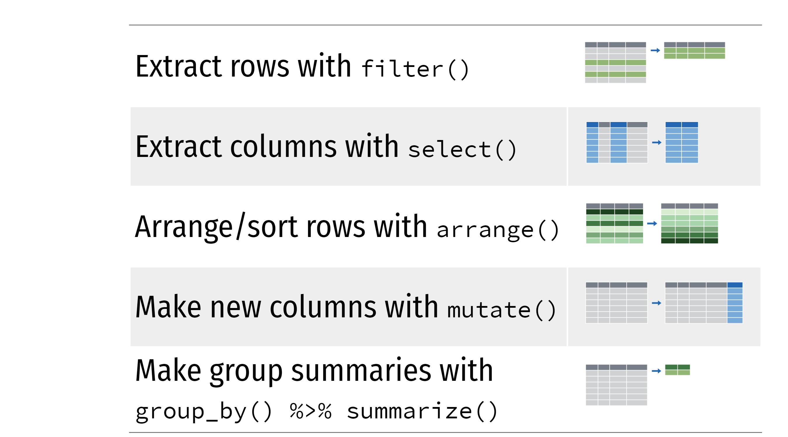
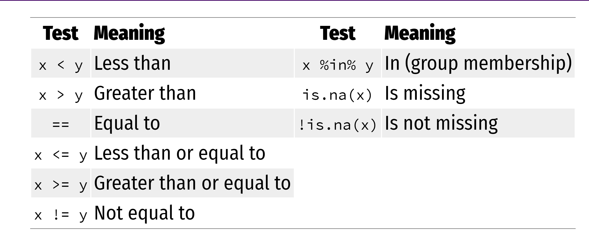
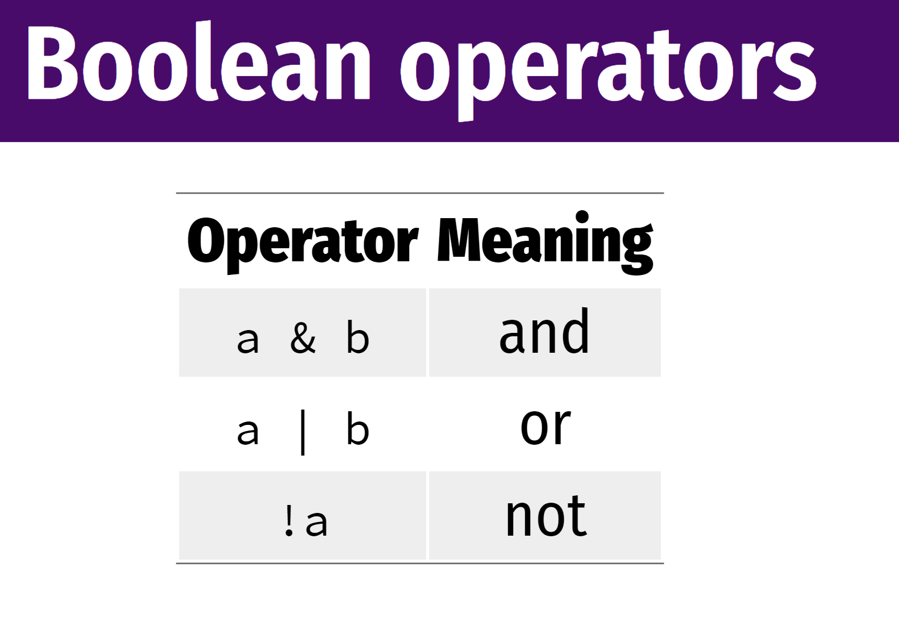
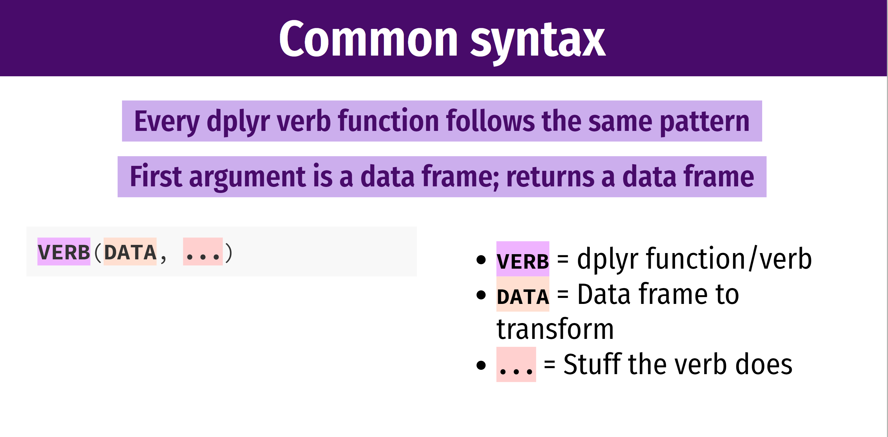
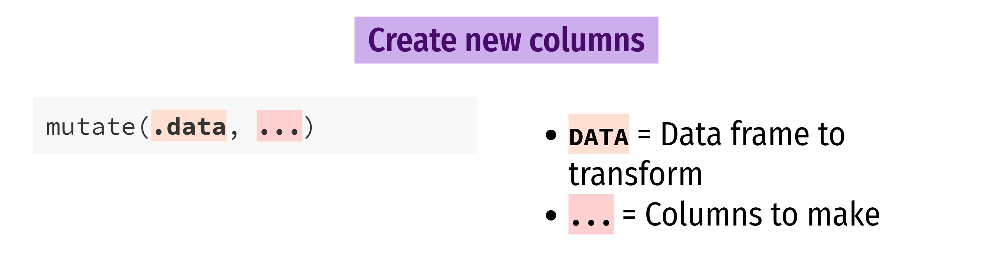
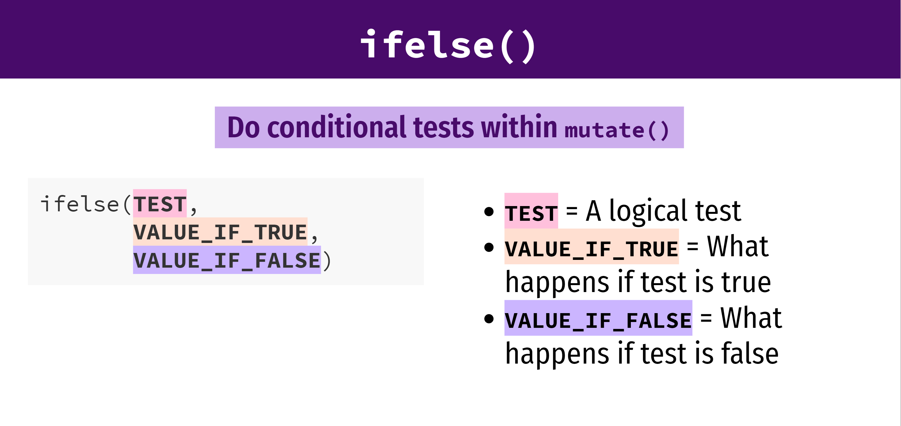

```{r setup, include=FALSE}
options(htmltools.dir.version = FALSE)
library(tidyverse)
library(palmerpenguins)
library(here)
```

## Outline of class

1. Quiz!
1. Online lecture review
1. Intro to {dplyr}
    - a set of verbs for manipulating data:
    - filtering rows, selecting columns, sorting rows, mutating columns, summarising, grouping, counting, removing NAs

Homework  
1. Practice with dplyr

[dplyr cheat sheet.](https://raw.githubusercontent.com/rstudio/cheatsheets/main/data-transformation.pdf) Download this now to use as a resource.

## Review

1. Where do I change the font size of my x and y labels?

1. How do I save my plot?

## Intro to the {dplyr} package (part of the TidyVerse)

{fig-align="center" width="70%"}

Illustrations from the Openscapes blog [Tidy Data for reproducibility, efficiency](https://www.openscapes.org/blog/2020/10/12/tidy-data/), and collaboration by Julia Lowndes and Allison Horst

## dplyr: verbs for manipulating data

{fig-align="center" width="90%"}

## Penguin data again.

```{r, message=FALSE, warning=FALSE, echo=TRUE}
### Today we are going to plot penguin data ####
### Created by: Dr. Nyssa Silbiger #############
### Updated on: 2026-09-15 ####################

#### Load Libraries ######
library(palmerpenguins)
library(tidyverse)
library(here)

### Load data ######
# The data is part of the package and is called penguins
glimpse(penguins)
```

## Filter

{fig-align="center" width="70%"}

## filter
### Extract rows that meet some criteria

::: {.columns}

::: {.column width="50%"}
```{r, eval=FALSE, echo=TRUE}
filter(.data = DATA, ...)
```
:::

::: {.column width="50%"}
- [DATA]{.orange} = Data frame to transform

- [...]{.orange} = One or more conditions  
[filter()]{.fn} returns each row for which the condition is TRUE
:::

:::

::: {.callout-tip}
## Tip: `.data =` is optional when piping
`filter(.data = penguins, sex == "female")` and `penguins |> filter(sex == "female")` do the same thing. When you use [|>]{.op}, the dataframe is passed in automatically — no need to write [.data =]{.param} explicitly.
:::

## Filter only the female penguins
### As always, exact spelling and capitalization matters

Before filtering

```{r, echo=TRUE}
head(penguins)
```

## Filter only the female penguins
### As always, exact spelling and capitalization matters

After filtering

```{r, echo=TRUE}
filter(.data = penguins, sex == "female")
```

## = vs ==

::: {.columns}

::: {.column width="50%"}
```{r, eval=FALSE, echo=TRUE}
#| code-line-numbers: "2"
filter(.data = penguins,
       sex == "female")
```
:::

::: {.column width="50%"}
One [=]{.green} sets an argument in the function

Two [==]{.green} reads as "is exactly equal to." It is a question that returns a TRUE or FALSE. Here, filter keeps every TRUE
:::

:::

## A list of logical expressions

{fig-align="center" width="80%"}

## How would I use filter to...

1. Penguins measured in the year 2008?

1. Penguins that have a body mass greater than 5000

::: {.fragment}
### Think, pair, share

Spend 2 minutes to *think* about it. Spend 2 minutes *paired* with a neighbor to discuss your answers. *Share* with the class.
:::

## Common mistakes

::: {.columns}

::: {.column width="50%"}
### Using [=]{.err} instead of [==]{.fn}

```{r, eval=FALSE, echo=TRUE}
# Wrong
filter(.data = penguins,
  sex = "females")

# Right
filter(.data = penguins,
  sex == "females")
```
:::

::: {.column width="50%"}
::: {.fragment}
### Forgetting quotes

```{r, eval=FALSE, echo=TRUE}
# Wrong
filter(.data = penguins,
       sex == females)

# Right
filter(.data = penguins,
       sex == "females")
```
:::
:::

:::

## Filter with multiple conditions

Select [females]{.orange} that are also [greater than 5000 g]{.green}

```{r, echo=TRUE}
filter(.data = penguins, sex == "female", body_mass_g > 5000)
```

## Boolean operators

{fig-align="center" width="85%"}

## Default for filter is **&**

These do the same exact thing

```{r, eval=FALSE, echo=TRUE}
filter(.data = penguins, sex == "female", body_mass_g > 5000)

filter(.data = penguins, sex == "female" & body_mass_g > 5000)
```

## Think, pair, share

Use filter and boolean logic to show:

1. Penguins that were collected in *either* 2008 *or* 2009

1. Penguins that *are not* from the island Dream

1. Penguins in the species Adelie and Gentoo

## Common mistakes

::: {.columns}

::: {.column width="50%"}
### Collapsing multiple tests into one
penguins between 3000 and 5000 g

```{r, eval=FALSE, echo=TRUE}
# Wrong
filter(.data = penguins,
       3000 < body_mass_g < 5000)

# Right
filter(.data = penguins,
       body_mass_g < 5000,
       body_mass_g > 3000)
```
:::

::: {.column width="50%"}
::: {.fragment}
### Using multiple tests instead of %in%
penguins in Dream and Biscoe

```{r, eval=FALSE, echo=TRUE}
# Wrong
filter(.data = penguins,
       island == "Dream",
       island == "Biscoe")

# Right
filter(.data = penguins,
       island %in% c("Dream", "Biscoe"))
```
:::
:::

:::

## filter syntax

{fig-align="center" width="85%"}

## mutate: add new columns

{fig-align="center" width="70%"}

## mutate

{fig-align="center" width="85%"}

## mutate

Add a new column converting body mass in g to kg

```{r, echo=TRUE}
#| code-line-numbers: "2"
mutate(.data = penguins,
       body_mass_kg = body_mass_g / 1000)
```


## Change multiple columns at once

```{r, echo=TRUE}
#| code-line-numbers: "2,3"
mutate(.data = penguins,
       body_mass_kg = body_mass_g / 1000,
       bill_length_depth = bill_length_mm / bill_depth_mm)
```


## Mutating multiple columns at once

To apply the same function to many columns you can use  [across()]{.fn} inside [mutate()]{.fn}:

```{r, eval=FALSE, echo=TRUE}
penguins |>
  mutate(across(where(is.numeric), ~ round(.x, 1)))
```


- [across()]{.fn} — "apply the same transformation **across** multiple columns at once"
- [where(is.numeric)]{.fn} — "but only the columns **where** the data are numeric"
- [~ round(.x, 1)]{.fn} — "the transformation to apply: round each value to 1 decimal place" (the [~]{.op} creates a small anonymous function; [.x]{.var} is a placeholder meaning "the current column")

So the whole line reads: *"For every numeric column, round its values to 1 decimal place."*

On your own, look up [`across()`](https://dplyr.tidyverse.org/reference/across.html) — it replaces the older `mutate_if()`, `mutate_at()`, and `mutate_all()` functions.

# 
::: {.callout-note}
## We'll come back to this
The [~]{.op} syntax used inside [across()]{.fn} are concepts we haven't covered yet. We will revisit [across()]{.fn} once we learn how to write our own functions. For now, just know it exists and what it does conceptually.
:::

## ifelse

{fig-align="center" width="85%"}

## mutate with if_else

```{r, echo=TRUE}
#| code-line-numbers: "2"
mutate(.data = penguins,
       after_2008 = if_else(year > 2008, "After 2008", "Before 2008"))
```

## Think, pair, share

1. Use mutate to create a new column to add flipper length and body mass together

1. Use mutate and if_else to create a new column where body mass greater than 4000 is labeled as "big" and everything else is "small"

## The pipe operator: [|>]{.op} {.inverse .center .middle}

## The pipe |>

### The "pipe" says "and then do"

```
dataframe |>   # select the dataframe and then
  verb1() |>   # do verb 1 and then
  verb2()      # do verb 2
```

## |>

```{r, eval=FALSE, echo=TRUE}
me |>
  wake_up(time = "6:00") |>
  music(turn = "on", to = "Beyonce") |>
  shower(wash_hair = TRUE) |>
  get_dressed(pants = TRUE, shirt = TRUE) |>
  leave_house(car = TRUE)
```

## The native pipe |>

The [|>]{.op} is built into **base R** (R 4.1+) — no package needed.

You may also see [%>%]{.op} (the **magrittr** pipe from tidyverse) in older code. They work the same in most situations. In this class we use [|>]{.op}.

[Please Read Here!](https://r4ds.hadley.nz/data-transform#sec-the-pipe)

::: {.callout-tip}
## Keyboard shortcut
Insert [|>]{.op} instantly with **Ctrl+Shift+M** (Windows/Linux) or **Cmd+Shift+M** (Mac).

To make sure RStudio inserts [|>]{.op} (not `%>%`): *Tools → Global Options → Code → Use native pipe operator, |>*
:::

## |>

Filter only female penguins and add a new column that calculates the log body mass.  
When you use [|>]{.op} the dataframe carries over so you don't need to write it out anymore.

```{r, echo=TRUE}
#| code-line-numbers: "3"
penguins |>
  filter(sex == "female") |>
  mutate(log_mass = log(body_mass_g))
```

## Select

Use [select()]{.fn} to select certain columns to remain in the dataframe

```{r, echo=TRUE}
#| code-line-numbers: "4"
penguins |>
  filter(sex == "female") |>
  mutate(log_mass = log(body_mass_g)) |>
  select(species, island, sex, log_mass)
```

## Select

You can also use [select()]{.fn} to rename columns.  
Here, we are renaming species to have a capital S.

```{r, echo=TRUE}
#| code-line-numbers: "4"
penguins |>
  filter(sex == "female") |>
  mutate(log_mass = log(body_mass_g)) |>
  select(Species = species, island, sex, log_mass)
```

## arrange

Use [arrange()]{.fn} to sort rows by a column — ascending by default.

```{r, echo=TRUE}
#| code-line-numbers: "2"
penguins |>
  arrange(body_mass_g)
```

## arrange

Use [desc()]{.fn} to sort in **descending** order.

```{r, echo=TRUE}
#| code-line-numbers: "2"
penguins |>
  arrange(desc(body_mass_g))
```


## Summarise

Compute a table of summarized data.  
Calculate the mean flipper length (and exclude any NAs).

```{r, echo=TRUE}
#| code-line-numbers: "2"
penguins |>
  summarise(mean_flipper = mean(flipper_length_mm, na.rm = TRUE))
```

::: {.fragment}
Calculate mean and min flipper length

```{r, echo=TRUE}
#| code-line-numbers: "2,3"
penguins |>
  summarise(mean_flipper = mean(flipper_length_mm, na.rm = TRUE),
            min_flipper  = min(flipper_length_mm, na.rm = TRUE))
```
:::

## group_by

You can summarize values by certain groups.  
[group_by()]{.fn} by itself doesn't do anything, but it is powerful when put before [summarise()]{.fn}.

Let's calculate the mean, max, and count of bill length by island.

```{r, echo=TRUE}
penguins |>
  group_by(island) |>
  summarise(mean_bill_length = mean(bill_length_mm, na.rm = TRUE),
            max_bill_length  = max(bill_length_mm, na.rm = TRUE),
            n                = n())
```

[n()]{.fn} counts the number of rows in each group.

## group_by both island and sex


```{r, echo=TRUE}
#| code-line-numbers: "2"
penguins |>
  group_by(island, sex) |>
  summarise(mean_bill_length = mean(bill_length_mm, na.rm = TRUE),
            max_bill_length  = max(bill_length_mm, na.rm = TRUE))
```

::: {.callout-note}
## The grouping message
You may see a message like `summarise() has grouped output by 'island'`. This is just informational — dplyr is telling you the output is still grouped.
:::

## count

[count()]{.fn} is a quick shortcut for counting rows per group — no need for [group_by()]{.fn} + [summarise()]{.fn}.

```{r, echo=TRUE}
penguins |>
  count(species)
```

## count

Count by multiple variables at once

```{r, echo=TRUE}
penguins |>
  count(species, island)
```


## Remove NAs

[drop_na()]{.fn} drops rows with NAs from a specific column.

Drop all the rows that are missing data on sex.

```{r, echo=TRUE}
#| code-line-numbers: "2"
penguins |>
  drop_na(sex)
```

## Remove NAs

[drop_na()]{.fn} drops rows with NAs from a specific column.

Drop all the rows that are missing data on sex, then calculate mean bill length by island and sex.

```{r, echo=TRUE}
#| code-line-numbers: "3,4"
penguins |>
  drop_na(sex) |>
  group_by(island, sex) |>
  summarise(mean_bill_length = mean(bill_length_mm, na.rm = TRUE))
```

## Pipe into a ggplot

You can connect your *data wrangling* to a ggplot with the pipe (you won't need to call the dataframe in ggplot if you pipe to it).

Drop NAs from sex, and then plot boxplots of flipper length by sex.

```{r, echo=TRUE, fig.height=4}
#| code-line-numbers: "3,4"
penguins |>
  drop_na(sex) |>
  ggplot(aes(x = sex, y = flipper_length_mm)) +
  geom_boxplot()
```

## "Totally Awesome R package of the day"

```{r, eval=FALSE, echo=TRUE}
install.packages("dadjokeapi")
```

```{r, echo=TRUE, message=TRUE}
library(dadjokeapi)
groan()
```

## Homework

Write a script that:

1. calculates the mean and variance of body mass by species, island, and sex without any NAs

2. filters out (i.e. excludes) male penguins, then calculates the log body mass, then selects only the columns for species, island, sex, and log body mass, then use these data to make any plot. Make sure the plot has clean and clear labels and follows best practices. Save the plot in the correct output folder.

Include both part 1 and part 2 in your script and push it to github in the appropriate folders.

## {.center .middle}

# Thanks!

Slides created via [**Quarto**](https://quarto.org/)

Some slides modified from [Andrew Wheiss](https://evalsp21.classes.andrewheiss.com/projects/01_lab/slides/01_lab.html#73)
