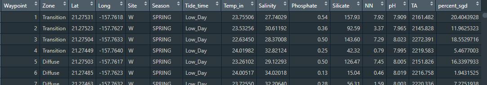
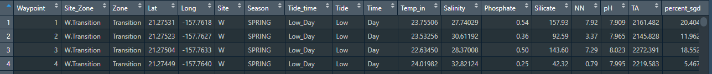
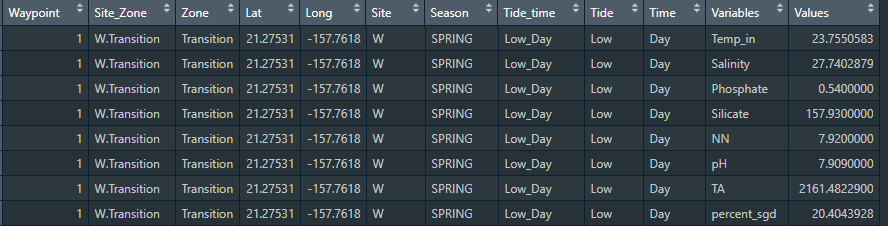

```{r setup, include=FALSE}
options(htmltools.dir.version = FALSE)
library(tidyverse)
library(here)
# Load with a relative path so the bundle works on Posit Connect
# (here() requires a .Rproj file that isn't included in the deployment bundle)
ChemData <- read_csv("data/chemicaldata_maunalua.csv", show_col_types = FALSE)
```

## Outline of class

1. Intro to {tidyr}
    - Separate columns and combine them with paste()
    - Pivot data between long and wide formats

1. Export csv with summary statistics

Homework  
1. Practice with tidyr

## Review

1. What function do you use to subset rows by some criterion?

1. How do I add a new column to my data frame?

## Intro to the {tidyr} package (part of the TidyVerse)

{fig-align="center" width="50%"}

## New dataset!

We are going to use a subset of data from Silbiger et al. 2020 Proceedings of the Royal Society: B.

In the data folder for this week, you will see two .csv files:

1. chemicaldata_maunalua.csv
1. chem_data_dictionary.csv

Move both of them to the data folder of YOUR repo.

Explore the data dictionary to understand what you will be working with.

Basics: I collected biogeochemistry data at sites in Hawai'i with submarine groundwater discharge (fresh groundwater that flows into coastal oceans through cracks in the reef plate). We have data on nutrient and carbonate chemistry from two sites, two seasons, high and low tide, and during the day and night.

## Set up your script for today

```{r, message=FALSE, warning=FALSE, echo=TRUE, eval=FALSE}
### Today we are going to practice tidyr with biogeochemistry data from Hawaii ####
### Created by: Dr. Nyssa Silbiger #############
### Updated on: 2026-09-14 ####################

#### Load Libraries ######
library(tidyverse)
library(here)

### Load data ######
ChemData <- read_csv(here("Week_04", "data", "chemicaldata_maunalua.csv"))
glimpse(ChemData)
```

```{r, echo=FALSE}
glimpse(ChemData)
```

## Another way to remove all the NAs

There are several ways we can remove all the NAs in a data set

```{r, echo=TRUE}
ChemData_clean <- ChemData |>
  filter(complete.cases(ChemData)) # filters out everything that is not a complete row
```

{fig-align="center" width="70%"}

::: {.callout-note}
## drop_na() vs complete.cases()
`drop_na()` (from yesterday's dplyr lesson) does the same thing and is the preferred tidyverse approach. `complete.cases()` is the base R equivalent — useful to recognize in older code, but `drop_na()` is simpler and more readable.
:::

## Separate function

We notice a silly column named Tide_time, which has tide (low/high) paired with time of day (day/night).

Nyssa did NOT follow directions for tidy data from the first week of class... Now we have to fix it.

{fig-align="center" width="40%"}

## Separate function

Notice that I have two bits of information: Low_Day is low tide during the day. It would be way easier to plot and analyze the data if we separate those into separate columns.

Type `?separate_wider_delim` to see all the options. The key arguments are:

```
separate_wider_delim(
  data        = [data frame you are using],
  cols        = [column that you want to separate],
  delim       = [what to separate by],
  names       = [names of the new columns],
  cols_remove = [keep original column? default TRUE removes it])
```

::: {.callout-note}
## Note on older code
`separate()` was deprecated in tidyr 1.3.0 — you may see it in older code and tutorials online. `separate_wider_delim()` is the current replacement.
:::

## Separate

Let's continue to build off our data frame

```{r, echo=TRUE}
#| code-line-numbers: "3,4,5"
ChemData_clean <- ChemData |>
  drop_na() |>
  separate_wider_delim(cols  = Tide_time,
                       delim = "_",
                       names = c("Tide", "Time"))

head(ChemData_clean)
```

## Separate

Notice this deletes the original column. If we wanted to keep it we would add `cols_remove = FALSE`.

```{r, echo=TRUE}
#| code-line-numbers: "6"
ChemData_clean <- ChemData |>
  drop_na() |>
  separate_wider_delim(cols        = Tide_time,
                       delim       = "_",
                       names       = c("Tide", "Time"),
                       cols_remove = FALSE) # keep the original Tide_time column

head(ChemData_clean)
```

## Combining columns with paste()

What if we have the opposite problem and want to *combine* two columns into one?

[paste()]{.fn} glues values together into a single string:

- [paste(x, y, sep = ".")]{.fn} — joins [x]{.var} and [y]{.var} with a `.` between them
- The [sep]{.param} argument controls the separator (default is a space `" "`)

```{r, echo=TRUE}
paste("Maunalua", "Fringing", sep = ".")
```

## Combining columns with paste()
Use it inside [mutate()]{.fn} to create a new combined column   

```{r, echo=TRUE}
#| code-line-numbers: "7"
ChemData_clean <- ChemData |>
  drop_na() |>
  separate_wider_delim(cols        = Tide_time,
                       delim       = "_",
                       names       = c("Tide", "Time"),
                       cols_remove = FALSE) |>
  mutate(Site_Zone = paste(Site, Zone, sep = "."))

head(ChemData_clean)
```


## Pivoting the dataset between wide and long {.inverse .center .middle}

## Wide data

### One observation per row and all the different variables are columns

| Sample ID | Treatment | Nitrate | Temp | Salinity |
|-----------|:---------:|--------:|-----:|---------:|
| 1 | High | 1.2 | 7.2 | 34.1 |
| 2 | High | 3.0 | 7.8 | 34.0 |
| 3 | Low  | 2.4 | 8.0 | 34.2 |
| 4 | Low  | 5.1 | 8.0 | 33.0 |
| 5 | Low  | 1.1 | 7.9 | 34.5 |

## Long data

### One unique measurement per row and all the info about that measurement in the same row

| Sample ID | Treatment | Measurement_Type | Value | Units |
|-----------|:---------:|-----------------:|------:|------:|
| 1 | High | Nitrate  | 1.2 | uM_L  |
| 1 | High | Temp     | 7.2 | deg_C |
| 1 | High | Salinity | 34.1| psu   |
| 2 | High | Nitrate  | 3.0 | uM_L  |
| 2 | High | Temp     | 7.9 | deg_C |
| 2 | High | Salinity | 34.0| psu   |

## Pivoting between long and wide in R

- Wide to long: [pivot_longer()]{.fn}
- Long to wide: [pivot_wider()]{.fn}

{fig-align="center" width="65%"}

## Is our data wide or long?

{fig-align="center" width="85%"}

::: {.fragment}
### Let's *pivot* our data so that it is in long format.

- We want one column with all the names of the biogeochemical parameters (i.e., NN, P, Si, etc.)
- Paired with one column with all the values associated with those variables
- We want all the metadata (lat, long, tide, etc.) to be preserved in the correct order
:::

## Why is long format helpful?

- Easier to summarize using [group_by()]{.fn} — group by the variable name to get summary statistics for every variable at once
- Easier to use [facet_wrap()]{.fn} — make one plot per variable instead of writing 10 individual plotting blocks

## pivot_longer()

Start with our [ChemData_clean]{.var} dataframe

```{r, echo=TRUE}
#| code-line-numbers: "2,3,4"
ChemData_long <- ChemData_clean |>
  pivot_longer(cols      = Temp_in:percent_sgd, # select columns to pivot
               names_to  = "Variables",         # new column for old column names
               values_to = "Values")            # new column for the values
```

{fig-align="center" width="70%"}

## What can we do with the long data set?

Let's calculate the mean and variance for all variables at each site

```{r, echo=TRUE}
#| code-line-numbers: "2,3,4"
ChemData_long |>
  group_by(Variables, Site) |>
  summarise(Param_means = mean(Values, na.rm = TRUE),
            Param_vars  = var(Values,  na.rm = TRUE))
```

## Think, Pair, Share

Calculate **mean, variance, and standard deviation** for all variables by **site, zone, and tide**

Here is your starter code:

```{r, eval=FALSE, echo=TRUE}
ChemData_long |>
  group_by(Variables, Site) |>
  summarise(Param_means = mean(Values, na.rm = TRUE),
            Param_vars  = var(Values,  na.rm = TRUE))
```

## Example using facet_wrap with long data

Create boxplots of every parameter by site

```{r, echo=TRUE}
#| code-line-numbers: "2,3,4"
ChemData_long |>
  ggplot(aes(x = Site, y = Values)) +
  geom_boxplot() +
  facet_wrap(~Variables)
```

## Fix the axes

Create boxplots of every parameter by site, [fix the axes.]{.orange}

`scales = "free"` releases both the x and y axes

```{r, echo=TRUE}
#| code-line-numbers: "4"
ChemData_long |>
  ggplot(aes(x = Site, y = Values)) +
  geom_boxplot() +
  facet_wrap(~Variables, scales = "free")
```

## pivot_wider()

Let's say we got data in long format and need to convert it back to wide

```{r, echo=TRUE}
#| code-line-numbers: "2,3"
ChemData_wide <- ChemData_long |>
  pivot_wider(names_from  = Variables,
              values_from = Values)
```

{fig-align="center" width="70%"}

## Full pipeline: summary statistics and export {.inverse .center .middle}

## Remove all NAs

Start from the beginning and work through our entire flow again, ending with data export.

```{r, eval=FALSE, echo=TRUE}
#| code-line-numbers: "2"
ChemData_clean <- ChemData |>
  drop_na()
```

## Separate Tide_time into two columns

```{r, eval=FALSE, echo=TRUE}
#| code-line-numbers: "3,4,5,6"
ChemData_clean <- ChemData |>
  drop_na() |>
  separate_wider_delim(cols        = Tide_time,
                       delim       = "_",
                       names       = c("Tide", "Time"),
                       cols_remove = FALSE)
```

## Pivot the data longer

```{r, eval=FALSE, echo=TRUE}
#| code-line-numbers: "7,8,9"
ChemData_clean <- ChemData |>
  drop_na() |>
  separate_wider_delim(cols        = Tide_time,
                       delim       = "_",
                       names       = c("Tide", "Time"),
                       cols_remove = FALSE) |>
  pivot_longer(cols      = Temp_in:percent_sgd,
               names_to  = "Variables",
               values_to = "Values")
```

## Group by Variable, Site, Time and calculate means

```{r, eval=FALSE, echo=TRUE}
#| code-line-numbers: "10,11"
ChemData_clean <- ChemData |>
  drop_na() |>
  separate_wider_delim(cols        = Tide_time,
                       delim       = "_",
                       names       = c("Tide", "Time"),
                       cols_remove = FALSE) |>
  pivot_longer(cols      = Temp_in:percent_sgd,
               names_to  = "Variables",
               values_to = "Values") |>
  group_by(Variables, Site, Time) |>
  summarise(mean_vals = mean(Values, na.rm = TRUE))
```

## Convert back to wide

```{r, eval=FALSE, echo=TRUE}
#| code-line-numbers: "12,13"
ChemData_clean <- ChemData |>
  drop_na() |>
  separate_wider_delim(cols        = Tide_time,
                       delim       = "_",
                       names       = c("Tide", "Time"),
                       cols_remove = FALSE) |>
  pivot_longer(cols      = Temp_in:percent_sgd,
               names_to  = "Variables",
               values_to = "Values") |>
  group_by(Variables, Site, Time) |>
  summarise(mean_vals = mean(Values, na.rm = TRUE)) |>
  pivot_wider(names_from  = Variables,
              values_from = mean_vals)
```

## Export the csv file

```{r, eval=FALSE, echo=TRUE}
#| code-line-numbers: "14"
ChemData_clean <- ChemData |>
  drop_na() |>
  separate_wider_delim(cols        = Tide_time,
                       delim       = "_",
                       names       = c("Tide", "Time"),
                       cols_remove = FALSE) |>
  pivot_longer(cols      = Temp_in:percent_sgd,
               names_to  = "Variables",
               values_to = "Values") |>
  group_by(Variables, Site, Time) |>
  summarise(mean_vals = mean(Values, na.rm = TRUE)) |>
  pivot_wider(names_from  = Variables,
              values_from = mean_vals) |>
  write_csv(here("Week_04", "output", "summary.csv"))
```

::: {.callout-note}
## No output?
`write_csv()` saves the file and returns the dataframe **invisibly** — nothing prints to the console, but the file is there. Check your `output/` folder to confirm it was created.
:::

## Today's totally awesome R package

### Make your animals talk with {cowsay}

```{r, eval=FALSE, echo=TRUE}
install.packages("cowsay")
```

```{r, echo=TRUE, message=TRUE}
library(cowsay)
say("I love tidy data!", by = "cat")
```

## Update on final independent project

See rubric under "Syllabus_and_Schedule" folder.

## Homework

Using the chemistry data:

- Create a new clean script
- Remove all the NAs
- Separate the Tide_time column into appropriate columns for analysis
- Filter out a subset of data (your choice)
- Use either [pivot_longer()]{.fn} or [pivot_wider()]{.fn} at least once
- Calculate some summary statistics (can be anything) and export the csv file into the output folder
- Make any kind of plot (it cannot be a boxplot) and export it into the output folder
- Make sure you comment your code and your data, outputs, and script are in the appropriate folders

## {.center .middle}

# Thanks!

Slides created via [**Quarto**](https://quarto.org/)

Some slides modified from [Andrew Wheiss](https://evalsp21.classes.andrewheiss.com/projects/01_lab/slides/01_lab.html#73)
