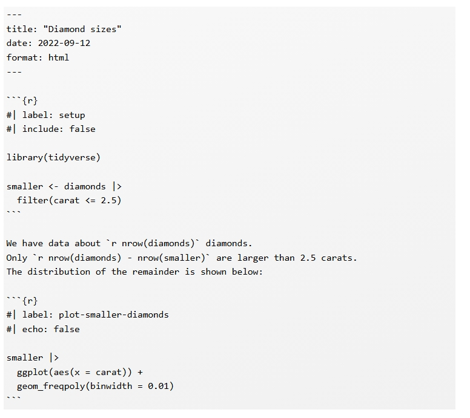
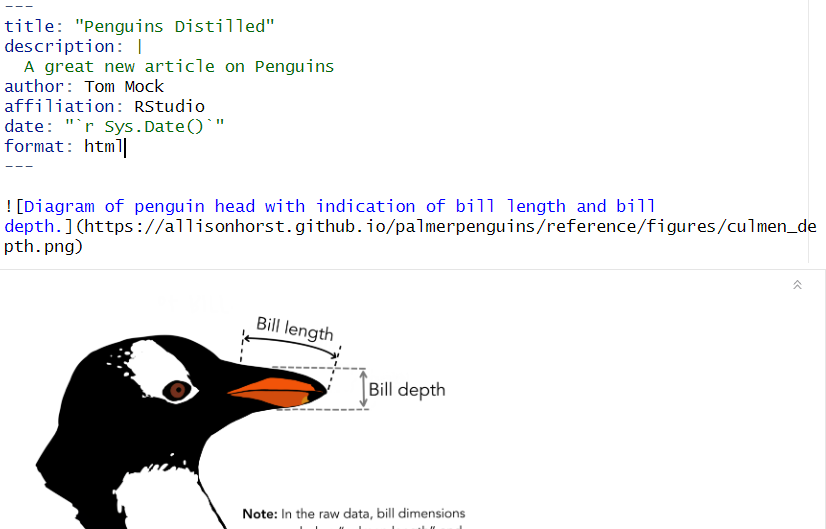
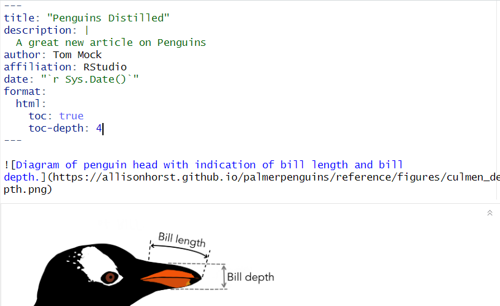
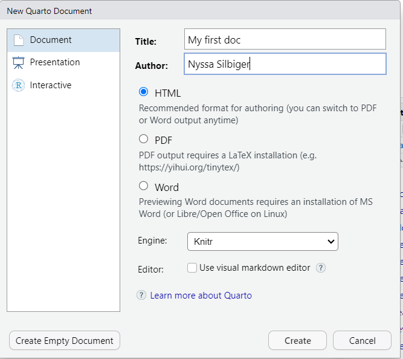
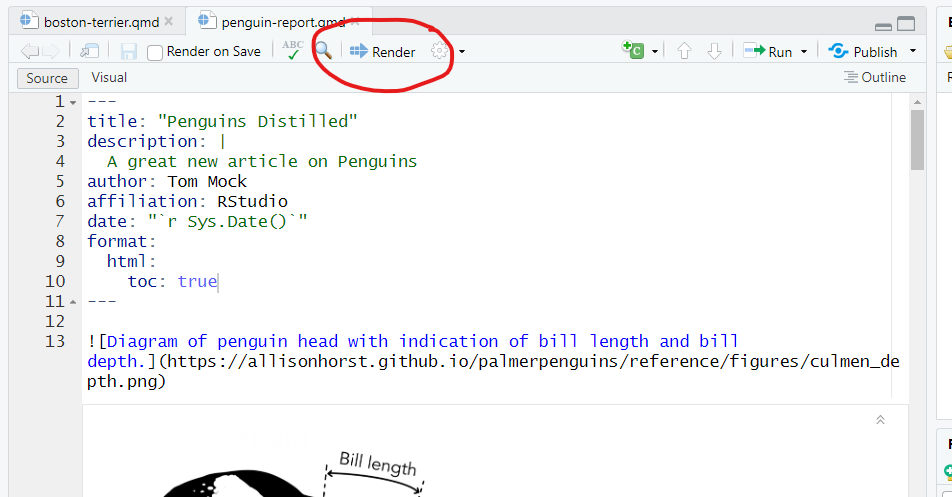
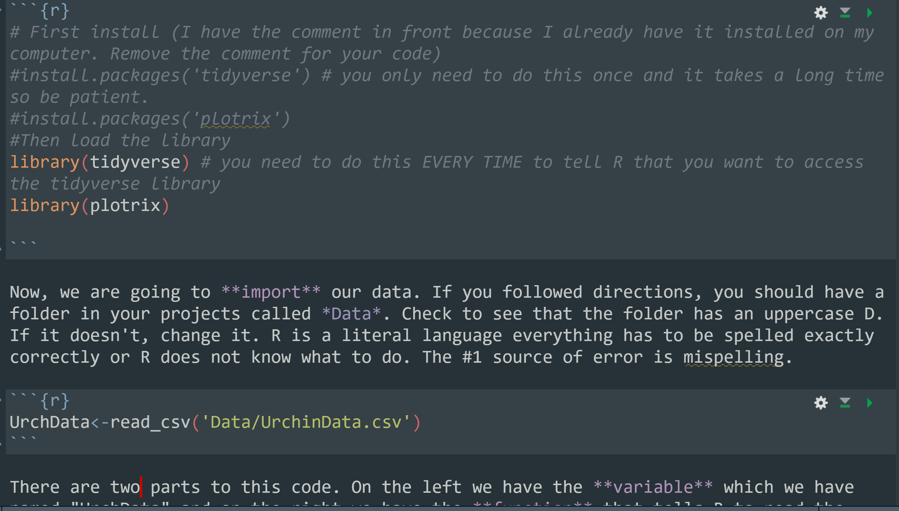
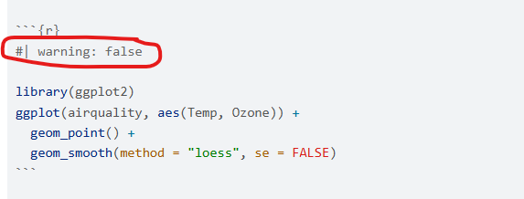
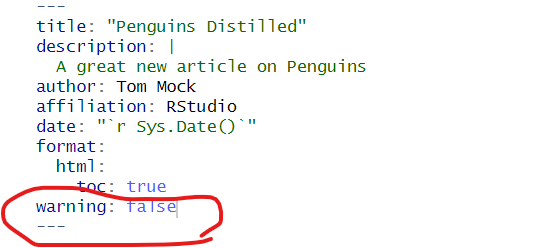
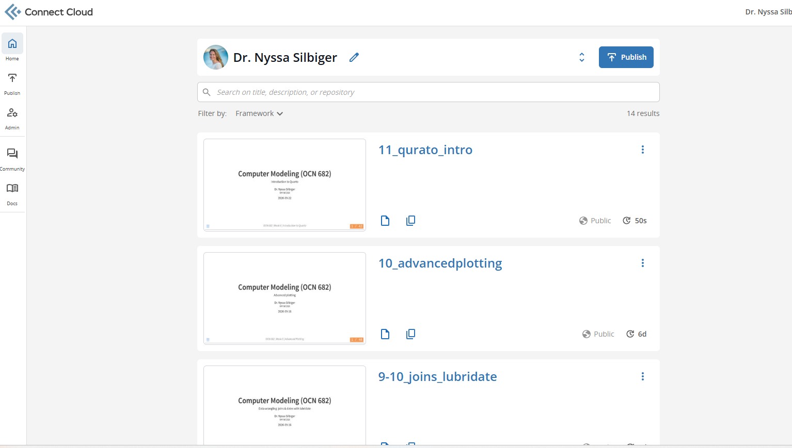

```{r setup, include=FALSE}
options(htmltools.dir.version = FALSE)
library(tidyverse)
library(palmerpenguins)
library(beepr)
```

## Outline of class

::: {.columns}
::: {.column width="50%"}
- Quiz 5
- What is Quarto?
- Metadata and outputs
- Basic Markdown Text
- Using code chunks
- Publishing & sharing your document
:::

::: {.column width="50%"}
*Next Time*

- Working with figures and tables
- Themes
- Advanced Outputs

[Quarto Cheatsheet](https://rstudio.github.io/cheatsheets/html/quarto.html)
:::
:::

## Review {.center}

> If I want to convert Feb 28 2021 10:05:50 to a date, what function do I use?

---

## What is Quarto?

### Analyze. Share. Reproduce. You have a story to tell with data—tell it with Quarto.


---

## What is Quarto? {.smaller}

[**Quarto provides a unified authoring framework for data science, combining your code, its results, and your prose. Quarto documents are fully reproducible and support dozens of output formats, like PDFs, Word files, presentations, and more.**]{.orange}

::: {.fragment}
1. For communicating to decision-makers, who want to focus on the conclusions, not the code behind the analysis.
:::

::: {.fragment}
2. For collaborating with other data scientists (including future you!), who are interested in both your conclusions, and how you reached them (i.e. the code).
:::

::: {.fragment}
3. As an environment in which to do data science, as a modern-day lab notebook where you can capture not only what you did, but also what you were thinking.
:::

---

## Change your mental mode {.smaller}

::: {.columns}
::: {.column width="50%"}
### Source to Output
{width="100%"}
:::

::: {.column width="50%"}
### Source to Output
{width="100%"}
:::
:::

::: {.callout-note}
## Key idea
**Take your notes in the same place as your code**
:::

---

## What is inside?


---

## What is inside?

Quarto is broken into 4 major parts:

::: {.columns}
::: {.column width="50%"}
- Metadata
- Text
- Code
- Output
:::

::: {.column width="50%"}
{width="100%"}
:::
:::

*Before we code together I will walk you through some of the features. Then I will have you work with me.*

---

## Metadata: YAML {.smaller}

### YAML - *yet another markup language*

```{r}
#| eval: false
#| echo: true
---
key: value
---
```

This goes at the top of your Quarto document, includes the metadata, style, and type of output for your document.

::: {.fragment}
You only need two pieces for it to work, but there is lots more to add to make it beautiful.

```{r}
#| eval: false
#| echo: true

---
title: "My Awesome Markdown File"
format: html
---
```

*title* is the title of your Quarto document  
*format* is the format that it will be saved as
:::

---

## Example YAML



---



---



---



---

## Let's get started


---

## Enter in some metadata and save the doc in your folder



---

## You create an html document by hitting render



---

## Text

The text is written in the markdown language. You have already done a lab on markdown and this is the exact language that you use for your readme files. This is a short review.

---

## Bold

::: {.columns}
::: {.column width="50%"}
```{r}
#| echo: true
#| eval: false

I **love** markdown
```

::: {.fragment}
### *Italics*
```{r}
#| echo: true
#| eval: false

I *love* markdown
```
:::
:::

::: {.column width="50%"}
I **love** markdown

::: {.fragment}
I *love* markdown
:::
:::
:::

## Lists

::: {.columns}
::: {.column width="50%"}
```{r}
#| eval: false
#| echo: true
  - item 1
  - item 2
  - item 3
```
:::

::: {.column width="50%"}
- item 1
- item 2
- item 3
:::
:::

---

## Images

```{r}
#| eval: false
#| echo: true

```


---

## Links

```{r}
#| eval: false
#| echo: true

[Silbiger Lab](https://silbigerlab.com)
```

[Silbiger Lab](https://silbigerlab.com)

---

## Code chunks

You can add a code chunk by pressing

- the keyboard shortcut **Ctrl + Alt + I** (OS X: **Cmd + Option + I**)
- Click **Code** at the top of RStudio then **+C** in green.



---

## Code chunk options

You can control what you want printed in the html within the code chunks by giving a key and a value within the chunks after a `#|`



[Code Chunk Options](https://quarto.org/docs/reference/cells/cells-knitr.html)

---

## Global code chunk options in the YAML

This will suppress warnings in every single code chunk as a default



---

## The `execute:` YAML block {.smaller}

Instead of setting options on every single chunk, set defaults once in your YAML:

```{r}
#| eval: false
#| echo: true

---
title: "My Analysis"
format: html
execute:
  warning: false   # suppress warnings in all chunks
  message: false   # suppress package loading messages
  echo: false      # hide code by default (show results only)
  eval: true       # run all chunks (the default)
---
```

::: {.fragment}
::: {.callout-tip}
## Override per-chunk when needed

YAML `execute:` options are **defaults** — override any one on an individual chunk:

```{r}
#| eval: false
#| echo: true

# Even if YAML says echo: false, this chunk shows its code:
# | echo: true
```
:::
:::

---

## Inline R code {.inverse .center .middle}

## Why type numbers by hand?

::: {.columns}

::: {.column width="50%"}
#### Hard-coded (fragile)

> The dataset contains **344 penguins** across **3 species**. The mean body mass was **4201.8 grams**.

::: {.callout-warning}
## Problem
If the data change, you have to find and update every number by hand — and it's easy to miss one.
:::
:::

::: {.column width="50%"}
#### Inline R code (reproducible)

> The dataset contains **`r nrow(penguins)`** penguins across **`r n_distinct(penguins$species)`** species. The mean body mass was **`r round(mean(penguins$body_mass_g, na.rm = TRUE), 1)`** grams.

::: {.callout-tip}
## Benefit
R recalculates every time you render — your text is always in sync with your data.
:::
:::

:::

## Inline R code: syntax

Wrap any R expression between a backtick-r and a closing backtick, directly in your prose:

```{r}
#| eval: false
#| echo: true

# In your prose (not a code chunk), write:
# backtick + r + space + expression + backtick

# Examples:
# The dataset has `nrow(penguins)` rows.
# The mean is `round(mean(x, na.rm = TRUE), 1)`.
# Analysis run on `Sys.Date()`.

```

::: {.fragment}
The output renders as **plain text** — readers never see the R code, only the result.
:::

## Inline R code: what it looks like

::: {.columns}

::: {.column width="50%"}
#### What you type in the .qmd
```{r}
#| eval: false
#| echo: true

# Prose line in your document:
The dataset has `r nrow(penguins)` rows
and `r ncol(penguins)` columns.
```
:::

::: {.column width="50%"}
#### What renders in the output

The dataset has **`r nrow(penguins)`** rows and **`r ncol(penguins)`** columns.

*The backtick-r expressions are replaced by their computed values.*
:::

:::

## {.inverse .center .middle}


## Activity: Inline R code

Open your Quarto document and add a prose paragraph using **only** inline R — no hard-coded numbers.

::: {.incremental}
1. Load [palmerpenguins]{.fn} in a code chunk at the top
2. Write a prose sentence describing the dataset (count, species, islands)
3. Write a second sentence with a summary statistic — try [mean()]{.fn}, [max()]{.fn}, or [min()]{.fn}, wrapped in [round()]{.fn}
4. Hit **Render** and confirm the numbers appear correctly in the output
:::

::: {.fragment}
::: {.callout-tip}
## Scaffold to get started

In your prose (not inside a chunk), write something like:

*"There are X penguins across Y islands. The heaviest weighed Z grams."*

Replace X, Y, Z with [nrow()]{.fn}, [n_distinct()]{.fn}, [max()]{.fn} — each wrapped in backtick‑r ... backtick
:::
:::

---

## File paths in Quarto {.smaller}

::: {.callout-warning}
## Quarto renders from the file's location, not the project root

When Quarto knits your `.qmd`, the working directory is set to **wherever the `.qmd` file lives** — not the RStudio project folder.

So if your file is at `scripts/my_analysis.qmd` and you write:

```r
data <- read_csv("data/myfile.csv")  # ❌ Breaks — "data/" doesn't exist relative to scripts/
```
:::

::: {.fragment}
::: {.callout-tip}
## Solution: always use [here()]{.fn}

[here()]{.fn} always anchors to the project root (where your `.Rproj` file lives), regardless of where the `.qmd` file is saved:

```r
library(here)
data <- read_csv(here("data", "myfile.csv"))  # ✅ Always works
```

This is true even when you run code interactively in the console — another reason to always use [here()]{.fn}.
:::
:::


## Publishing your Quarto document {.inverse .center .middle}

## What is Posit Connect Cloud?

[connect.posit.cloud](https://connect.posit.cloud) is a free hosted service where you can publish and share your rendered Quarto documents, R Markdown files, and Shiny apps as a live URL.

::: {.incremental}
- Anyone with the link can view your rendered document — no R required
- Every time you re-publish, the URL stays the same
- This is how you will **submit homework** — share the link, not the file
:::

::: {.fragment}
::: {.callout-tip}
## Free tier is enough
The free account supports publishing documents for this course. No credit card needed.
:::
:::

---

## Step 1: Create your account

::: {.incremental}
1. Go to [connect.posit.cloud](https://connect.posit.cloud)
2. Click **Sign Up** and create a free account
3. Verify your email address
4. Log in — you should see your empty Connect Cloud dashboard
:::

::: {.fragment}
{fig-align="center" width="55%"}
:::

---

## Step 2: Link RStudio to your account

Run this **once** in your console — it opens a browser window to authenticate:

```{r}
#| eval: false
#| echo: true

install.packages("rsconnect")   # if you haven't already
library(rsconnect)

rsconnect::connectCloudUser()   # opens browser → log in → authorize
```

::: {.fragment}
Confirm it worked:

```{r}
#| eval: false
#| echo: true

rsconnect::accounts()  # should show your Connect Cloud account
```
:::

::: {.fragment}
::: {.callout-warning}
## Do this in the console, not your script
Authentication stores a token on your machine. You only need to do this once per computer.
:::
:::

---

## Step 3: Publish your document

With your `.qmd` file open, run this in the console:

```{r}
#| eval: false
#| echo: true

library(rsconnect)
library(here)

rsconnect::deployDoc(
  doc      = here("scripts", "my_analysis.qmd"),  # path to your .qmd
  appTitle = "OCN 682 - Your Name - Week 6"        # give it a clear title
)
```

::: {.fragment}
::: {.callout-tip}
## What happens next
Quarto renders the document, bundles it, and uploads it to Connect Cloud. Your browser will open automatically to the published page when it's done.

You can also press the "Publish" button at the top right.
:::
:::

---

## Step 4: Share your link

After publishing, your browser opens to the live document. Copy that URL — that is what you submit.

::: {.incremental}
1. On the published page, click **Access** in the left sidebar
2. Under *Who can view this content*, select **Anyone**
3. Copy the URL from your browser's address bar
4. Paste it into your readme file
:::

::: {.fragment}
::: {.callout-warning}
## Make it public before submitting
If you leave access set to "Only me," I cannot open your link and you will not receive credit.
:::
:::

---

## Totally awesome R package of the day

```{r}
#| eval: false
#| echo: true

install.packages("beepr")
```

```{r}
#| echo: true

library(beepr)
beep(5)
beep(9)
```
---

## Upcoming homework: Good Plot / Bad Plot 🏆 {.smaller}

**Due October 20 — this is a contest. There is a prize.**

Create two versions of a plot using any dataset you choose:

::: {.incremental}
- [**Bad plot:**]{.orange} Make it as misleading, confusing, and ugly as possible — then explain in writing every principle you broke
- [**Good plot:**]{.green} Same (or similar) data, done right — explain briefly why it works
:::

::: {.fragment}
**Rules:**
- Both plots made in [ggplot2]{.fn} with code visible in your Quarto document
- The raw data must be visible in at least one plot
- Submit as a **rendered Quarto doc pushed to your GitHub folder** — create a dedicated `goodplot-badplot/` folder
- Let me know if you prefer your plots not be posted on social media
:::

::: {.fragment}
::: {.callout-tip}
## Great data source
[TidyTuesday](https://github.com/rfordatascience/tidytuesday) — a new dataset every week, community favorites included
:::
:::

---

## {.center .middle}

# Thanks!

Slides created with [**Quarto**](https://quarto.org/)
